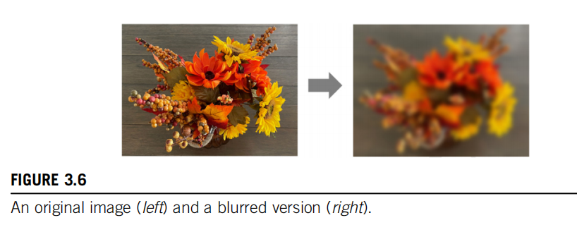

## 1.4 并行编程的挑战

并行编程为何困难？有人曾经说过，如果你不关心性能，那么并行编程就非常简单。你几乎可以在一个小时内写出一个并行程序。但是，如果你不关心性能，为什么要写一个并行程序呢？这本书将讨论在实现高性能并行编程时遇到的几个挑战。首先，设计具有与顺序算法相同算法（计算）复杂度的并行算法可能具有挑战性。许多并行算法执行的工作量与它们的顺序对应物相同。然而，一些并行算法做的工作比它们的顺序对应物更多。实际上，有时它们可能做了这么多额外的工作，以至于对于大型输入数据集来说，它们的运行速度最终会变慢。

这尤其是一个问题，因为快速处理大型输入数据集是并行编程的一个重要动机。例如，许多现实世界的问题最自然地用数学递归来描述。并行化这些问题通常需要非直观的方式来思考问题，并且可能需要在执行期间进行冗余工作。有一些重要的算法原语，如前缀和，可以促进将问题的顺序递归表述转换为更并行的形式。我们将在第11章“前缀和（扫描）”中更正式地介绍工作效率的概念，并说明设计并行算法时所涉及的方法和权衡，这些算法与它们的顺序对应物具有相同的计算复杂度。

其次，许多应用程序的执行速度受到内存访问延迟和/或吞吐量的限制。我们称这些应用程序为内存绑定；相比之下，计算绑定应用程序受到每字节数据执行的指令数量的限制。实现内存绑定应用程序的高性能并行执行通常需要提高内存访问速度的方法。我们将在第5章“内存架构和数据局部性”和第6章“性能考虑”中介绍内存访问优化技术，并将这些技术应用于几章中的并行模式和应用程序。

第三，与顺序对应物相比，并行程序的执行速度通常对输入数据特征更敏感。许多现实世界的应用程序需要处理具有广泛变化特征的输入，例如不稳定或不可预测的数据大小和不均匀的数据分布。这些大小和分布的变化可能导致并行线程被分配不均的工作量，并且可以显著降低并行执行的有效性。并行程序的性能有时可能因这些特征而发生巨大变化。我们将在介绍并行模式和应用程序的章节中介绍规范化数据分布和/或动态细化线程数量的技术，以解决这些挑战。

第四，一些应用程序可以在不需要跨不同线程的大量协作的情况下进行并行化。这些应用程序通常被称为“尴尬地并行”。其他应用程序需要线程相互协作，这需要使用同步操作，如屏障或原子操作。这些同步操作给应用程序带来了开销，因为线程经常发现自己在等待其他线程而不是执行有用的工作。我们将在整本书中讨论减少这种同步开销的各种策略。幸运的是，研究人员已经解决了大多数这些挑战。此外，跨应用领域有共同的模式，允许我们将在一个领域中派生出的解决方案应用于其他领域的挑战。这就是为什么我们将在重要并行计算模式和应用程序的上下文中介绍解决这些挑战的关键技术的主要原因。

## 1.5 相关的并行编程接口

在过去的几十年中，已经提出了许多并行编程语言和模型。其中最广泛使用的是OpenMP（开放，2005）用于共享内存多处理器系统，以及消息传递接口（MPI）（MPI，2009）用于可扩展的集群计算。两者都已成为由主要计算机供应商支持的标准编程接口。OpenMP的实现包括编译器和运行时系统。程序员向OpenMP编译器指定有关循环的指令（命令）和提示（pragmas）。有了这些指令和提示，OpenMP编译器生成并行代码。运行时系统通过管理并行线程和资源来支持并行代码的执行。OpenMP最初是为CPU执行设计的，并且已经扩展以支持GPU执行。OpenMP的主要优点是它提供了编译器自动化和运行时支持，以抽象出程序员的许多并行编程细节。这种自动化和抽象可以帮助使应用程序代码在不同供应商生产的系统之间以及同一供应商的不同代系统之间更具可移植性。我们称这种属性为性能可移植性。然而，有效的OpenMP编程仍然需要程序员理解所有涉及的详细并行编程概念。因为CUDA为程序员提供了这些并行编程细节的显式控制，所以它是一个极好的学习工具，即使对于那些希望将OpenMP作为他们主要编程接口的人也是如此。此外，根据我们的经验，OpenMP编译器仍在不断发展和改进。许多程序员可能需要在OpenMP编译器不足的领域使用类似CUDA的接口。另一方面，MPI是一个计算节点在集群中不共享内存的编程接口（MPI，2009）。所有数据共享和交互必须通过显式消息传递完成。MPI已在高性能计算（HPC）中得到广泛应用。用MPI编写的应用程序已成功在拥有超过100,000个节点的集群计算系统上运行。今天，许多HPC集群采用异构CPU/GPU节点。将应用程序移植到MPI所需的工作量可能相当高，因为计算节点之间缺乏共享内存。程序员需要执行域分解，将输入和输出数据分配到各个节点。基于域分解，程序员还需要调用消息发送和接收函数来管理节点之间的数据交换。相比之下，CUDA为GPU中的并行执行提供了共享内存，以解决这一困难。虽然CUDA是每个节点的有效接口，但大多数应用程序开发人员需要在集群级别使用MPI进行编程。此外，通过API（如NVIDIA集体通信库（NCCL））对CUDA的多GPU编程支持也在增加。因此，了解如何在现代计算集群中使用多GPU节点进行联合MPI/CUDA编程对于高性能计算领域的并行程序员来说很重要，这是第20章“编程异构计算集群”中介绍的主题。2009年，包括苹果、英特尔、AMD/ATI和NVIDIA在内的几个主要行业参与者联合开发了一个名为Open Compute Language（OpenCL）（The Khronos Group，2009）的标准化编程模型。与CUDA类似，OpenCL编程模型定义了语言扩展和运行时API，允许程序员管理大规模并行处理器中的并行性和数据传递。与CUDA相比，OpenCL更多地依赖API而不是语言扩展。这允许供应商快速适应他们现有的编译器和工具来处理OpenCL程序。OpenCL是一个标准化的编程模型，因为用OpenCL开发的应用可以正确运行，无需修改，就可以在所有支持OpenCL语言扩展和API的处理器上运行。然而，为了在新处理器上实现高性能，可能需要修改应用程序。熟悉OpenCL和CUDA的人都知道OpenCL和CUDA的关键概念和特性之间有着显著的相似性。也就是说，一个CUDA程序员可以以最小的努力学习OpenCL编程。更重要的是，几乎所有在使用CUDA中学到的技术都可以轻松地应用到OpenCL编程中。

## 1.6 总体目标

我们的主要目标是教会您，读者，如何编程大规模并行处理器以实现高性能。因此，本书的大部分内容都致力于开发高性能并行代码的技术。我们的方法不需要大量的硬件专业知识。然而，您需要对并行硬件架构有良好的概念理解，以便能够理解您的代码的性能行为。因此，我们将专门用一些篇幅来直观地理解硬件架构的基本特征，并用很多篇幅来介绍开发高性能并行程序的技术。特别是，我们将专注于计算思维（Wing，2006）技术，这将使您能够以适合在大规模并行处理器上高效执行的方式来思考问题。在大多数处理器上进行高性能并行编程需要一些硬件工作原理的知识。构建允许程序员在没有这种知识的情况下开发高性能代码的工具和机器可能需要很多年。即使我们拥有这样的工具，我们怀疑了解硬件的程序员将能够比那些不了解的人更有效地使用这些工具。因此，我们专门用第4章“计算架构和调度”来介绍GPU架构的基础知识。我们还将讨论更专业的架构概念，作为我们讨论高性能并行编程技术的一部分。

我们的第二个目标是教授并行编程以实现正确的功能和可靠性，这在并行计算中是一个微妙的问题。过去在并行系统上工作过的程序员知道，仅仅实现初始性能是不够的。挑战在于以一种方式实现它，以便您可以调试代码并支持用户。CUDA编程模型鼓励使用简单的屏障同步、内存一致性和原子性来管理并行性。此外，它提供了强大的工具，允许人们不仅调试功能的方面，还可以调试性能瓶颈。我们将展示通过专注于数据并行性，可以在应用程序中实现高性能和高可靠性。

我们的第三个目标是通过探索并行编程的方法来实现跨未来硬件代的可扩展性，以便未来的机器，将越来越并行，可以使您的代码比今天的机器运行得更快。我们希望帮助您掌握并行编程，使您的程序能够扩展到新一代机器的性能水平。这种可扩展性的关键是通过规范化和局部化内存数据访问来最小化对关键资源的消耗和数据结构更新中的冲突。因此，开发高性能并行代码的技术对于确保应用程序未来的可扩展性也很重要。实现这些目标需要大量的技术知识，因此，我们将在本书中介绍许多并行编程的原理和模式（Mattson等人，2004）。我们不会单独教授这些原理和模式。我们将在并行化有用应用程序的上下文中教授它们。然而，我们无法涵盖所有内容，因此我们已经选择了最有用和经过验证的技术来进行详细讨论。事实上，当前版本在并行模式方面有显著增加的章节数量。

我们已经准备好为您提供本书其余部分的快速概述。

1.7 书籍组织结构

本书分为四个部分。第一部分涵盖了并行编程的基本概念、数据并行性、GPU以及性能优化。这些基础章节为读者提供了成为GPU程序员所需的基本知识和技能。第二部分涵盖了原始并行模式，第三部分涵盖了更高级的并行模式和应用。这两部分应用了第一部分中学到的知识和技能，并根据需要引入了其他GPU架构特性和优化技术。最后一个部分，第四部分，介绍了高级实践，以完成希望成为专家级GPU程序员的读者的知识。

第1部分关于基本概念，包括第2至6章。第2章《异构数据并行计算》介绍了数据并行性和CUDA C编程。本章基于读者具有C编程的先验经验。它首先介绍了CUDA C作为C的简单、小型扩展，支持异构CPU/GPU计算和广泛使用的单程序、多数据并行编程模型。然后，它涵盖了涉及以下内容的思维过程：(1) 确定应用程序中要并行化的部分；(2) 隔离要由并行化代码使用的数据，使用API函数在并行计算设备上分配内存；(3) 使用API函数将数据传输到并行计算设备；(4) 将并行部分开发成将由并行线程执行的内核函数；(5) 启动内核函数以供并行线程执行；(6) 最终使用API函数调用将数据传回主机处理器。我们使用向量加法的运行示例来说明这些概念。虽然第2章的目标是教授足够的CUDA C编程模型概念，以便读者可以编写一个简单的并行CUDA C程序，但它涵盖了开发任何并行编程接口的并行应用程序所需的几个基本技能。第3章《多维网格和数据》介绍了CUDA并行执行模型的更多细节，特别是它与使用多维线程组织处理多维数据的关系。它提供了足够的洞察力，以创建、组织、绑定资源和绑定数据的线程，使读者能够使用CUDA C实现复杂的计算。第4章《计算架构和调度》介绍了GPU架构，重点是计算核心的组织方式以及线程如何在这些核心上执行的调度。讨论了各种架构考虑因素，以及它们对在GPU架构上执行的代码性能的影响。这些包括透明可扩展性、SIMD执行和控制分歧、多线程和延迟容忍度以及占用率等概念，这些都在本章中定义和讨论。第5章《内存架构和数据局部性》通过讨论GPU的内存架构，扩展了第4章《计算架构和调度》的内容。它还讨论了可用于持有CUDA变量以管理数据传递和提高程序执行速度的特殊内存。我们介绍了分配和使用这些内存的CUDA语言特性。适当使用这些内存可以大幅提高数据访问吞吐量，并有助于缓解内存系统中的流量拥堵。第6章《性能考虑》介绍了当前CUDA硬件的几个重要性能考虑因素。特别是，它更详细地介绍了线程执行和内存访问的期望模式。这些细节为程序员提供了概念基础，以便他们能够推理他们关于组织计算和数据的决策的后果。本章最后给出了一个常见优化策略的清单，GPU程序员经常使用这些策略来优化任何计算模式。这份清单将在整个书的后两部分中用来优化各种并行模式和应用。

第二部分关于原始并行模式，包括第7至12章。第7章《卷积》介绍了卷积，这是一种经常使用的并行计算模式，它源于数字信号处理和计算机视觉，并需要仔细管理数据访问局部性。我们还使用这种模式来介绍现代GPU中的常量内存和缓存。第8章《模板》介绍了模板模式，它与卷积类似，但源于解决微分方程，并具有特定的特征，为进一步优化数据访问局部性提供了独特的机会。我们还使用这种模式来介绍线程和数据的三维组织，并展示第6章《性能考虑》中引入的针对线程粒度的优化。第9章《并行直方图》涵盖了直方图，这是一种在统计数据分析以及大型数据集的模式识别中广泛使用的模式。我们还使用这种模式来介绍原子操作作为协调对共享数据并发更新的手段，以及减少这些操作开销的私有化优化。第10章《归约和最小化分歧》介绍了归约树模式，它用于总结一组输入数据。我们还使用这种模式来演示控制分歧对性能的影响，并展示如何减轻这种影响的技术。第11章《前缀和（扫描）》介绍了前缀和，或扫描，这是一个重要的并行计算模式，它将本质上的顺序计算转换为并行计算。我们还使用这种模式来介绍并行算法中工作效率的概念。最后，第12章《合并》涵盖了并行合并，这是一种在分而治之的工作划分策略中广泛使用的模式。我们还使用本章来介绍动态输入数据识别和组织。

第三部分关于高级并行模式和应用，与第二部分在精神上相似，但涵盖的模式更复杂，通常包括更多的应用上下文。因此这些章节不太侧重于介绍新技术或特性，而更侧重于特定于应用的考虑。对于每个应用，我们首先确定并行执行基本结构的不同表述方式，并讨论每种替代方案的优缺点。然后，我们将经历实现高性能所需的代码转换步骤。这些章节帮助读者将前面章节的所有材料整合在一起，并在他们承担自己的应用开发项目时为他们提供支持。第三部分包括第13至19章。第13章《排序》介绍了两种形式的并行排序：基数排序和归并排序。这种高级模式利用了前面章节中介绍的更原始的模式，特别是前缀和和并行合并。第14章《稀疏矩阵计算》介绍了稀疏矩阵计算，它广泛用于处理非常大的数据集。

第15章《图遍历》介绍了图算法以及如何在GPU编程中高效实现图搜索。讨论了多种并行化图算法的不同策略，并讨论了图结构对选择最佳算法的影响。这些策略建立在更原始的模式上，如直方图和合并。第16章《深度学习》涵盖了深度学习，这是GPU计算中变得越来越重要的一个领域。我们介绍了卷积神经网络的有效实现，并将在其他来源中进行更深入的讨论。卷积神经网络的有效实现利用了诸如平铺和卷积等模式的技术。第17章《迭代磁共振成像重建》涵盖了非笛卡尔MRI重建以及如何利用循环融合和分散-聚集转换等技术来增强并行性和减少同步开销。第18章《静电势图》涵盖了分子可视化和分析，这些技术从稀疏矩阵计算中受益，通过应用不规则数据的处理技术。第19章《并行编程和计算思维》介绍了计算思维，这是一种以更易于高性能计算的方式制定和解决计算问题的艺术。它通过涵盖组织程序的计算任务的概念，使它们可以并行完成。我们首先讨论将抽象科学、问题特定的概念转化为计算任务的转换过程，这是生产高质量应用软件，无论是串行还是并行的重要第一步。本章还讨论了并行算法结构及其对应用程序性能的影响，这基于CUDA的性能调整经验。虽然我们不深入讨论这些替代并行编程风格的实现细节，但我们期望读者能够通过在本书中获得的基础学会使用任何一种编程风格。我们还提供了一个高层次的案例研究，以展示通过创造性计算思维可以看到的机会。

第四部分关于高级实践，包括第20至22章。第20章《编程异构计算集群》涵盖了在异构集群上的CUDA编程，其中每个计算节点由CPU和GPU组成。我们讨论了与CUDA一起使用MPI来整合节点间计算和节点内计算以及由此产生的通信问题和实践。第21章《CUDA动态并行性》涵盖了动态并行性，这是GPU根据数据或程序结构动态为自己创建工作的能力，而不是总是等待CPU这样做。第22章《高级实践和未来发展》介绍了CUDA程序员需要了解的一些杂项高级功能和实践的列表。这些包括零拷贝内存、统一虚拟内存、多个内核的同时执行、函数调用、异常处理、调试、分析、双精度支持、可配置的缓存/暂存区大小等主题。例如，CUDA的早期版本在CPU和GPU之间提供了有限的共享内存能力。程序员需要显式管理CPU和GPU之间的数据传输。然而，当前版本的CUDA支持诸如统一虚拟内存和零拷贝内存等功能，实现CPU和GPU之间数据的无缝共享。有了这样的支持，CUDA程序员可以声明变量和数据结构为CPU和GPU共享。运行时硬件和软件根据需要自动维护一致性并执行优化的数据传输操作。这种支持显著降低了在计算和I/O活动期间重叠数据传输所涉及的编程复杂性。在教科书的介绍部分，我们使用显式数据传输的API，以便读者更好地理解底层发生的事情。我们稍后在第22章《高级实践和未来发展》中介绍统一虚拟内存和零拷贝内存。尽管本书中的章节基于CUDA，但它们帮助读者建立了一般并行编程的基础。我们相信，当我们通过具体示例学习时，人类理解得最好。也就是说，我们必须首先在特定的编程模型的上下文中学习概念，这为我们在将知识推广到其他编程模型时提供了坚实的基础。随着我们这样做，我们可以借鉴我们从CUDA示例中获得的具体经验。深入的CUDA经验还使我们能够获得成熟度，这将帮助我们学习可能甚至不适用于CUDA模型的概念。

第23章，结论与展望，对大规模并行编程的未来进行了总结和展望。我们首先回顾我们的目标，并总结这些章节如何结合在一起以帮助实现目标。然后，我们最后预测，这些在大规模并行计算方面的快速发展将使其成为未来十年最令人兴奋的领域之一。

# 2 异构数据并行计算

 数据并行性是指在数据集的不同部分上所要执行的计算工作可以相互独立地完成，从而可以相互并行地完成的现象。许多应用程序显示出大量的数据并行性，这使它们易于进行可伸缩的并行执行。因此，对于并行程序员来说，熟悉数据并行性的概念和用来编写利用数据并行性的代码的并行编程语言构造是很重要的。在本章中，我们将使用CUDA C语言构造来开发一个简单的数据并行程序。

## 2.1 数据并行性

数据并行性指的是在不同数据集的部分上执行的计算工作可以相互独立，因此可以并行完成的现象。许多应用程序展现出丰富的数据并行性，使它们适合于可扩展的并行执行。因此，对于并行程序员来说，熟悉数据并行性的概念以及用于编写代码利用数据并行性的并行编程语言结构非常重要。在本章中，我们将使用CUDA C语言结构来开发一个简单的数据并行程序。

当现代软件应用程序运行缓慢时，问题通常是数据——需要处理的数据量太大。图像处理应用程序处理的图像或视频包含数百万到数万亿像素。科学应用程序使用数十亿个网格点来模拟流体动力学。分子动力学应用程序必须模拟数千到数十亿个原子之间的相互作用。航空公司的调度涉及数千次航班、机组人员和机场登机口。这些像素、粒子、网格点、相互作用、航班等通常可以大部分独立处理。例如，在图像处理中，将彩色像素转换为灰度只需要该像素的数据。模糊图像需要将每个像素的颜色与附近像素的颜色平均，只需要该像素小邻域内的数据。甚至看似全局操作的，例如找出图像中所有像素的平均亮度，也可以分解为许多可以独立执行的较小计算。这种不同数据片段的独立评估是数据并行性的基础。编写数据并行代码需要（重新）组织计算，使其围绕数据进行，以便我们可以并行执行生成的独立计算，以更快地完成整个工作——通常要快得多。让我们通过一个将颜色转换为灰度的例子来说明数据并行性的概念。图2.1显示了一个由许多像素组成的彩色图像（左侧），每个像素包含红色、绿色和蓝色分数值（r, g, b），这些值从0（黑色）变化到1（完全强度）。要将彩色图像（图2.1左侧）转换为灰度图像（右侧），我们通过应用以下加权和公式计算每个像素的亮度值L：

\[ L = 0.21r + 0.72g + 0.07b \]

在RGB颜色表示中，图像中的每个像素都存储为(r, g, b)值的元组。图像的一行的格式是(r g b) (r g b) ... (r g b)，如图中所示。每个元组指定了红色(R)、绿色(G)和蓝色(B)的混合。也就是说，对于每个像素，r、g和b值表示在渲染像素时红色、绿色和蓝色光源的强度（0表示暗，1表示完全强度）。

实际上，这三种颜色的允许混合在行业指定的颜色空间中有所不同。在这里，AdobeRGB颜色空间中三种颜色的有效组合显示为三角形的内部。每个混合的垂直坐标（y值）和水平坐标（x值）显示了像素强度的分数，应该分配给G和R。剩余的分数（1-y-x）的像素强度应该分配给B。要渲染图像，每个像素的r、g、b值用于计算像素的总强度（亮度）以及混合系数（x，y，1-y-x)。

如果我们考虑输入是一个以RGB值数组I组织的图像，输出是一个相应的亮度值数组O，我们得到图2.2所示的简单计算结构。例如，O[0]是通过根据上述公式计算I[0]中RGB值的加权和生成的；O[1]是通过计算I[1]中RGB值的加权和生成的；O[2]是通过计算I[2]中RGB值的加权和生成的；以此类推。这些每个像素的计算彼此独立。显然，颜色到灰度的转换展现出丰富的数据并行性。当然，完整应用程序中的数据并行性可能更复杂，本书的大部分内容都致力于教授寻找和利用数据并行性的并行思维。

任务并行性与数据并行性 

并行性不是并行编程中使用的唯一类型。任务并行性也在并行编程中得到了广泛的应用。任务并行性通常通过应用程序的任务分解来暴露。例如，一个简单的应用程序可能需要执行向量加法和矩阵-向量乘法。如果这两个任务可以独立完成，那么就存在任务并行性。I/O和数据传输也是任务的常见来源。在大型应用程序中，通常有更多独立的任务，因此任务并行性的数量也更大。例如，在分子动力学模拟器中，自然任务列表包括振动力、旋转力、非键合力的邻近识别、非键合力、基于速度和位置的速度和位置等其他物理属性。通常，数据并行性是并行程序可扩展性的主要来源。对于大型数据集，通常可以找到丰富的数据并行性，以利用大规模并行处理器，并允许应用程序性能随着每一代硬件拥有更多的执行资源而增长。尽管如此，任务并行性在实现性能目标中也可以发挥重要作用。我们将在稍后介绍流时涵盖任务并行性。

## 2.2 CUDA C程序结构

我们现在已经准备好学习如何编写一个CUDA C程序来利用数据并行性来加速执行。CUDA C1扩展了流行的ANSI C编程语言，增加了最小的新语法和库函数，让程序员可以针对包含CPU核心和大规模并行GPU的异构计算系统进行编程。顾名思义，CUDA C是建立在NVIDIA的CUDA平台之上的。CUDA目前是大规模并行计算最成熟的框架。它在高性能计算行业中得到了广泛应用，拥有编译器、调试器和分析器等基本工具，这些工具在最常见的操作系统上都可用。CUDA C程序的结构反映了计算机中主机（CPU）和一台或多台设备（GPU）的共存。每个CUDA C源文件可以包含主机代码和设备代码的混合。默认情况下，任何传统的C程序都是只包含主机代码的CUDA程序。你可以在任何源文件中添加设备代码。设备代码用特殊的CUDA C关键字清楚地标记。设备代码包括函数，或者称为内核，其代码以数据并行的方式执行。CUDA程序的执行如图2.3所示。执行从主机代码（CPU串行代码）开始。当调用内核函数时，在设备上启动大量线程来执行内核。由内核调用启动的所有线程统称为网格。这些线程是CUDA平台上并行执行的主要工具。图2.3显示了两个网格线程的执行。我们很快将讨论这些网格是如何组织的。当网格的所有线程完成执行时，网格终止，执行继续在主机上进行，直到启动另一个网格。

注意图2.3显示了一个简化模型，其中CPU执行和GPU执行不重叠。许多异构计算应用程序管理重叠的CPU和GPU执行，以利用两者的优势。启动网格通常会产生许多线程来利用数据并行性。在颜色到灰度转换的例子中，每个线程可以用来计算输出数组O的一个像素。在这种情况下，应该由网格启动生成的线程数量等于图像中的像素数量。对于大图像，将生成大量线程。CUDA程序员可以假设这些线程的生成和调度只需要很少的时钟周期，这得益于高效的硬件支持。这与通常需要数千个时钟周期来生成和调度的传统CPU线程形成对比。在下一章中，我们将展示如何实现颜色到灰度转换和图像模糊内核。在本章的其余部分，我们将使用向量加法作为运行示例，以简化说明。

线程是现代计算机中处理器执行顺序程序的简化视图。一个线程由程序的代码、正在执行的代码点以及其变量和数据结构的值组成。就用户而言，线程的执行是顺序的。可以使用源级调试器通过一次执行一个语句、查看下一个将被执行的语句以及检查变量和数据结构的值来监控线程的进度。多年来，线程在编程中一直被使用。如果程序员想要在应用程序中开始并行执行，他/她将使用线程库或特殊语言创建和管理多个线程。在CUDA中，每个线程的执行也是顺序的。CUDA程序通过调用内核函数来启动并行执行，这会导致底层运行时机制在设备上启动一个线程网格，这些线程并行处理不同的数据部分。

## 2.3 向量加法内核

我们使用向量加法来演示CUDA C程序结构。向量加法可以说是最简单的可能的数据并行计算——与顺序编程中的“Hello World”等价。在我们展示向量加法的内核代码之前，先回顾一下传统向量加法（主机代码）函数的工作原理是很有帮助的。图2.4显示了一个简单的传统C程序，由一个主函数和一个向量加法函数组成。在我们的示例中，每当需要区分主机和设备数据时，我们将使用主机的变量名后缀“_h”，将设备使用的变量名后缀“_d”，以提醒我们这些变量的预期用途。由于图2.4中只有主机代码，我们只看到带有“_h”后缀的变量。

C语言中的指针 

在图2.4中，函数参数A、B和C是指针。在C语言中，指针可以用来访问变量和数据结构。虽然可以用以下方式声明一个浮点变量V：float V; 但可以用以下方式声明一个指针变量P：float * P; 通过将V的地址赋给P的语句P = &V，我们使P“指向”V。*P成为V的同义词。例如，U = *P将V的值赋给U。另一个例子，\*P = 3将V的值更改为3。在C程序中，可以通过指向其0元素的指针来访问数组。例如，语句P = &(A[0])使P指向数组A的0元素。P[i]成为A[i]的同义词。实际上，数组名A本身就是指向其0元素的指针。在图2.4中，将数组名A作为第一个参数传递给函数调用vecAdd，使函数的第一个参数A_h指向A的0元素。因此，函数体中的A_h[i]可以用来访问主函数中数组A的A[i]。有关C中指针详细使用的易于理解的解释，请参阅Patt和Patel（Patt和Patel，2020）。

假设要加的向量存储在A和B数组中，这些数组在主程序中被分配和初始化。输出向量在C数组中，也在主程序中被分配。为了简洁，我们没有展示A、B和C是如何在主函数中分配或初始化的细节。这些数组的指针被传递给vecAdd函数，以及包含向量长度的变量N。注意，vecAdd函数的参数带有“_h”后缀，以强调它们由主机使用。这种命名约定在我们接下来引入设备代码时将很有帮助。

图2.4中的vecAdd函数使用for循环遍历向量元素。在第i次迭代中，输出元素C_h[i]接收A_h[i]和B_h[i]的和。向量长度参数n用于控制循环，以便迭代次数与向量长度相匹配。该函数通过指针A_h、B_h和C_h分别读取A和B的元素，并写入C的元素。当vecAdd函数返回时，主函数中的后续语句可以访问C的新内容。

执行向量加法的一个直接方法是修改vecAdd函数，将其计算移动到设备上。这种修改后的vecAdd函数的结构如图2.5所示。第1部分在设备（GPU）内存中为A、B和C向量分配空间，并将A和B向量从主机内存复制到设备内存。第2部分调用实际的向量加法内核，以在设备上启动线程网格来执行实际的向量加法。第3部分将和向量C从设备内存复制到主机内存，并从设备内存中释放三个数组。

请注意，修订后的vecAdd函数本质上是一个外包代理，它将输入数据发送到设备，激活设备上的计算，并从设备收集结果。代理以一种方式这样做，使得主程序甚至不需要知道向量加法实际上是在设备上完成的。在实践中，这种“透明”的外包模型可能非常低效，因为所有的数据来回复制。通常，我们会将大型和重要的数据结构保留在设备上，并简单地从主机代码调用设备函数。然而，目前我们将使用简化的透明模型来介绍基本的CUDA C程序结构。修订后的函数的详细信息以及组成内核函数的方式将是本章其余部分的主题。

## 2.4 设备全局内存和数据传输

在当前的CUDA系统中，设备通常是硬件卡，它们配备了自己的动态随机存取内存，称为设备全局内存，或简称全局内存。例如，NVIDIA Volta V100配备了16GB或32GB的全局内存。将其称为“全局”内存是为了将其与程序员也可以访问的其他类型的设备内存区分开来。CUDA内存模型和不同类型设备内存的详细信息将在第5章“内存架构和数据局部性”中讨论。

对于向量加法内核，在调用内核之前，程序员需要在设备全局内存中分配空间，并将数据从主机内存传输到设备全局内存中分配的空间。这对应于图2.5的第1部分。类似地，在设备执行后，程序员需要将结果数据从设备全局内存传输回主机内存，并释放不再需要的设备全局内存中分配的空间。这对应于图2.5的第3部分。CUDA运行时系统（通常在主机上运行）提供了应用程序编程接口（API）函数，代表程序员执行这些活动。从这一点开始，我们将简单地说数据从主机传输到设备，作为将数据从主机内存复制到设备全局内存的简写。反之亦然。

在图2.5中，vecAdd函数的第1部分和第3部分需要使用CUDA API函数为A、B和C分配设备全局内存；将A和B从主机传输到设备；在向量加法后将C从设备传输到主机；并释放A、B和C的设备全局内存。我们首先将解释内存分配和释放函数。

图2.6展示了两个用于分配和释放设备全局内存的API函数。可以从主机代码中调用cudaMalloc函数为对象分配一块设备全局内存。读者应该注意到cudaMalloc与标准C运行库中的malloc函数之间的显著相似性。这是有意为之的；CUDA C是C语言的最小扩展。CUDA C使用标准C运行库的malloc函数来管理主机内存，并增加了cudaMalloc作为C运行库的扩展。通过尽可能保持与原始C运行库的接口接近，CUDA C最小化了C程序员重新学习这些扩展的使用时间。

cudaMalloc函数的第一个参数是要设置为指向已分配对象的指针变量的地址。指针变量的地址应该强制转换为(void **)，因为该函数期望一个通用指针；内存分配函数是一个通用函数，不限制于任何特定类型的对象。这个参数允许cudaMalloc函数将已分配内存的地址写入提供的指针变量，无论其类型如何。调用内核的主机代码将这个指针值传递给需要访问已分配内存对象的内核。cudaMalloc函数的第二个参数是要分配的数据的大小，以字节为单位。这个第二个参数的使用与C malloc函数的大小参数一致。

我们现在使用以下简单的代码示例来说明cudaMalloc和cudaFree的使用：

这是图2.5示例的延续。为了清晰起见，我们用“_d”后缀表示指针变量指向设备全局内存中的对象。传递给cudaMalloc的第一个参数是指针A_d的地址（即&A_d），并将其强制转换为void指针。当cudaMalloc返回时，A_d将指向为A向量分配的设备全局内存区域。传递给cudaMalloc的第二个参数是将要分配的区域的大小。由于大小是以字节为单位，程序员需要在确定size的值时，从数组的元素数量转换为字节数量。例如，在为n个单精度浮点元素数组分配空间时，size的值将为n乘以单精度浮点数的大小，而在当今的计算机中，单精度浮点数是4个字节。因此，size的值将为n*4。计算完成后，调用cudaFree并传递指针A_d作为参数，以释放A向量从设备全局内存中分配的存储空间。注意，cudaFree不需要改变A_d的值；它只需要使用A_d的值将已分配的内存返回到可用池中。因此，只有A_d的值而不是地址被传递为参数。

A_d、B_d和C_d中的地址指向设备全局内存中的位置。这些地址在主机代码中不应该被解引用。它们应该在调用API函数和内核函数时使用。在主机代码中解引用设备全局内存指针可能会引发异常或其他类型的运行时错误。

读者应该用类似的B_d和C_d指针变量声明以及相应的cudaMalloc调用完成图2.5中的第1部分。此外，图2.5的第3部分可以完成B_d和C_d的cudaFree调用。

一旦主机代码为数据对象在设备全局内存中分配了空间，它就可以请求将数据从主机传输到设备。这可以通过调用一个CUDA API函数来完成。图2.7显示了这样的API函数，即cudaMemcpy。cudaMemcpy函数接受四个参数。第一个参数是将要复制的数据对象的目标位置的指针。第二个参数指向源位置。第三个参数指定要复制的字节数。第四个参数指示参与复制的内存类型：主机到主机、主机到设备、设备到主机和设备到设备。例如，内存复制函数可以用来将数据从一个设备全局内存位置复制到设备全局内存中的另一个位置。

vecAdd 函数调用 cudaMemcpy 函数将 A_h 和 B_h 向量从主机内存复制到设备内存中的 A_d 和 B_d，然后进行加法运算，并将 C_d 向量从设备内存复制到主机内存中的 C_h。假设 A_h、B_h、A_d、B_d 和 size 的值已经像我们之前讨论的那样设置好了，那么三个 cudaMemcpy 调用如下所示。两个符号常量 cudaMemcpyHostToDevice 和 cudaMemcpyDeviceToHost 是 CUDA 编程环境中的预定义常量。请注意，通过正确地排列源指针和目标指针，并使用适当的传输类型常量，同一个函数可以用于双向数据传输。

概括而言，图2.4中的主要程序调用了在主机上执行的vecAdd。vecAdd函数的概要如图2.5所示，它在设备全局内存中分配空间，请求数据传输，并调用执行实际向量加法的核心函数。我们称这种类型的主机代码为调用核心函数的存根。我们在图2.8中展示了vecAdd函数的一个更完整的版本。

与图2.5相比，图2.8中的vecAdd函数对于第1部分和第3部分是完整的。第1部分为A_d、B_d和C_d在设备全局内存中分配空间，并将A_h传输到A_d，将B_h传输到B_d。这是通过调用cudaMalloc和cudaMemcpy函数完成的。鼓励读者编写自己的函数调用，并使用适当的参数值，并将他们的代码与图2.8中显示的代码进行比较。第2部分调用核心函数，将在随后的小节中描述。第3部分将向量和数据从设备复制到主机，以便在主函数中可以使用这些值。这是通过调用cudaMemcpy函数实现的。然后通过调用cudaFree函数（见图2.9）释放设备全局内存中A_d、B_d和C_d的内存。

CUDA中的错误检查和处理

一般来说，对于程序来说，检查和处理错误是非常重要的。 CUDA API函数在提供请求服务时返回标志，这些标志表明是否发生了错误。大多数错误是由于调用中使用了不适当的参数值。 为了简洁，我们的示例中不会显示错误检查代码。例如，图2.9显示了一个对cudaMalloc的调用： cudaMalloc((void**) &A_d, size); 实际上，我们应该用代码包围这个调用，以测试错误条件并打印出错误消息，这样用户就可以意识到发生了错误。以下是这样一个检查代码的简单版本：

这种方式下，如果系统没有足够的设备内存，用户将被告知情况。这可以节省很多调试时间。可以定义一个C宏来使源代码中的错误检查代码更加简洁。

## 2.5 内核函数和线程

在 CUDA C 中，核心函数指定了在并行阶段所有线程要执行的代码。由于所有这些线程执行相同的代码，CUDA C 编程是众所周知的单程序多数据（SPMD）（Atallah, 1998）并行编程风格的一个实例，这是并行计算系统中流行的编程风格。当程序的主机代码调用一个核心函数时，CUDA 运行时系统启动了一个线程网格，这些线程被组织成两级层次结构。每个网格被组织成一个线程块的数组，我们将简称为“块”。所有网格的块大小相同；在当前系统中，每个块最多可以包含 1024 个线程。图 2.9 显示了一个示例，其中每个块由 256 个线程组成。每个线程由一个从标记有线程在块中索引号的框中延伸出来的卷曲箭头表示。

许多编程语言都有内置变量。这些变量具有特殊的含义和目的。这些变量的值通常由运行时系统预先初始化，并且在程序中通常是只读的。程序员应该避免为其他目的重新定义这些变量。'

当调用核心函数时，主机代码指定了每个线程块中的线程总数。同一个核心函数可以在主机代码的不同部分用不同数量的线程调用。对于给定的线程网格，块中的线程数可以在内置变量blockDim中获取。blockDim变量是一个结构体，包含三个无符号整数字段（x、y和z），这些字段帮助程序员将线程组织成一维、二维或三维数组。对于一维组织，只使用x字段。对于二维组织，使用x和y字段。对于三维结构，使用所有三个x、y和z字段。组织线程的维度选择通常反映数据的维度。这是有意义的，因为线程是为了并行处理数据而创建的，所以线程的组织反映数据的组织是很自然的。在图2.9中，每个线程块被组织成一维线程数组，因为数据是一维向量。blockDim.x变量的值表示每个块中的线程总数，图2.9中是256。通常建议，出于硬件效率的原因，每个线程块的每个维度的线程数应该是32的倍数。我们稍后将重新讨论这一点。

CUDA核心函数可以访问两个额外的内置变量（threadIdx和blockIdx），这些变量允许线程相互区分并确定每个线程要处理的数据区域。threadIdx变量为块内的每个线程提供了一个唯一的坐标。在图2.9中，由于我们使用的是一维线程组织，因此只使用threadIdx.x。图2.9中每个线程的小阴影框内显示了每个线程的threadIdx.x值。每个块中的第一个线程的threadIdx.x变量值为0，第二个线程的值为1，第三个线程的值为2，以此类推。

> CUDA线程的层次化组织
> 像CUDA线程一样，许多现实世界的系统也是层次化组织的。美国的电话系统是一个很好的例子。在最顶层，电话系统由“区”组成，每个区对应一个地理区域。同一区内的所有电话线都有相同的3位数字“区号”。有时一个电话区比一个城市还要大。例如，伊利诺伊州中部的许多县和城市都位于同一个电话区，共享相同的区号217。在一个区内，每部电话线都有一个七位数字的本地电话号码，这使得每个区最多可以有大约一千万号码。
> 我们可以将每部电话线想象成CUDA线程，区号作为blockIdx的值，七位数字的本地号码作为threadIdx的值。这种层次化组织允许系统拥有非常大量的电话线，同时保持了对同一区呼叫的“局部性”。也就是说，当拨打同一区内的电话线时，拨打者只需要拨打本地号码。只要我们大多数电话都在本地区内拨打，我们很少需要拨打区号。如果我们偶尔需要拨打其他区的电话线，我们拨打1和区号，然后是本地号码。（这就是为什么任何区内的本地号码都不应以1开头的原因。）CUDA线程的层次化组织也提供了一种局部性。我们将很快研究这种局部性。

blockIdx变量为块中的所有线程提供了一个共同的块坐标。在图2.9中，第一个块中的所有线程在它们的blockIdx.x变量中的值都是0，第二个线程块中的值为1，以此类推。使用电话系统的类比，我们可以将threadIdx.x视为本地电话号码，将blockIdx.x视为区号。两者结合在一起，为全国的每条电话线提供了一个唯一的电话号码。类似地，每个线程可以结合它的threadIdx和blockIdx值，为自己在整个网格中创建一个唯一的全局索引。

在图2.9中，一个唯一的全局索引i被计算为\[i = blockIdx.x \times blockDim.x + threadIdx.x\]。回想一下，在我们的示例中blockDim是256。块0中的线程的i值范围从0到255。块1中的线程的i值范围从256到511。块2中的线程的i值范围从512到767。也就是说，这三个块中的线程的i值形成了从0到767的连续覆盖。由于每个线程使用i来访问A、B和C，这些线程覆盖了原始循环的前768次迭代。通过启动包含更多块的网格，可以处理更大的向量。通过启动包含n或更多线程的网格，可以处理长度为n的向量。

图2.10显示了一个用于向量加法的核心函数。注意，我们在核心函数中不使用“_h”和“_d”的约定，因为不会产生混淆。在我们的示例中，我们将不会访问主机内存。核心函数的语法是ANSI C，带有一些值得注意的扩展。首先，在vecAddKernel函数的声明前有一个CUDA-C特定的关键字“__global__”。这个关键字表明该函数是一个核心函数，并且可以被调用以在设备上生成线程网格。

CUDA C通过三个限定符关键字扩展了C语言，这些关键字可以用于函数声明。这些关键字的含义总结在图2.11中。"__global__"关键字表明正在声明的函数是一个CUDA C核心函数。注意"global"这个词两边各有两个下划线字符。这样的核心函数在设备上执行，并且可以从主机调用。在支持动态并行的CUDA系统中，它也可以从设备调用，正如我们将在第21章"CUDA动态并行"中看到的那样。重要的特点是调用这样的核心函数会导致在设备上启动一个新的线程网格。

"__device__"关键字表明正在声明的函数是一个CUDA设备函数。设备函数在CUDA设备上执行，并且只能从核心函数或其他设备函数中调用。设备函数由调用它的设备线程执行，并且不会导致启动任何新的设备线程。

"__host__"关键字表明正在声明的函数是一个CUDA主机函数。主机函数是一个传统的C函数，它在主机上执行，并且只能从另一个主机函数中调用。默认情况下，如果它们的声明中没有任何CUDA关键字，CUDA程序中的所有函数都是主机函数。这是有意义的，因为许多CUDA应用程序是从仅CPU执行环境移植过来的。程序员在移植过程中会添加核心函数和设备函数。原始函数仍然作为主机函数保留。让所有函数默认为主机函数可以节省程序员修改所有原始函数声明的繁琐工作。

需要注意的是，可以在函数声明中同时使用“__host__”和“__device__”。这种组合告诉编译系统为同一个函数生成两个版本的目标代码。一个在主机上执行，并且只能从主机函数中调用。另一个在设备上执行，并且只能从设备或核心函数中调用。这支持了一个常见的用例，即相同的函数源代码可以重新编译以生成设备版本。许多用户库函数可能会属于这一类。

图2.10中的第二个值得注意的C语言扩展是内置变量“threadIdx”、“blockIdx”和“blockDim”。回想一下，所有线程都执行相同的核心代码，需要有一种方式让它们相互区分，并将每个线程引导到数据的特定部分。这些内置变量是线程访问提供标识坐标的硬件寄存器的方式。不同的线程在其threadIdx.x、blockIdx.x和blockDim.x变量中会看到不同的值。为了可读性，我们有时会在讨论中将一个线程称为$thread_{blockIdx.x、threadIdx.x}$。

在图2.10中，有一个自动（局部）变量i。在CUDA核心函数中，自动变量是每个线程私有的。也就是说，将为每个线程生成i的一个版本。如果网格以10,000个线程启动，将会有10,000个i的版本，每个线程一个。一个线程分配给它的i变量的值对其他线程是不可见的。我们将在第5章“内存架构和数据局部性”中更详细地讨论这些自动变量。

通过比较图2.4和图2.10，可以揭示CUDA核心函数的一个重要见解。图2.10中的核心函数没有与图2.4中的循环相对应的循环。读者应该问循环去哪儿了。答案是循环现在被线程网格取代了。整个网格形成了循环的等价物。网格中的每个线程对应原始循环的一个迭代。这有时被称为循环并行性，其中原始顺序代码的迭代由线程并行执行。

注意，在图2.10中的addVecKernel有一个if (i < n)语句。这是因为并非所有向量长度都可以表示为块大小的倍数。例如，假设向量长度为100。最小的有效线程块维度是32。假设我们选择32作为块大小。需要启动四个线程块来处理所有100个向量元素。然而，这四个线程块将有128个线程。我们需要禁用第三个线程块中的最后28个线程执行原始程序不期望的工作。由于所有线程都要执行相同的代码，所有线程都将测试它们的i值与n（即100）的关系。有了if (i < n)语句，前100个线程将执行加法，而最后28个则不会。这允许核心函数被调用以处理任意长度的向量。

## 2.6调用内核函数

实现了核心函数后，剩余的步骤是从主机代码中调用该函数以启动网格。这在图2.12中有所说明。当主机代码调用核心函数时，它通过执行配置参数设置网格和线程块的维度。配置参数在传统C函数参数之前的“<<< , , >>>”和“...”之间给出。第一个配置参数给出了网格中的块数。第二个指定了每个块中的线程数。在这个例子中，每个块中有256个线程。为了确保我们有足够的线程覆盖所有的向量元素，我们需要将网格中的块数设置为所需线程数（在这种情况下是n）除以线程块大小（在这种情况下是256）的向上取整（将商向上取整到最近的更高整数值）。执行向上取整除法有很多方法。一种方法是将C语言的向上取整函数应用于n/256.0。使用浮点值256.0确保我们为除法生成一个浮点值，以便向上取整函数可以正确地向上取整。例如，如果我们想要1000个线程，我们将启动ceil(1000/256.0) = 4个线程块。因此，该语句将启动4 * 256 = 1024个线程。在核心函数中如图2.10所示的if (i < n)语句，前1000个线程将对1000个向量元素执行加法。其余的24个线程将不会执行。

图 2.13 显示了 vecAdd 函数中的最终主机代码。这段源代码完成了图 2.5 中的框架。图 2.12 和 2.13 共同展示了一个简单的 CUDA 程序，它由主机代码和一个设备内核组成。代码被硬编码为使用每个线程块 256 个线程。 然而，使用的线程块数量取决于向量的长度（n）。如果 n 是 750，将使用三个线程块。如果 n 是 4000，将使用 16 个线程块。如果 n 是 2,000,000，则将使用 7813 个线程块。需要注意的是，所有线程块都在向量的不同部分上操作。它们可以以任意顺序执行。程序员不得对执行顺序做出任何假设。一个拥有少量执行资源的小 GPU 可能只能并行执行一个或两个这些线程块。一个更大的 GPU 可能并行执行 64 或 128 个线程块。这使得 CUDA 内核在执行速度上具有可扩展性。也就是说，相同的代码在小 GPU 上运行速度较慢，在大 GPU 上运行速度较快。我们将在第 4 章“计算架构和调度”中再次讨论这一点。

再次强调，向量加法示例之所以被使用，是因为它简单。在实践中，分配设备内存、从主机到设备输入数据传输、从设备到主机输出数据传输以及释放设备内存的开销可能会使最终代码比图 2.4 中的原始顺序代码慢。这是因为内核执行的计算量相对于处理或传输的数据量来说是很小的。对于两个浮点输入操作数和一个浮点输出操作数，只执行一次加法。实际应用通常具有内核，相对于处理的数据量，需要更多的工作，这使得额外的开销是值得的。实际应用也倾向于在多次内核调用之间保持数据在设备内存中，以便可以分摊开销。我们将展示几个这样的应用示例。

## 2.7 编译

我们已经看到，实现 CUDA C 内核需要使用各种扩展，这些扩展不是 C 语言的一部分。一旦这些扩展在代码中使用，传统的 C 编译器就不再接受它。代码需要由一个能够识别和理解这些扩展的编译器来编译，比如 NVCC（NVIDIA C 编译器）。正如图 2.14 顶部所示，NVCC 编译器处理一个 CUDA C 程序，使用 CUDA 关键字来分隔主机代码和设备代码。主机代码是直接的 ANSI C 代码，使用主机的标准 C/C++ 编译器进行编译，并作为传统的 CPU 进程运行。设备代码，用 CUDA 关键字标记，这些关键字指定 CUDA 内核及其相关的辅助函数和数据结构，由 NVCC 编译成称为 PTX 文件的虚拟二进制文件。这些 PTX 文件进一步由 NVCC 的运行时组件编译成真实的对象文件，并在支持 CUDA 的 GPU 设备上执行。

## 2.8总结

### 2.8.1 函数声明
CUDA C 扩展了 C 函数声明语法以支持异构并行计算。这些扩展在图 2.12 中进行了总结。使用 " __global__ "、" __device__ " 或 " __host__ " 中的一个，CUDA C 程序员可以指示编译器生成内核函数、设备函数或主机函数。所有没有这些关键字的函数声明默认为主机函数。如果一个函数声明中同时使用了 " __host__ " 和 " __device__ "，则编译器会为设备和主机生成两个版本的函数。如果一个函数声明没有任何 CUDA C 扩展关键字，则函数默认为主机函数。

### 2.8.2 内核调用和网格启动
CUDA C 扩展了 C 函数调用语法，通过在<< >>中包含内核执行配置参数。这些执行配置参数仅在调用内核函数以启动网格时使用。我们讨论了定义网格维度和每个块维度的执行配置参数。读者应参考 CUDA 编程指南（NVIDIA，2021）以获取有关内核启动扩展以及其他类型的执行配置参数的更多详细信息。

### 2.8.3 内置（预定义）变量
CUDA 内核可以访问一组内置的、预定义的只读变量，这些变量允许每个线程区分自己与其他线程，并确定要处理的数据区域。我们在本章讨论了 threadIdx、blockDim 和 blockIdx 变量。在第 3 章“多维网格和数据”中，我们将讨论使用这些变量的更多细节。

### 2.8.4运行时应用程序编程接口

CUDA 提供了一系列 API 函数，为 CUDA C 程序提供服务。本章中我们讨论了 cudaMalloc、cudaFree 和 cudaMemcpy 函数。这些函数由主机代码调用，分别用于分配设备全局内存、释放设备全局内存以及代表调用程序在主机和设备之间传输数据。读者可以参考 CUDA C 编程指南了解更多其他 CUDA API 函数。

本章的目标是介绍 CUDA C 的核心概念以及编写简单 CUDA C 程序所必需的 CUDA 扩展。本章绝不是 CUDA 所有特性的全面概述。书中的其余部分将涵盖其中的一些特性。然而，我们将重点放在这些特性所支持的关键并行计算概念上。我们将只介绍并行编程技术示例代码中所需的 CUDA C 特性。通常，我们希望鼓励读者始终参考 CUDA C 编程指南以获取更多 CUDA C 特性的详细信息。

# 3 多维网格和数据

在第2章“异构数据并行计算”中，我们学习了如何编写一个简单的CUDA C 11程序，通过调用内核函数来启动一维线程网格，以操作一维数组的元素。内核指定了网格中每个单独线程执行的语句。在本章中，我们将更一般地了解线程是如何组织的，并学习如何使用线程和块来处理多维数组。整个章节中将使用多个示例，包括将彩色图像转换为灰度图像、模糊图像和矩阵乘法。这些示例还有助于让读者在讨论即将到来的GPU架构、内存组织和性能优化之前，熟悉数据并行性推理。

## 3.1多维网格组织

在 CUDA 中，网格中的所有线程都执行相同的内核函数，并且它们依赖于坐标，即线程索引，来区分彼此并识别要处理的数据的适当部分。正如我们在第 2 章“异构数据并行计算”中看到的，这些线程被组织成两级层次结构：一个网格由一个或多个块组成，每个块由一个或多个线程组成。一个块中的所有线程共享相同的块索引，可以通过 blockIdx（内置）变量访问。每个线程还有一个线程索引，可以通过 threadIdx（内置）变量访问。当一个线程执行内核函数时，对 blockIdx 和 threadIdx 变量的引用将返回线程的坐标。内核调用语句中的执行配置参数指定了网格的维度和每个块的维度。这些维度可以通过 gridDim 和 blockDim（内置）变量获得。

在一般情况下，网格是一个三维（3D）的块数组，每个块是一个三维（3D）的线程数组。在调用内核时，程序需要指定网格和每个维度的块的大小。这些通过内核调用语句的执行配置参数（在<< >>中...）来指定。第一个执行配置参数指定了网格的维度，以块的数量来表示。第二个参数指定了每个块的维度，以线程的数量来表示。每个这样的参数都是dim3类型，这是一个包含三个元素x、y和z的整数向量类型。这三个元素指定了三个维度的大小。程序员可以通过将未使用的维度的大小设置为1来使用少于三个维度。

例如，以下主机代码可以用来调用 `vecAddkernel()` 内核函数，并生成一个1D网格，该网格由32个块组成，每个块包含128个线程。网格中的总线程数是 $(128 \times 32 = 4096)$。

请注意，dimBlock 和 dimGrid 是由程序员定义的主机代码变量。这些变量可以有任何合法的 C 变量名称，只要它们具有 dim3 类型。例如，以下语句与上述语句达到相同的结果：

网格和块的维度也可以从其他变量计算得出。例如，图 2.12 中的内核调用可以写成以下形式

这允许块的数量根据向量的大小变化，以便网格有足够的线程来覆盖所有向量元素。在这个例子中，程序员选择将块大小固定在256。内核调用时变量 n 的值将决定网格的维度。如果 n 等于1000，网格将由四个块组成。如果 n 等于4000，网格将有16个块。在每种情况下，都有足够的线程来覆盖所有的向量元素。一旦网格被启动，网格和块的维度将保持不变，直到整个网格完成执行。

为了方便，CUDA 提供了一个特殊捷径来调用具有一维（1D）网格和块的内核。而不是使用 dim3 变量，可以使用算术表达式来指定1D网格和块的配置。在这种情况下，CUDA 编译器简单地将算术表达式作为 x 维度，并假定 y 和 z 维度为 1。这给我们带来了图 2.12 所示的内核调用语句：

了解 C++ 的读者会意识到，这种“简写”约定利用了 C++ 构造函数和默认参数的工作原理。`dim3` 构造函数的参数默认值是 1。当在期望 `dim3` 的地方传递单个值时，该值将传递给构造函数的第一个参数，而第二和第三个参数则取默认值 1。结果是创建了一个一维网格或块，其中 x 维度的大小是传递的值，而 y 和 z 维度的大小为 1。

在内核函数内部，变量 `gridDim` 和 `blockDim` 的 x 字段根据执行配置参数的值预先初始化。例如，如果 n 等于 4000，那么在 `vectAddkernel` 内核中对 `gridDim.x` 和 `blockDim.x` 的引用将分别产生 16 和 256。需要注意的是，与主机代码中的 `dim3` 变量不同，这些变量在内核函数内的名称是 CUDA C 规范的一部分，不能更改。也就是说，`gridDim` 和 `blockDim` 是内核中的内置变量，始终反映网格和块的维度。

在 CUDA C 中，gridDim.x 的允许值范围从 1 到 \(2^{31} - 2\)，而 gridDim.y 和 gridDim.z 的允许值范围从 1 到 \(2^{16} - 1\)（即 65,535）。一个块内的所有线程共享相同的 blockIdx.x、blockIdx.y 和 blockIdx.z 值。在不同的块之间，blockIdx.x 的值范围从 0 到 gridDim.x-1，blockIdx.y 的值范围从 0 到 gridDim.y-1，blockIdx.z 的值范围从 0 到 gridDim.z-1。

我们现在转向块的配置。每个块被组织成一个三维的线程数组。可以通过将 blockDim.z 设置为 1 来创建二维块。通过将 blockDim.y 和 blockDim.z 都设置为 1，可以创建一维块，如 vectorAddkernel 示例所示。正如我们之前提到的，网格中的所有块具有相同的维度和大小。块中每个维度的线程数由内核调用时的第二个执行配置参数指定。在内核内，这个配置参数可以作为 blockDim 的 x、y 和 z 字段访问。

当前 CUDA 系统中，一个块的总大小限制为 1024 个线程。这些线程可以以任何方式分布在三个维度上，只要总线程数不超过 1024。例如，blockDim 值 (512, 1, 1)、(8, 16, 4) 和 (32, 16, 2) 都是允许的，但是 (32, 32, 2) 是不允许的，因为总线程数将超过 1024。

网格和它的块不需要具有相同的维度。网格可以具有比其块更高的维度，反之亦然。例如，图 3.1 显示了一个具有 gridDim (2, 2, 1) 和 blockDim (4, 2, 2) 的小型玩具网格示例。这样的网格可以使用以下主机代码创建：

图 3.1 中的网格由四个块组成，这些块被组织成一个 2x2 的数组。每个块用 (blockIdx.y, blockIdx.x) 进行标记。例如，块 (1,0) 的 blockIdx.y 为 1，blockIdx.x 为 0。注意，块和线程标签的顺序是最高维度在前。这种标记方法与 C 语句中设置配置参数时使用的顺序相反，后者是最低维度在前。这种相反的标记顺序在说明线程坐标映射到多维数据索引时更有效。

每个 threadIdx 也包含三个字段：x 坐标 threadId.x，y 坐标 threadIdx.y，以及 z 坐标 threadIdx.z。图 3.1 展示了块内线程的组织方式。在这个例子中，每个块被组织成 4x2x2 的线程数组。由于网格内所有块的维度相同，我们只展示了其中一个。图 3.1 展开块 (1,1) 来展示它的 16 个线程。例如，线程 (1,0,2) 的 threadIdx.z 为 1，threadIdx.y 为 0，threadIdx.x 为 2。注意，在这个例子中我们有 4 个块，每个块有 16 个线程，总共有 64 个线程在网格中。我们使用这些小数字以保持插图简单。典型的 CUDA 网格包含数千到数百万线程。

## 3.2 将线程映射到多维数据

选择一维（1D）、二维（2D）或三维（3D）线程组织通常基于数据的性质。例如，图片是像素的二维数组。使用由二维块组成的二维网格通常方便于处理图片中的像素。图 3.2 显示了处理一个 62x76 像素的图片 P 的这种安排（垂直或 y 方向上有 62 个像素，水平或 x 方向上有 76 个像素）。假设我们决定使用 16x16 的块，x 方向上有 16 个线程，y 方向上有 16 个线程。我们需要 y 方向上的四个块和 x 方向上的五个块，这将产生 4x5，共 20 个块，如图 3.2 所示。粗线标记了块的边界。阴影区域描绘了覆盖像素的线程。每个线程被分配处理一个像素，其 y 和 x 坐标是从其 blockIdx、blockDim 和 threadIdx 变量值派生出来的：

[^]: 我们将按降序引用多维数据的维数：z维数后跟y维数，以此类推。例如，对于垂直或y维度的n个像素和水平或x维度的m个像素的图片，我们将其称为n 3 m的图片。这遵循了C多维数组索引约定。例如，为了简洁起见，我们可以在文本和数字中将x称为Py，x。不幸的是，这种排序顺序与数据维度在网格维度和块维度中的排序顺序相反。当我们根据要由线程处理的多维数组来定义线程网格的维度时，这种差异可能尤其令人困惑。

例如，由块 (1,0) 中的线程 (0,0) 要处理的像素元素可以按以下方式确定：

请注意，在图 3.2 中，我们在 y 方向上有两个额外的线程，在 x 方向上有四个额外的线程。也就是说，我们将生成 64x80 个线程来处理 62x76 个像素。这类似于在图 2.9 中使用四个 256 线程块的一维内核 vecAddKernel 处理 1000 元素向量的情况。回想一下，在图 2.10 中需要一个 if 语句来防止额外的 24 个线程产生影响。类似地，我们应该预期图像处理内核函数将有 if 语句来测试线程的垂直和水平索引是否落在像素的有效范围内。

我们假设主机代码使用一个整数变量 n 来跟踪 y 方向上的像素数，另一个整数变量 m 来跟踪 x 方向上的像素数。我们进一步假设输入图像数据已经被复制到设备全局内存，并且可以通过指针变量 Pin_d 访问。输出图像已经在设备内存中分配，并且可以通过指针变量 Pout_d 访问。以下主机代码可以用来调用一个 2D 内核 colorToGrayscaleConversion 来处理图像，如下所示：

在本例中，我们为了简单起见假设块的尺寸固定为 16x16。另一方面，网格的尺寸取决于图片的尺寸。为了处理一个 1500x2000（300 万像素）的图片，我们将生成 11,750 个块：y 方向上有 94 个块，x 方向上有 125 个块。在内核函数中，对 gridDim.x、gridDim.y、blockDim.x 和 blockDim.y 的引用将分别产生 125、94、16 和 16。

在我们展示内核代码之前，我们首先需要理解 C 语句如何访问动态分配的多维数组的元素。理想情况下，我们希望能够将 Pin_d 作为一个二维数组访问，其中行 j 和列 i 的元素可以作为 Pin_d[j][i] 访问。然而，基于 ANSI C 标准的 CUDA C 开发要求在编译时就知道 Pin 中的列数，以便将 Pin 作为二维数组访问。不幸的是，对于动态分配的数组来说，编译时并不知道这个信息。实际上，使用动态分配数组的部分原因正是为了允许这些数组的大小和维度根据运行时的数据大小而变化。

因此，设计上编译时并不知道动态分配的二维数组的列数。结果，程序员需要明确地将动态分配的二维数组“展平”或“线性化”为等价的一维数组，这在当前的 CUDA C 中是必需的。

实际上，C 中的所有多维数组都是线性化的。这是由于现代计算机使用“平面”内存空间（见“内存空间”侧边栏）。在静态分配的数组的情况下，编译器允许程序员使用更高维度的索引语法，例如 Pin_d[j][i]，来访问它们的元素。在幕后，编译器将它们线性化为等价的一维数组，并将多维索引语法转换为一维偏移。在动态分配的数组的情况下，由于编译时缺乏维度信息，当前的 CUDA C 编译器将这种转换工作留给了程序员。

> 内存空间
> 内存空间是现代计算机中处理器访问其内存的简化视图。通常，每个运行的应用程序都与一个内存空间相关联。应用程序要处理的数据和执行的指令都存储在其内存空间的位置中。每个位置通常可以容纳一个字节，并具有一个地址。需要多个字节的变量——浮点数4个字节，双精度数8个字节——存储在连续的字节位置中。当从内存空间访问数据值时，处理器给出起始地址（起始字节位置的地址）和所需的字节数。
> 大多数现代计算机至少有4G字节大小的位置，其中每个G是1,073,741,824（2的30次方）。所有位置都标有从0到最大使用数字的地址。由于每个位置只有一个地址，我们说内存空间具有“平坦”的组织。因此，所有多维数组最终都被“展平”成等价的一维数组。虽然C程序员可以使用多维数组语法来访问多维数组的元素，但编译器将这些访问转换为指向数组起始元素的基本指针，以及从这些多维索引计算出的一维偏移量。

有两种方法可以将二维数组线性化。一种是将同一行的所有元素放置在连续的位置。然后将这些行一个接一个地放入内存空间。这种排列方式称为行主序布局，如图3.3所示。为了提高可读性，我们使用Mj,i来表示M的第j行第i列的元素。Mj,i等同于C语言表达式M[j][i]，但更易于阅读。图3.3展示了一个4x3x4矩阵M被线性化为一个16元素的一维数组的例子，首先是第0行的所有元素，然后是第1行的四个元素，以此类推。

因此，M的第j行第i列的元素的一维等价索引是$j \times 4 + i$。j乘以4的项跳过第j行之前的所有行的元素。然后i项在选择第j行部分内的正确元素。例如，M2,1的一维索引是$2 \times 4 + 1 = 9$。这在图3.3中被说明，其中M9是M2,1的一维等价。这是C编译器线性化二维数组的方式。

另一种将二维数组线性化的方法是将同一列的所有元素放置在连续的位置。然后这些列一个接一个地放入内存空间。这种排列方式称为列主序布局，由FORTRAN编译器使用。请注意，二维数组的列主序布局等同于其转置形式的行主序布局。我们不会在这个问题上花费更多时间，只是提醒那些主要以前的编程经验是使用FORTRAN的读者，CUDA C使用行主序布局而不是列主序布局。此外，许多设计用于FORTRAN程序的C库使用列主序布局以匹配FORTRAN编译器的布局。因此，这些库的手册页面通常告诉用户，如果他们从C程序调用这些库，就需要转置输入数组。

我们现在准备研究图3.4中显示的colorToGrayscaleConversion的源代码。内核代码使用以下公式将每个颜色像素转换为其灰度对应物：

在水平方向上总共有blockDim.x * gridDim.x个线程。 类似于vecAddKernel示例，以下表达式生成从0到blockDim.x * gridDim.x - 1的所有整数值（第06行）：

我们知道gridDim.x * blockDim.x大于或等于宽度（从主机代码传入的m值）。我们在水平方向上的线程数量至少与像素数量一样多。我们还知道在垂直方向上的线程数量至少与像素数量一样多。因此，只要我们测试并确保只有行和列值都在范围内的线程，即(col < width) && (row < height)，我们就能够覆盖图片中的每个像素（第07行）。

由于每行有width个像素，我们可以生成行号为row、列号为col的像素的一维索引，公式为 row * width + col（第10行）。这个一维索引grayOffset是输出灰度图像Pout的像素索引，因为输出灰度图像中的每个像素是1个字节（无符号字符）。以我们的62x76图像为例，使用以下公式计算块(1,0)中线程(0,0)计算的Pout像素的线性化一维索引：

对于输入图像Pin，我们需要将灰度像素索引乘以3（第13行），因为每个彩色像素存储为三个元素（r, g, b），每个元素都是1个字节。得到的rgbOffset给出了Pin数组中彩色像素的起始位置。我们从Pin数组的三个连续字节位置读取r、g和b的值（第14-16行），执行灰度像素值的计算，并将该值写入Pout数组，使用grayOffset（第19行）。以我们的62x76图像为例，由块(1,0)中的线程(0,0)处理的Pin像素的第一个分量的线性化一维索引可以通过以下公式计算

正在访问的数据是从字节偏移量3648开始的3个字节。

图3.5展示了在处理我们的62x76示例时colorToGrayscaleConversion的执行情况。假设有16x16的块，调用colorToGrayscaleConversion内核将生成64x80个线程。网格将有4x5x5=20个块：垂直方向有四个，水平方向有五个。块的执行行为将分为四种不同的情况，如图3.5中的四个阴影区域所示。

图3.5中标记为1的第一个区域包括属于覆盖图片中大多数像素的12个块的线程。这些线程的col和row值都在范围内；所有这些线程都通过了if语句测试，并在图片的暗阴影区域处理像素。也就是说，每个块中的16x16=256个线程将处理像素。

图3.5中标记为2的第二个区域包含属于中等阴影区域的三个块的线程，这些区域覆盖了图片的右上角像素。尽管这些线程的row值始终在范围内，但其中一些线程的col值超过了76的m值。这是因为水平方向上的线程数始终是程序员选择的blockDim.x值（在这种情况下是16）的倍数。覆盖76个像素所需的16的最小倍数是80。因此，每行的12个线程将发现它们的col值在范围内，并将处理像素。每行剩余的四个线程将发现它们的col值超出范围，因此将不满足if语句条件。这些线程将不处理任何像素。总的来说，每个块中的16x16=256个线程中有12x16=192个线程将处理像素。

图3.5中标记为3的第三个区域涵盖了覆盖图片中等阴影区域的四个左下角块。尽管这些线程的col值始终在范围内，但其中一些线程的row值超过了62的n值。这是因为垂直方向上的线程数始终是程序员选择的blockDim.y值（在这种情况下是16）的倍数。覆盖62的16的最小倍数是64。因此，每列的14个线程将发现它们的row值在范围内，并将处理像素。每列剩余的两个线程将不会通过if语句，也不会处理任何像素。总的来说，256个线程中有16x14=224个线程将处理像素。

图3.5中标记为4的第四个区域包含了覆盖图片右下角，浅色阴影区域的线程。像区域2一样，顶部14行中的每个4个线程将发现它们的col值超出范围。像区域3一样，这个块的整个底部两行将发现它们的row值超出范围。总的来说，只有16x16=256中的14x12=168个线程将处理像素。

我们可以很容易地将我们对二维数组的讨论扩展到三维数组，通过在数组线性化时增加另一个维度。这是通过将数组的每个“平面”一个接一个地放入地址空间来完成的。假设程序员使用变量m和n分别跟踪三维数组中的列数和行数。程序员还需要在调用内核时确定blockDim.z和gridDim.z的值。在内核中，数组索引将涉及另一个全局索引：

三维数组P的线性化访问形式为 P[plane * m * n + row * m + col]。处理三维P数组的内核需要检查三个全局索引，即plane、row和col，是否落在数组的有效范围内。在CUDA内核中使用三维数组将在第8章“模板”中进一步研究，特别是对于模板模式。

## 3.3图像模糊：一个更复杂的内核

我们已经研究了vecAddkernel和colorToGrayscaleConversion，其中每个线程只在数组元素上执行少量的算术运算。这些内核很好地完成了它们的目的：说明基本的CUDA C程序结构和数据并行执行概念。在这一点上，读者应该提出一个明显的问题：CUDA C程序中的所有线程是否只执行这样简单和琐碎的操作，并且彼此独立？答案是不。在真正的CUDA C程序中，线程经常在它们的数据上执行复杂操作，并且需要相互合作。在接下来的几章中，我们将要处理越来越复杂的例子，这些例子表现出这些特征。我们将从图像模糊函数开始。

图像模糊平滑了像素值的突然变化，同时保留了对识别图像关键特征至关重要的边缘。图3.6展示了图像模糊的效果。简单地说，我们使图像变得模糊。对人类眼睛来说，模糊的图像倾向于掩盖细节，呈现出“大局”印象，或者是图像中的主要主题对象。在计算机图像处理算法中，图像模糊的常见用例是通过用干净的周围像素值校正有问题的像素值，来减少图像中噪声和颗粒渲染效果的影响。在计算机视觉中，图像模糊可以用来让边缘检测和对象识别算法专注于主题对象，而不是被大量细粒度的对象所困扰。在显示中，有时使用图像模糊来突出图像的某个部分，通过使图像的其余部分变得模糊。

数学上，图像模糊函数计算输出图像像素的值为输入图像中包围该像素的像素块的加权和。正如我们将在第7章“卷积”中学到的，这种加权和的计算属于卷积模式。在本章中，我们将采用简化的方法，取目标像素周围（包括目标像素本身）的NxN像素块的简单平均值。为了保持算法的简单性，我们不会根据任何像素与目标像素的距离来赋予其权重。在实践中，卷积模糊方法（如高斯模糊）中放置这样的权重是非常常见的。
