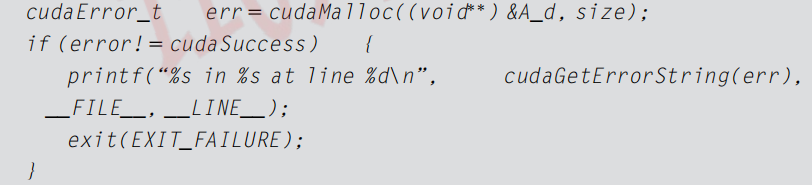
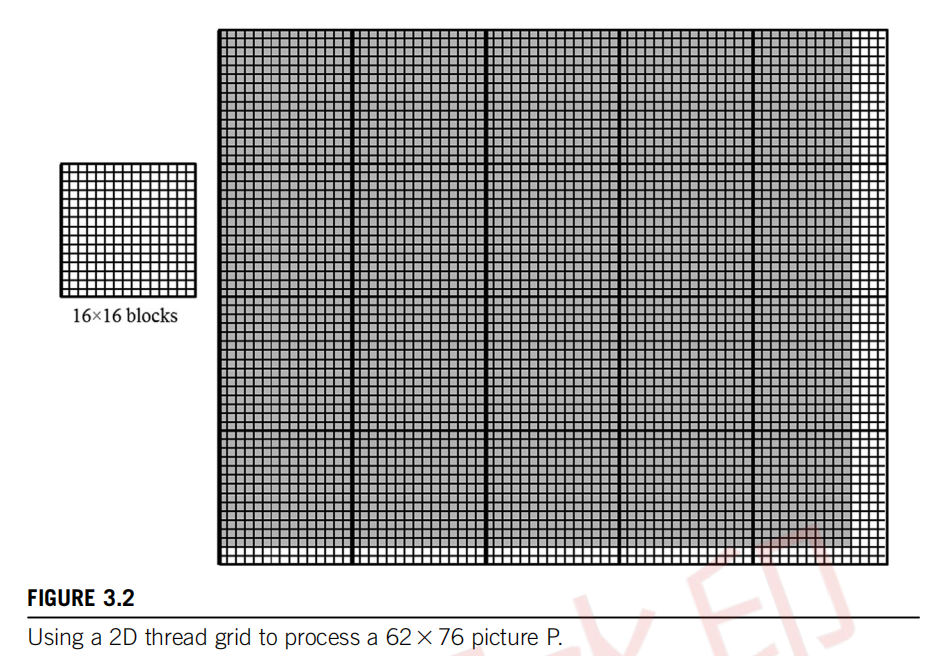
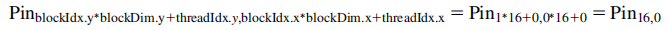
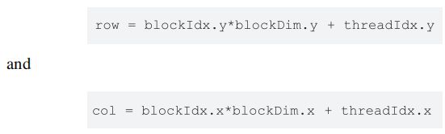
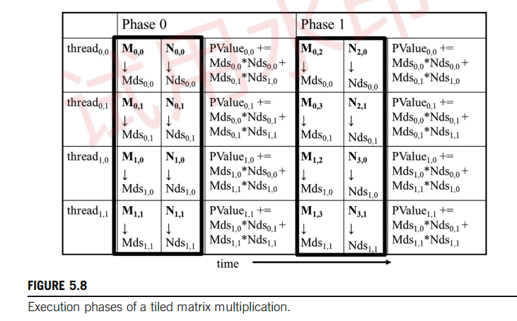
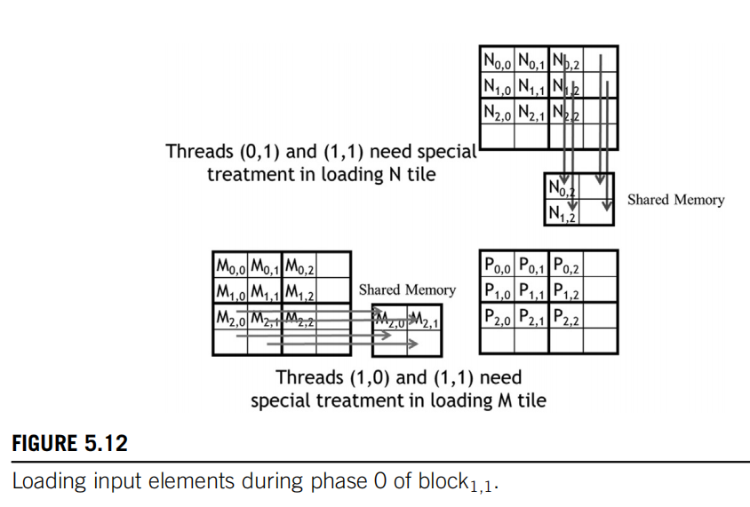
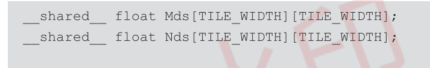
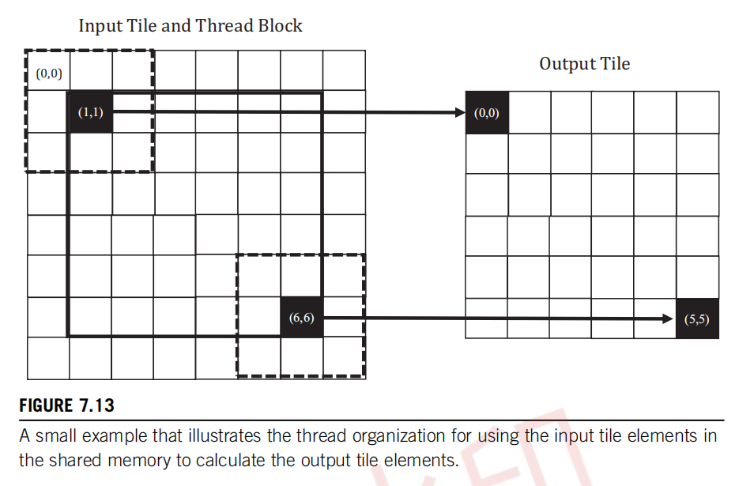

# 1 Introduction

## 1.1 异构并行计算

## 1.2 Why more speed or parallelism? 

## 1.3 加快实际应用程序

## 1.4 并行编程的挑战

并行编程为何困难？有人曾经说过，如果你不关心性能，那么并行编程就非常简单。你几乎可以在一个小时内写出一个并行程序。但是，如果你不关心性能，为什么要写一个并行程序呢？这本书将讨论在实现高性能并行编程时遇到的几个挑战。首先，设计具有与顺序算法相同算法（计算）复杂度的并行算法可能具有挑战性。许多并行算法执行的工作量与它们的顺序对应物相同。然而，一些并行算法做的工作比它们的顺序对应物更多。实际上，有时它们可能做了这么多额外的工作，以至于对于大型输入数据集来说，它们的运行速度最终会变慢。

这尤其是一个问题，因为快速处理大型输入数据集是并行编程的一个重要动机。例如，许多现实世界的问题最自然地用数学递归来描述。并行化这些问题通常需要非直观的方式来思考问题，并且可能需要在执行期间进行冗余工作。有一些重要的算法原语，如前缀和，可以促进将问题的顺序递归表述转换为更并行的形式。我们将在第11章“前缀和（扫描）”中更正式地介绍工作效率的概念，并说明设计并行算法时所涉及的方法和权衡，这些算法与它们的顺序对应物具有相同的计算复杂度。

其次，许多应用程序的执行速度受到内存访问延迟和/或吞吐量的限制。我们称这些应用程序为内存绑定；相比之下，计算绑定应用程序受到每字节数据执行的指令数量的限制。实现内存绑定应用程序的高性能并行执行通常需要提高内存访问速度的方法。我们将在第5章“内存架构和数据局部性”和第6章“性能考虑”中介绍内存访问优化技术，并将这些技术应用于几章中的并行模式和应用程序。

第三，与顺序对应物相比，并行程序的执行速度通常对输入数据特征更敏感。许多现实世界的应用程序需要处理具有广泛变化特征的输入，例如不稳定或不可预测的数据大小和不均匀的数据分布。这些大小和分布的变化可能导致并行线程被分配不均的工作量，并且可以显著降低并行执行的有效性。并行程序的性能有时可能因这些特征而发生巨大变化。我们将在介绍并行模式和应用程序的章节中介绍规范化数据分布和/或动态细化线程数量的技术，以解决这些挑战。

第四，一些应用程序可以在不需要跨不同线程的大量协作的情况下进行并行化。这些应用程序通常被称为“尴尬地并行”。其他应用程序需要线程相互协作，这需要使用同步操作，如屏障或原子操作。这些同步操作给应用程序带来了开销，因为线程经常发现自己在等待其他线程而不是执行有用的工作。我们将在整本书中讨论减少这种同步开销的各种策略。幸运的是，研究人员已经解决了大多数这些挑战。此外，跨应用领域有共同的模式，允许我们将在一个领域中派生出的解决方案应用于其他领域的挑战。这就是为什么我们将在重要并行计算模式和应用程序的上下文中介绍解决这些挑战的关键技术的主要原因。

## 1.5 相关的并行编程接口

在过去的几十年中，已经提出了许多并行编程语言和模型。其中最广泛使用的是OpenMP（开放，2005）用于共享内存多处理器系统，以及消息传递接口（MPI）（MPI，2009）用于可扩展的集群计算。两者都已成为由主要计算机供应商支持的标准编程接口。OpenMP的实现包括编译器和运行时系统。程序员向OpenMP编译器指定有关循环的指令（命令）和提示（pragmas）。有了这些指令和提示，OpenMP编译器生成并行代码。运行时系统通过管理并行线程和资源来支持并行代码的执行。OpenMP最初是为CPU执行设计的，并且已经扩展以支持GPU执行。OpenMP的主要优点是它提供了编译器自动化和运行时支持，以抽象出程序员的许多并行编程细节。这种自动化和抽象可以帮助使应用程序代码在不同供应商生产的系统之间以及同一供应商的不同代系统之间更具可移植性。我们称这种属性为性能可移植性。然而，有效的OpenMP编程仍然需要程序员理解所有涉及的详细并行编程概念。因为CUDA为程序员提供了这些并行编程细节的显式控制，所以它是一个极好的学习工具，即使对于那些希望将OpenMP作为他们主要编程接口的人也是如此。此外，根据我们的经验，OpenMP编译器仍在不断发展和改进。许多程序员可能需要在OpenMP编译器不足的领域使用类似CUDA的接口。另一方面，MPI是一个计算节点在集群中不共享内存的编程接口（MPI，2009）。所有数据共享和交互必须通过显式消息传递完成。MPI已在高性能计算（HPC）中得到广泛应用。用MPI编写的应用程序已成功在拥有超过100,000个节点的集群计算系统上运行。今天，许多HPC集群采用异构CPU/GPU节点。将应用程序移植到MPI所需的工作量可能相当高，因为计算节点之间缺乏共享内存。程序员需要执行域分解，将输入和输出数据分配到各个节点。基于域分解，程序员还需要调用消息发送和接收函数来管理节点之间的数据交换。相比之下，CUDA为GPU中的并行执行提供了共享内存，以解决这一困难。虽然CUDA是每个节点的有效接口，但大多数应用程序开发人员需要在集群级别使用MPI进行编程。此外，通过API（如NVIDIA集体通信库（NCCL））对CUDA的多GPU编程支持也在增加。因此，了解如何在现代计算集群中使用多GPU节点进行联合MPI/CUDA编程对于高性能计算领域的并行程序员来说很重要，这是第20章“编程异构计算集群”中介绍的主题。2009年，包括苹果、英特尔、AMD/ATI和NVIDIA在内的几个主要行业参与者联合开发了一个名为Open Compute Language（OpenCL）（The Khronos Group，2009）的标准化编程模型。与CUDA类似，OpenCL编程模型定义了语言扩展和运行时API，允许程序员管理大规模并行处理器中的并行性和数据传递。与CUDA相比，OpenCL更多地依赖API而不是语言扩展。这允许供应商快速适应他们现有的编译器和工具来处理OpenCL程序。OpenCL是一个标准化的编程模型，因为用OpenCL开发的应用可以正确运行，无需修改，就可以在所有支持OpenCL语言扩展和API的处理器上运行。然而，为了在新处理器上实现高性能，可能需要修改应用程序。熟悉OpenCL和CUDA的人都知道OpenCL和CUDA的关键概念和特性之间有着显著的相似性。也就是说，一个CUDA程序员可以以最小的努力学习OpenCL编程。更重要的是，几乎所有在使用CUDA中学到的技术都可以轻松地应用到OpenCL编程中。

## 1.6 总体目标

我们的主要目标是教会您，读者，如何编程大规模并行处理器以实现高性能。因此，本书的大部分内容都致力于开发高性能并行代码的技术。我们的方法不需要大量的硬件专业知识。然而，您需要对并行硬件架构有良好的概念理解，以便能够理解您的代码的性能行为。因此，我们将专门用一些篇幅来直观地理解硬件架构的基本特征，并用很多篇幅来介绍开发高性能并行程序的技术。特别是，我们将专注于计算思维（Wing，2006）技术，这将使您能够以适合在大规模并行处理器上高效执行的方式来思考问题。在大多数处理器上进行高性能并行编程需要一些硬件工作原理的知识。构建允许程序员在没有这种知识的情况下开发高性能代码的工具和机器可能需要很多年。即使我们拥有这样的工具，我们怀疑了解硬件的程序员将能够比那些不了解的人更有效地使用这些工具。因此，我们专门用第4章“计算架构和调度”来介绍GPU架构的基础知识。我们还将讨论更专业的架构概念，作为我们讨论高性能并行编程技术的一部分。

我们的第二个目标是教授并行编程以实现正确的功能和可靠性，这在并行计算中是一个微妙的问题。过去在并行系统上工作过的程序员知道，仅仅实现初始性能是不够的。挑战在于以一种方式实现它，以便您可以调试代码并支持用户。CUDA编程模型鼓励使用简单的屏障同步、内存一致性和原子性来管理并行性。此外，它提供了强大的工具，允许人们不仅调试功能的方面，还可以调试性能瓶颈。我们将展示通过专注于数据并行性，可以在应用程序中实现高性能和高可靠性。

我们的第三个目标是通过探索并行编程的方法来实现跨未来硬件代的可扩展性，以便未来的机器，将越来越并行，可以使您的代码比今天的机器运行得更快。我们希望帮助您掌握并行编程，使您的程序能够扩展到新一代机器的性能水平。这种可扩展性的关键是通过规范化和局部化内存数据访问来最小化对关键资源的消耗和数据结构更新中的冲突。因此，开发高性能并行代码的技术对于确保应用程序未来的可扩展性也很重要。实现这些目标需要大量的技术知识，因此，我们将在本书中介绍许多并行编程的原理和模式（Mattson等人，2004）。我们不会单独教授这些原理和模式。我们将在并行化有用应用程序的上下文中教授它们。然而，我们无法涵盖所有内容，因此我们已经选择了最有用和经过验证的技术来进行详细讨论。事实上，当前版本在并行模式方面有显著增加的章节数量。

我们已经准备好为您提供本书其余部分的快速概述。

1.7 书籍组织结构

本书分为四个部分。第一部分涵盖了并行编程的基本概念、数据并行性、GPU以及性能优化。这些基础章节为读者提供了成为GPU程序员所需的基本知识和技能。第二部分涵盖了原始并行模式，第三部分涵盖了更高级的并行模式和应用。这两部分应用了第一部分中学到的知识和技能，并根据需要引入了其他GPU架构特性和优化技术。最后一个部分，第四部分，介绍了高级实践，以完成希望成为专家级GPU程序员的读者的知识。

第1部分关于基本概念，包括第2至6章。第2章《异构数据并行计算》介绍了数据并行性和CUDA C编程。本章基于读者具有C编程的先验经验。它首先介绍了CUDA C作为C的简单、小型扩展，支持异构CPU/GPU计算和广泛使用的单程序、多数据并行编程模型。然后，它涵盖了涉及以下内容的思维过程：(1) 确定应用程序中要并行化的部分；(2) 隔离要由并行化代码使用的数据，使用API函数在并行计算设备上分配内存；(3) 使用API函数将数据传输到并行计算设备；(4) 将并行部分开发成将由并行线程执行的内核函数；(5) 启动内核函数以供并行线程执行；(6) 最终使用API函数调用将数据传回主机处理器。我们使用向量加法的运行示例来说明这些概念。虽然第2章的目标是教授足够的CUDA C编程模型概念，以便读者可以编写一个简单的并行CUDA C程序，但它涵盖了开发任何并行编程接口的并行应用程序所需的几个基本技能。第3章《多维网格和数据》介绍了CUDA并行执行模型的更多细节，特别是它与使用多维线程组织处理多维数据的关系。它提供了足够的洞察力，以创建、组织、绑定资源和绑定数据的线程，使读者能够使用CUDA C实现复杂的计算。第4章《计算架构和调度》介绍了GPU架构，重点是计算核心的组织方式以及线程如何在这些核心上执行的调度。讨论了各种架构考虑因素，以及它们对在GPU架构上执行的代码性能的影响。这些包括透明可扩展性、SIMD执行和控制分歧、多线程和延迟容忍度以及占用率等概念，这些都在本章中定义和讨论。第5章《内存架构和数据局部性》通过讨论GPU的内存架构，扩展了第4章《计算架构和调度》的内容。它还讨论了可用于持有CUDA变量以管理数据传递和提高程序执行速度的特殊内存。我们介绍了分配和使用这些内存的CUDA语言特性。适当使用这些内存可以大幅提高数据访问吞吐量，并有助于缓解内存系统中的流量拥堵。第6章《性能考虑》介绍了当前CUDA硬件的几个重要性能考虑因素。特别是，它更详细地介绍了线程执行和内存访问的期望模式。这些细节为程序员提供了概念基础，以便他们能够推理他们关于组织计算和数据的决策的后果。本章最后给出了一个常见优化策略的清单，GPU程序员经常使用这些策略来优化任何计算模式。这份清单将在整个书的后两部分中用来优化各种并行模式和应用。

第二部分关于原始并行模式，包括第7至12章。第7章《卷积》介绍了卷积，这是一种经常使用的并行计算模式，它源于数字信号处理和计算机视觉，并需要仔细管理数据访问局部性。我们还使用这种模式来介绍现代GPU中的常量内存和缓存。第8章《模板》介绍了模板模式，它与卷积类似，但源于解决微分方程，并具有特定的特征，为进一步优化数据访问局部性提供了独特的机会。我们还使用这种模式来介绍线程和数据的三维组织，并展示第6章《性能考虑》中引入的针对线程粒度的优化。第9章《并行直方图》涵盖了直方图，这是一种在统计数据分析以及大型数据集的模式识别中广泛使用的模式。我们还使用这种模式来介绍原子操作作为协调对共享数据并发更新的手段，以及减少这些操作开销的私有化优化。第10章《归约和最小化分歧》介绍了归约树模式，它用于总结一组输入数据。我们还使用这种模式来演示控制分歧对性能的影响，并展示如何减轻这种影响的技术。第11章《前缀和（扫描）》介绍了前缀和，或扫描，这是一个重要的并行计算模式，它将本质上的顺序计算转换为并行计算。我们还使用这种模式来介绍并行算法中工作效率的概念。最后，第12章《合并》涵盖了并行合并，这是一种在分而治之的工作划分策略中广泛使用的模式。我们还使用本章来介绍动态输入数据识别和组织。

第三部分关于高级并行模式和应用，与第二部分在精神上相似，但涵盖的模式更复杂，通常包括更多的应用上下文。因此这些章节不太侧重于介绍新技术或特性，而更侧重于特定于应用的考虑。对于每个应用，我们首先确定并行执行基本结构的不同表述方式，并讨论每种替代方案的优缺点。然后，我们将经历实现高性能所需的代码转换步骤。这些章节帮助读者将前面章节的所有材料整合在一起，并在他们承担自己的应用开发项目时为他们提供支持。第三部分包括第13至19章。第13章《排序》介绍了两种形式的并行排序：基数排序和归并排序。这种高级模式利用了前面章节中介绍的更原始的模式，特别是前缀和和并行合并。第14章《稀疏矩阵计算》介绍了稀疏矩阵计算，它广泛用于处理非常大的数据集。

第15章《图遍历》介绍了图算法以及如何在GPU编程中高效实现图搜索。讨论了多种并行化图算法的不同策略，并讨论了图结构对选择最佳算法的影响。这些策略建立在更原始的模式上，如直方图和合并。第16章《深度学习》涵盖了深度学习，这是GPU计算中变得越来越重要的一个领域。我们介绍了卷积神经网络的有效实现，并将在其他来源中进行更深入的讨论。卷积神经网络的有效实现利用了诸如平铺和卷积等模式的技术。第17章《迭代磁共振成像重建》涵盖了非笛卡尔MRI重建以及如何利用循环融合和分散-聚集转换等技术来增强并行性和减少同步开销。第18章《静电势图》涵盖了分子可视化和分析，这些技术从稀疏矩阵计算中受益，通过应用不规则数据的处理技术。第19章《并行编程和计算思维》介绍了计算思维，这是一种以更易于高性能计算的方式制定和解决计算问题的艺术。它通过涵盖组织程序的计算任务的概念，使它们可以并行完成。我们首先讨论将抽象科学、问题特定的概念转化为计算任务的转换过程，这是生产高质量应用软件，无论是串行还是并行的重要第一步。本章还讨论了并行算法结构及其对应用程序性能的影响，这基于CUDA的性能调整经验。虽然我们不深入讨论这些替代并行编程风格的实现细节，但我们期望读者能够通过在本书中获得的基础学会使用任何一种编程风格。我们还提供了一个高层次的案例研究，以展示通过创造性计算思维可以看到的机会。

第四部分关于高级实践，包括第20至22章。第20章《编程异构计算集群》涵盖了在异构集群上的CUDA编程，其中每个计算节点由CPU和GPU组成。我们讨论了与CUDA一起使用MPI来整合节点间计算和节点内计算以及由此产生的通信问题和实践。第21章《CUDA动态并行性》涵盖了动态并行性，这是GPU根据数据或程序结构动态为自己创建工作的能力，而不是总是等待CPU这样做。第22章《高级实践和未来发展》介绍了CUDA程序员需要了解的一些杂项高级功能和实践的列表。这些包括零拷贝内存、统一虚拟内存、多个内核的同时执行、函数调用、异常处理、调试、分析、双精度支持、可配置的缓存/暂存区大小等主题。例如，CUDA的早期版本在CPU和GPU之间提供了有限的共享内存能力。程序员需要显式管理CPU和GPU之间的数据传输。然而，当前版本的CUDA支持诸如统一虚拟内存和零拷贝内存等功能，实现CPU和GPU之间数据的无缝共享。有了这样的支持，CUDA程序员可以声明变量和数据结构为CPU和GPU共享。运行时硬件和软件根据需要自动维护一致性并执行优化的数据传输操作。这种支持显著降低了在计算和I/O活动期间重叠数据传输所涉及的编程复杂性。在教科书的介绍部分，我们使用显式数据传输的API，以便读者更好地理解底层发生的事情。我们稍后在第22章《高级实践和未来发展》中介绍统一虚拟内存和零拷贝内存。尽管本书中的章节基于CUDA，但它们帮助读者建立了一般并行编程的基础。我们相信，当我们通过具体示例学习时，人类理解得最好。也就是说，我们必须首先在特定的编程模型的上下文中学习概念，这为我们在将知识推广到其他编程模型时提供了坚实的基础。随着我们这样做，我们可以借鉴我们从CUDA示例中获得的具体经验。深入的CUDA经验还使我们能够获得成熟度，这将帮助我们学习可能甚至不适用于CUDA模型的概念。

第23章，结论与展望，对大规模并行编程的未来进行了总结和展望。我们首先回顾我们的目标，并总结这些章节如何结合在一起以帮助实现目标。然后，我们最后预测，这些在大规模并行计算方面的快速发展将使其成为未来十年最令人兴奋的领域之一。

# 2 异构数据并行计算

 数据并行性是指在数据集的不同部分上所要执行的计算工作可以相互独立地完成，从而可以相互并行地完成的现象。许多应用程序显示出大量的数据并行性，这使它们易于进行可伸缩的并行执行。因此，对于并行程序员来说，熟悉数据并行性的概念和用来编写利用数据并行性的代码的并行编程语言构造是很重要的。在本章中，我们将使用CUDA C语言构造来开发一个简单的数据并行程序。

## 2.1 数据并行性

数据并行性指的是在不同数据集的部分上执行的计算工作可以相互独立，因此可以并行完成的现象。许多应用程序展现出丰富的数据并行性，使它们适合于可扩展的并行执行。因此，对于并行程序员来说，熟悉数据并行性的概念以及用于编写代码利用数据并行性的并行编程语言结构非常重要。在本章中，我们将使用CUDA C语言结构来开发一个简单的数据并行程序。

当现代软件应用程序运行缓慢时，问题通常是数据——需要处理的数据量太大。图像处理应用程序处理的图像或视频包含数百万到数万亿像素。科学应用程序使用数十亿个网格点来模拟流体动力学。分子动力学应用程序必须模拟数千到数十亿个原子之间的相互作用。航空公司的调度涉及数千次航班、机组人员和机场登机口。这些像素、粒子、网格点、相互作用、航班等通常可以大部分独立处理。例如，在图像处理中，将彩色像素转换为灰度只需要该像素的数据。模糊图像需要将每个像素的颜色与附近像素的颜色平均，只需要该像素小邻域内的数据。甚至看似全局操作的，例如找出图像中所有像素的平均亮度，也可以分解为许多可以独立执行的较小计算。这种不同数据片段的独立评估是数据并行性的基础。编写数据并行代码需要（重新）组织计算，使其围绕数据进行，以便我们可以并行执行生成的独立计算，以更快地完成整个工作——通常要快得多。让我们通过一个将颜色转换为灰度的例子来说明数据并行性的概念。图2.1显示了一个由许多像素组成的彩色图像（左侧），每个像素包含红色、绿色和蓝色分数值（r, g, b），这些值从0（黑色）变化到1（完全强度）。要将彩色图像（图2.1左侧）转换为灰度图像（右侧），我们通过应用以下加权和公式计算每个像素的亮度值L：

\[ L = 0.21r + 0.72g + 0.07b \]

在RGB颜色表示中，图像中的每个像素都存储为(r, g, b)值的元组。图像的一行的格式是(r g b) (r g b) ... (r g b)，如图中所示。每个元组指定了红色(R)、绿色(G)和蓝色(B)的混合。也就是说，对于每个像素，r、g和b值表示在渲染像素时红色、绿色和蓝色光源的强度（0表示暗，1表示完全强度）。

实际上，这三种颜色的允许混合在行业指定的颜色空间中有所不同。在这里，AdobeRGB颜色空间中三种颜色的有效组合显示为三角形的内部。每个混合的垂直坐标（y值）和水平坐标（x值）显示了像素强度的分数，应该分配给G和R。剩余的分数（1-y-x）的像素强度应该分配给B。要渲染图像，每个像素的r、g、b值用于计算像素的总强度（亮度）以及混合系数（x，y，1-y-x)。

如果我们考虑输入是一个以RGB值数组I组织的图像，输出是一个相应的亮度值数组O，我们得到图2.2所示的简单计算结构。例如，O[0]是通过根据上述公式计算I[0]中RGB值的加权和生成的；O[1]是通过计算I[1]中RGB值的加权和生成的；O[2]是通过计算I[2]中RGB值的加权和生成的；以此类推。这些每个像素的计算彼此独立。显然，颜色到灰度的转换展现出丰富的数据并行性。当然，完整应用程序中的数据并行性可能更复杂，本书的大部分内容都致力于教授寻找和利用数据并行性的并行思维。

任务并行性与数据并行性 

并行性不是并行编程中使用的唯一类型。任务并行性也在并行编程中得到了广泛的应用。任务并行性通常通过应用程序的任务分解来暴露。例如，一个简单的应用程序可能需要执行向量加法和矩阵-向量乘法。如果这两个任务可以独立完成，那么就存在任务并行性。I/O和数据传输也是任务的常见来源。在大型应用程序中，通常有更多独立的任务，因此任务并行性的数量也更大。例如，在分子动力学模拟器中，自然任务列表包括振动力、旋转力、非键合力的邻近识别、非键合力、基于速度和位置的速度和位置等其他物理属性。通常，数据并行性是并行程序可扩展性的主要来源。对于大型数据集，通常可以找到丰富的数据并行性，以利用大规模并行处理器，并允许应用程序性能随着每一代硬件拥有更多的执行资源而增长。尽管如此，任务并行性在实现性能目标中也可以发挥重要作用。我们将在稍后介绍流时涵盖任务并行性。

## 2.2 CUDA C程序结构

我们现在已经准备好学习如何编写一个CUDA C程序来利用数据并行性来加速执行。CUDA C1扩展了流行的ANSI C编程语言，增加了最小的新语法和库函数，让程序员可以针对包含CPU核心和大规模并行GPU的异构计算系统进行编程。顾名思义，CUDA C是建立在NVIDIA的CUDA平台之上的。CUDA目前是大规模并行计算最成熟的框架。它在高性能计算行业中得到了广泛应用，拥有编译器、调试器和分析器等基本工具，这些工具在最常见的操作系统上都可用。CUDA C程序的结构反映了计算机中主机（CPU）和一台或多台设备（GPU）的共存。每个CUDA C源文件可以包含主机代码和设备代码的混合。默认情况下，任何传统的C程序都是只包含主机代码的CUDA程序。你可以在任何源文件中添加设备代码。设备代码用特殊的CUDA C关键字清楚地标记。设备代码包括函数，或者称为内核，其代码以数据并行的方式执行。CUDA程序的执行如图2.3所示。执行从主机代码（CPU串行代码）开始。当调用内核函数时，在设备上启动大量线程来执行内核。由内核调用启动的所有线程统称为网格。这些线程是CUDA平台上并行执行的主要工具。图2.3显示了两个网格线程的执行。我们很快将讨论这些网格是如何组织的。当网格的所有线程完成执行时，网格终止，执行继续在主机上进行，直到启动另一个网格。

注意图2.3显示了一个简化模型，其中CPU执行和GPU执行不重叠。许多异构计算应用程序管理重叠的CPU和GPU执行，以利用两者的优势。启动网格通常会产生许多线程来利用数据并行性。在颜色到灰度转换的例子中，每个线程可以用来计算输出数组O的一个像素。在这种情况下，应该由网格启动生成的线程数量等于图像中的像素数量。对于大图像，将生成大量线程。CUDA程序员可以假设这些线程的生成和调度只需要很少的时钟周期，这得益于高效的硬件支持。这与通常需要数千个时钟周期来生成和调度的传统CPU线程形成对比。在下一章中，我们将展示如何实现颜色到灰度转换和图像模糊内核。在本章的其余部分，我们将使用向量加法作为运行示例，以简化说明。

线程是现代计算机中处理器执行顺序程序的简化视图。一个线程由程序的代码、正在执行的代码点以及其变量和数据结构的值组成。就用户而言，线程的执行是顺序的。可以使用源级调试器通过一次执行一个语句、查看下一个将被执行的语句以及检查变量和数据结构的值来监控线程的进度。多年来，线程在编程中一直被使用。如果程序员想要在应用程序中开始并行执行，他/她将使用线程库或特殊语言创建和管理多个线程。在CUDA中，每个线程的执行也是顺序的。CUDA程序通过调用内核函数来启动并行执行，这会导致底层运行时机制在设备上启动一个线程网格，这些线程并行处理不同的数据部分。

## 2.3 向量加法内核

我们使用向量加法来演示CUDA C程序结构。向量加法可以说是最简单的可能的数据并行计算——与顺序编程中的“Hello World”等价。在我们展示向量加法的内核代码之前，先回顾一下传统向量加法（主机代码）函数的工作原理是很有帮助的。图2.4显示了一个简单的传统C程序，由一个主函数和一个向量加法函数组成。在我们的示例中，每当需要区分主机和设备数据时，我们将使用主机的变量名后缀“_h”，将设备使用的变量名后缀“_d”，以提醒我们这些变量的预期用途。由于图2.4中只有主机代码，我们只看到带有“_h”后缀的变量。

C语言中的指针 

在图2.4中，函数参数A、B和C是指针。在C语言中，指针可以用来访问变量和数据结构。虽然可以用以下方式声明一个浮点变量V：float V; 但可以用以下方式声明一个指针变量P：float * P; 通过将V的地址赋给P的语句P = &V，我们使P“指向”V。*P成为V的同义词。例如，U = *P将V的值赋给U。另一个例子，\*P = 3将V的值更改为3。在C程序中，可以通过指向其0元素的指针来访问数组。例如，语句P = &(A[0])使P指向数组A的0元素。P[i]成为A[i]的同义词。实际上，数组名A本身就是指向其0元素的指针。在图2.4中，将数组名A作为第一个参数传递给函数调用vecAdd，使函数的第一个参数A_h指向A的0元素。因此，函数体中的A_h[i]可以用来访问主函数中数组A的A[i]。有关C中指针详细使用的易于理解的解释，请参阅Patt和Patel（Patt和Patel，2020）。

假设要加的向量存储在A和B数组中，这些数组在主程序中被分配和初始化。输出向量在C数组中，也在主程序中被分配。为了简洁，我们没有展示A、B和C是如何在主函数中分配或初始化的细节。这些数组的指针被传递给vecAdd函数，以及包含向量长度的变量N。注意，vecAdd函数的参数带有“_h”后缀，以强调它们由主机使用。这种命名约定在我们接下来引入设备代码时将很有帮助。

图2.4中的vecAdd函数使用for循环遍历向量元素。在第i次迭代中，输出元素C_h[i]接收A_h[i]和B_h[i]的和。向量长度参数n用于控制循环，以便迭代次数与向量长度相匹配。该函数通过指针A_h、B_h和C_h分别读取A和B的元素，并写入C的元素。当vecAdd函数返回时，主函数中的后续语句可以访问C的新内容。

执行向量加法的一个直接方法是修改vecAdd函数，将其计算移动到设备上。这种修改后的vecAdd函数的结构如图2.5所示。第1部分在设备（GPU）内存中为A、B和C向量分配空间，并将A和B向量从主机内存复制到设备内存。第2部分调用实际的向量加法内核，以在设备上启动线程网格来执行实际的向量加法。第3部分将和向量C从设备内存复制到主机内存，并从设备内存中释放三个数组。

请注意，修订后的vecAdd函数本质上是一个外包代理，它将输入数据发送到设备，激活设备上的计算，并从设备收集结果。代理以一种方式这样做，使得主程序甚至不需要知道向量加法实际上是在设备上完成的。在实践中，这种“透明”的外包模型可能非常低效，因为所有的数据来回复制。通常，我们会将大型和重要的数据结构保留在设备上，并简单地从主机代码调用设备函数。然而，目前我们将使用简化的透明模型来介绍基本的CUDA C程序结构。修订后的函数的详细信息以及组成内核函数的方式将是本章其余部分的主题。

## 2.4 设备全局内存和数据传输

在当前的CUDA系统中，设备通常是硬件卡，它们配备了自己的动态随机存取内存，称为设备全局内存，或简称全局内存。例如，NVIDIA Volta V100配备了16GB或32GB的全局内存。将其称为“全局”内存是为了将其与程序员也可以访问的其他类型的设备内存区分开来。CUDA内存模型和不同类型设备内存的详细信息将在第5章“内存架构和数据局部性”中讨论。

对于向量加法内核，在调用内核之前，程序员需要在设备全局内存中分配空间，并将数据从主机内存传输到设备全局内存中分配的空间。这对应于图2.5的第1部分。类似地，在设备执行后，程序员需要将结果数据从设备全局内存传输回主机内存，并释放不再需要的设备全局内存中分配的空间。这对应于图2.5的第3部分。CUDA运行时系统（通常在主机上运行）提供了应用程序编程接口（API）函数，代表程序员执行这些活动。从这一点开始，我们将简单地说数据从主机传输到设备，作为将数据从主机内存复制到设备全局内存的简写。反之亦然。

在图2.5中，vecAdd函数的第1部分和第3部分需要使用CUDA API函数为A、B和C分配设备全局内存；将A和B从主机传输到设备；在向量加法后将C从设备传输到主机；并释放A、B和C的设备全局内存。我们首先将解释内存分配和释放函数。

图2.6展示了两个用于分配和释放设备全局内存的API函数。可以从主机代码中调用cudaMalloc函数为对象分配一块设备全局内存。读者应该注意到cudaMalloc与标准C运行库中的malloc函数之间的显著相似性。这是有意为之的；CUDA C是C语言的最小扩展。CUDA C使用标准C运行库的malloc函数来管理主机内存，并增加了cudaMalloc作为C运行库的扩展。通过尽可能保持与原始C运行库的接口接近，CUDA C最小化了C程序员重新学习这些扩展的使用时间。

cudaMalloc函数的第一个参数是要设置为指向已分配对象的指针变量的地址。指针变量的地址应该强制转换为(void **)，因为该函数期望一个通用指针；内存分配函数是一个通用函数，不限制于任何特定类型的对象。这个参数允许cudaMalloc函数将已分配内存的地址写入提供的指针变量，无论其类型如何。调用内核的主机代码将这个指针值传递给需要访问已分配内存对象的内核。cudaMalloc函数的第二个参数是要分配的数据的大小，以字节为单位。这个第二个参数的使用与C malloc函数的大小参数一致。

我们现在使用以下简单的代码示例来说明cudaMalloc和cudaFree的使用：

这是图2.5示例的延续。为了清晰起见，我们用“_d”后缀表示指针变量指向设备全局内存中的对象。传递给cudaMalloc的第一个参数是指针A_d的地址（即&A_d），并将其强制转换为void指针。当cudaMalloc返回时，A_d将指向为A向量分配的设备全局内存区域。传递给cudaMalloc的第二个参数是将要分配的区域的大小。由于大小是以字节为单位，程序员需要在确定size的值时，从数组的元素数量转换为字节数量。例如，在为n个单精度浮点元素数组分配空间时，size的值将为n乘以单精度浮点数的大小，而在当今的计算机中，单精度浮点数是4个字节。因此，size的值将为n*4。计算完成后，调用cudaFree并传递指针A_d作为参数，以释放A向量从设备全局内存中分配的存储空间。注意，cudaFree不需要改变A_d的值；它只需要使用A_d的值将已分配的内存返回到可用池中。因此，只有A_d的值而不是地址被传递为参数。

A_d、B_d和C_d中的地址指向设备全局内存中的位置。这些地址在主机代码中不应该被解引用。它们应该在调用API函数和内核函数时使用。在主机代码中解引用设备全局内存指针可能会引发异常或其他类型的运行时错误。

读者应该用类似的B_d和C_d指针变量声明以及相应的cudaMalloc调用完成图2.5中的第1部分。此外，图2.5的第3部分可以完成B_d和C_d的cudaFree调用。

一旦主机代码为数据对象在设备全局内存中分配了空间，它就可以请求将数据从主机传输到设备。这可以通过调用一个CUDA API函数来完成。图2.7显示了这样的API函数，即cudaMemcpy。cudaMemcpy函数接受四个参数。第一个参数是将要复制的数据对象的目标位置的指针。第二个参数指向源位置。第三个参数指定要复制的字节数。第四个参数指示参与复制的内存类型：主机到主机、主机到设备、设备到主机和设备到设备。例如，内存复制函数可以用来将数据从一个设备全局内存位置复制到设备全局内存中的另一个位置。

vecAdd 函数调用 cudaMemcpy 函数将 A_h 和 B_h 向量从主机内存复制到设备内存中的 A_d 和 B_d，然后进行加法运算，并将 C_d 向量从设备内存复制到主机内存中的 C_h。假设 A_h、B_h、A_d、B_d 和 size 的值已经像我们之前讨论的那样设置好了，那么三个 cudaMemcpy 调用如下所示。两个符号常量 cudaMemcpyHostToDevice 和 cudaMemcpyDeviceToHost 是 CUDA 编程环境中的预定义常量。请注意，通过正确地排列源指针和目标指针，并使用适当的传输类型常量，同一个函数可以用于双向数据传输。

概括而言，图2.4中的主要程序调用了在主机上执行的vecAdd。vecAdd函数的概要如图2.5所示，它在设备全局内存中分配空间，请求数据传输，并调用执行实际向量加法的核心函数。我们称这种类型的主机代码为调用核心函数的存根。我们在图2.8中展示了vecAdd函数的一个更完整的版本。

与图2.5相比，图2.8中的vecAdd函数对于第1部分和第3部分是完整的。第1部分为A_d、B_d和C_d在设备全局内存中分配空间，并将A_h传输到A_d，将B_h传输到B_d。这是通过调用cudaMalloc和cudaMemcpy函数完成的。鼓励读者编写自己的函数调用，并使用适当的参数值，并将他们的代码与图2.8中显示的代码进行比较。第2部分调用核心函数，将在随后的小节中描述。第3部分将向量和数据从设备复制到主机，以便在主函数中可以使用这些值。这是通过调用cudaMemcpy函数实现的。然后通过调用cudaFree函数（见图2.9）释放设备全局内存中A_d、B_d和C_d的内存。

CUDA中的错误检查和处理

一般来说，对于程序来说，检查和处理错误是非常重要的。 CUDA API函数在提供请求服务时返回标志，这些标志表明是否发生了错误。大多数错误是由于调用中使用了不适当的参数值。 为了简洁，我们的示例中不会显示错误检查代码。例如，图2.9显示了一个对cudaMalloc的调用： cudaMalloc((void**) &A_d, size); 实际上，我们应该用代码包围这个调用，以测试错误条件并打印出错误消息，这样用户就可以意识到发生了错误。以下是这样一个检查代码的简单版本：

这种方式下，如果系统没有足够的设备内存，用户将被告知情况。这可以节省很多调试时间。可以定义一个C宏来使源代码中的错误检查代码更加简洁。

## 2.5 内核函数和线程

在 CUDA C 中，核心函数指定了在并行阶段所有线程要执行的代码。由于所有这些线程执行相同的代码，CUDA C 编程是众所周知的单程序多数据（SPMD）（Atallah, 1998）并行编程风格的一个实例，这是并行计算系统中流行的编程风格。当程序的主机代码调用一个核心函数时，CUDA 运行时系统启动了一个线程网格，这些线程被组织成两级层次结构。每个网格被组织成一个线程块的数组，我们将简称为“块”。所有网格的块大小相同；在当前系统中，每个块最多可以包含 1024 个线程。图 2.9 显示了一个示例，其中每个块由 256 个线程组成。每个线程由一个从标记有线程在块中索引号的框中延伸出来的卷曲箭头表示。

许多编程语言都有内置变量。这些变量具有特殊的含义和目的。这些变量的值通常由运行时系统预先初始化，并且在程序中通常是只读的。程序员应该避免为其他目的重新定义这些变量。'

当调用核心函数时，主机代码指定了每个线程块中的线程总数。同一个核心函数可以在主机代码的不同部分用不同数量的线程调用。对于给定的线程网格，块中的线程数可以在内置变量blockDim中获取。blockDim变量是一个结构体，包含三个无符号整数字段（x、y和z），这些字段帮助程序员将线程组织成一维、二维或三维数组。对于一维组织，只使用x字段。对于二维组织，使用x和y字段。对于三维结构，使用所有三个x、y和z字段。组织线程的维度选择通常反映数据的维度。这是有意义的，因为线程是为了并行处理数据而创建的，所以线程的组织反映数据的组织是很自然的。在图2.9中，每个线程块被组织成一维线程数组，因为数据是一维向量。blockDim.x变量的值表示每个块中的线程总数，图2.9中是256。通常建议，出于硬件效率的原因，每个线程块的每个维度的线程数应该是32的倍数。我们稍后将重新讨论这一点。

CUDA核心函数可以访问两个额外的内置变量（threadIdx和blockIdx），这些变量允许线程相互区分并确定每个线程要处理的数据区域。threadIdx变量为块内的每个线程提供了一个唯一的坐标。在图2.9中，由于我们使用的是一维线程组织，因此只使用threadIdx.x。图2.9中每个线程的小阴影框内显示了每个线程的threadIdx.x值。每个块中的第一个线程的threadIdx.x变量值为0，第二个线程的值为1，第三个线程的值为2，以此类推。

> CUDA线程的层次化组织
> 像CUDA线程一样，许多现实世界的系统也是层次化组织的。美国的电话系统是一个很好的例子。在最顶层，电话系统由“区”组成，每个区对应一个地理区域。同一区内的所有电话线都有相同的3位数字“区号”。有时一个电话区比一个城市还要大。例如，伊利诺伊州中部的许多县和城市都位于同一个电话区，共享相同的区号217。在一个区内，每部电话线都有一个七位数字的本地电话号码，这使得每个区最多可以有大约一千万号码。
> 我们可以将每部电话线想象成CUDA线程，区号作为blockIdx的值，七位数字的本地号码作为threadIdx的值。这种层次化组织允许系统拥有非常大量的电话线，同时保持了对同一区呼叫的“局部性”。也就是说，当拨打同一区内的电话线时，拨打者只需要拨打本地号码。只要我们大多数电话都在本地区内拨打，我们很少需要拨打区号。如果我们偶尔需要拨打其他区的电话线，我们拨打1和区号，然后是本地号码。（这就是为什么任何区内的本地号码都不应以1开头的原因。）CUDA线程的层次化组织也提供了一种局部性。我们将很快研究这种局部性。

blockIdx变量为块中的所有线程提供了一个共同的块坐标。在图2.9中，第一个块中的所有线程在它们的blockIdx.x变量中的值都是0，第二个线程块中的值为1，以此类推。使用电话系统的类比，我们可以将threadIdx.x视为本地电话号码，将blockIdx.x视为区号。两者结合在一起，为全国的每条电话线提供了一个唯一的电话号码。类似地，每个线程可以结合它的threadIdx和blockIdx值，为自己在整个网格中创建一个唯一的全局索引。

在图2.9中，一个唯一的全局索引i被计算为\[i = blockIdx.x \times blockDim.x + threadIdx.x\]。回想一下，在我们的示例中blockDim是256。块0中的线程的i值范围从0到255。块1中的线程的i值范围从256到511。块2中的线程的i值范围从512到767。也就是说，这三个块中的线程的i值形成了从0到767的连续覆盖。由于每个线程使用i来访问A、B和C，这些线程覆盖了原始循环的前768次迭代。通过启动包含更多块的网格，可以处理更大的向量。通过启动包含n或更多线程的网格，可以处理长度为n的向量。

图2.10显示了一个用于向量加法的核心函数。注意，我们在核心函数中不使用“_h”和“_d”的约定，因为不会产生混淆。在我们的示例中，我们将不会访问主机内存。核心函数的语法是ANSI C，带有一些值得注意的扩展。首先，在vecAddKernel函数的声明前有一个CUDA-C特定的关键字“__global__”。这个关键字表明该函数是一个核心函数，并且可以被调用以在设备上生成线程网格。

CUDA C通过三个限定符关键字扩展了C语言，这些关键字可以用于函数声明。这些关键字的含义总结在图2.11中。"__global__"关键字表明正在声明的函数是一个CUDA C核心函数。注意"global"这个词两边各有两个下划线字符。这样的核心函数在设备上执行，并且可以从主机调用。在支持动态并行的CUDA系统中，它也可以从设备调用，正如我们将在第21章"CUDA动态并行"中看到的那样。重要的特点是调用这样的核心函数会导致在设备上启动一个新的线程网格。

"__device__"关键字表明正在声明的函数是一个CUDA设备函数。设备函数在CUDA设备上执行，并且只能从核心函数或其他设备函数中调用。设备函数由调用它的设备线程执行，并且不会导致启动任何新的设备线程。

"__host__"关键字表明正在声明的函数是一个CUDA主机函数。主机函数是一个传统的C函数，它在主机上执行，并且只能从另一个主机函数中调用。默认情况下，如果它们的声明中没有任何CUDA关键字，CUDA程序中的所有函数都是主机函数。这是有意义的，因为许多CUDA应用程序是从仅CPU执行环境移植过来的。程序员在移植过程中会添加核心函数和设备函数。原始函数仍然作为主机函数保留。让所有函数默认为主机函数可以节省程序员修改所有原始函数声明的繁琐工作。

需要注意的是，可以在函数声明中同时使用“__host__”和“__device__”。这种组合告诉编译系统为同一个函数生成两个版本的目标代码。一个在主机上执行，并且只能从主机函数中调用。另一个在设备上执行，并且只能从设备或核心函数中调用。这支持了一个常见的用例，即相同的函数源代码可以重新编译以生成设备版本。许多用户库函数可能会属于这一类。

图2.10中的第二个值得注意的C语言扩展是内置变量“threadIdx”、“blockIdx”和“blockDim”。回想一下，所有线程都执行相同的核心代码，需要有一种方式让它们相互区分，并将每个线程引导到数据的特定部分。这些内置变量是线程访问提供标识坐标的硬件寄存器的方式。不同的线程在其threadIdx.x、blockIdx.x和blockDim.x变量中会看到不同的值。为了可读性，我们有时会在讨论中将一个线程称为$thread_{blockIdx.x、threadIdx.x}$。

在图2.10中，有一个自动（局部）变量i。在CUDA核心函数中，自动变量是每个线程私有的。也就是说，将为每个线程生成i的一个版本。如果网格以10,000个线程启动，将会有10,000个i的版本，每个线程一个。一个线程分配给它的i变量的值对其他线程是不可见的。我们将在第5章“内存架构和数据局部性”中更详细地讨论这些自动变量。

通过比较图2.4和图2.10，可以揭示CUDA核心函数的一个重要见解。图2.10中的核心函数没有与图2.4中的循环相对应的循环。读者应该问循环去哪儿了。答案是循环现在被线程网格取代了。整个网格形成了循环的等价物。网格中的每个线程对应原始循环的一个迭代。这有时被称为循环并行性，其中原始顺序代码的迭代由线程并行执行。

注意，在图2.10中的addVecKernel有一个if (i < n)语句。这是因为并非所有向量长度都可以表示为块大小的倍数。例如，假设向量长度为100。最小的有效线程块维度是32。假设我们选择32作为块大小。需要启动四个线程块来处理所有100个向量元素。然而，这四个线程块将有128个线程。我们需要禁用第三个线程块中的最后28个线程执行原始程序不期望的工作。由于所有线程都要执行相同的代码，所有线程都将测试它们的i值与n（即100）的关系。有了if (i < n)语句，前100个线程将执行加法，而最后28个则不会。这允许核心函数被调用以处理任意长度的向量。

## 2.6调用内核函数

实现了核心函数后，剩余的步骤是从主机代码中调用该函数以启动网格。这在图2.12中有所说明。当主机代码调用核心函数时，它通过执行配置参数设置网格和线程块的维度。配置参数在传统C函数参数之前的“<<< , , >>>”和“...”之间给出。第一个配置参数给出了网格中的块数。第二个指定了每个块中的线程数。在这个例子中，每个块中有256个线程。为了确保我们有足够的线程覆盖所有的向量元素，我们需要将网格中的块数设置为所需线程数（在这种情况下是n）除以线程块大小（在这种情况下是256）的向上取整（将商向上取整到最近的更高整数值）。执行向上取整除法有很多方法。一种方法是将C语言的向上取整函数应用于n/256.0。使用浮点值256.0确保我们为除法生成一个浮点值，以便向上取整函数可以正确地向上取整。例如，如果我们想要1000个线程，我们将启动ceil(1000/256.0) = 4个线程块。因此，该语句将启动4 * 256 = 1024个线程。在核心函数中如图2.10所示的if (i < n)语句，前1000个线程将对1000个向量元素执行加法。其余的24个线程将不会执行。

图 2.13 显示了 vecAdd 函数中的最终主机代码。这段源代码完成了图 2.5 中的框架。图 2.12 和 2.13 共同展示了一个简单的 CUDA 程序，它由主机代码和一个设备内核组成。代码被硬编码为使用每个线程块 256 个线程。 然而，使用的线程块数量取决于向量的长度（n）。如果 n 是 750，将使用三个线程块。如果 n 是 4000，将使用 16 个线程块。如果 n 是 2,000,000，则将使用 7813 个线程块。需要注意的是，所有线程块都在向量的不同部分上操作。它们可以以任意顺序执行。程序员不得对执行顺序做出任何假设。一个拥有少量执行资源的小 GPU 可能只能并行执行一个或两个这些线程块。一个更大的 GPU 可能并行执行 64 或 128 个线程块。这使得 CUDA 内核在执行速度上具有可扩展性。也就是说，相同的代码在小 GPU 上运行速度较慢，在大 GPU 上运行速度较快。我们将在第 4 章“计算架构和调度”中再次讨论这一点。

再次强调，向量加法示例之所以被使用，是因为它简单。在实践中，分配设备内存、从主机到设备输入数据传输、从设备到主机输出数据传输以及释放设备内存的开销可能会使最终代码比图 2.4 中的原始顺序代码慢。这是因为内核执行的计算量相对于处理或传输的数据量来说是很小的。对于两个浮点输入操作数和一个浮点输出操作数，只执行一次加法。实际应用通常具有内核，相对于处理的数据量，需要更多的工作，这使得额外的开销是值得的。实际应用也倾向于在多次内核调用之间保持数据在设备内存中，以便可以分摊开销。我们将展示几个这样的应用示例。

## 2.7 编译

我们已经看到，实现 CUDA C 内核需要使用各种扩展，这些扩展不是 C 语言的一部分。一旦这些扩展在代码中使用，传统的 C 编译器就不再接受它。代码需要由一个能够识别和理解这些扩展的编译器来编译，比如 NVCC（NVIDIA C 编译器）。正如图 2.14 顶部所示，NVCC 编译器处理一个 CUDA C 程序，使用 CUDA 关键字来分隔主机代码和设备代码。主机代码是直接的 ANSI C 代码，使用主机的标准 C/C++ 编译器进行编译，并作为传统的 CPU 进程运行。设备代码，用 CUDA 关键字标记，这些关键字指定 CUDA 内核及其相关的辅助函数和数据结构，由 NVCC 编译成称为 PTX 文件的虚拟二进制文件。这些 PTX 文件进一步由 NVCC 的运行时组件编译成真实的对象文件，并在支持 CUDA 的 GPU 设备上执行。

## 2.8总结

### 2.8.1 函数声明
CUDA C 扩展了 C 函数声明语法以支持异构并行计算。这些扩展在图 2.12 中进行了总结。使用 " __global__ "、" __device__ " 或 " __host__ " 中的一个，CUDA C 程序员可以指示编译器生成内核函数、设备函数或主机函数。所有没有这些关键字的函数声明默认为主机函数。如果一个函数声明中同时使用了 " __host__ " 和 " __device__ "，则编译器会为设备和主机生成两个版本的函数。如果一个函数声明没有任何 CUDA C 扩展关键字，则函数默认为主机函数。

### 2.8.2 内核调用和网格启动
CUDA C 扩展了 C 函数调用语法，通过在<< >>中包含内核执行配置参数。这些执行配置参数仅在调用内核函数以启动网格时使用。我们讨论了定义网格维度和每个块维度的执行配置参数。读者应参考 CUDA 编程指南（NVIDIA，2021）以获取有关内核启动扩展以及其他类型的执行配置参数的更多详细信息。

### 2.8.3 内置（预定义）变量
CUDA 内核可以访问一组内置的、预定义的只读变量，这些变量允许每个线程区分自己与其他线程，并确定要处理的数据区域。我们在本章讨论了 threadIdx、blockDim 和 blockIdx 变量。在第 3 章“多维网格和数据”中，我们将讨论使用这些变量的更多细节。

### 2.8.4运行时应用程序编程接口

CUDA 提供了一系列 API 函数，为 CUDA C 程序提供服务。本章中我们讨论了 cudaMalloc、cudaFree 和 cudaMemcpy 函数。这些函数由主机代码调用，分别用于分配设备全局内存、释放设备全局内存以及代表调用程序在主机和设备之间传输数据。读者可以参考 CUDA C 编程指南了解更多其他 CUDA API 函数。

本章的目标是介绍 CUDA C 的核心概念以及编写简单 CUDA C 程序所必需的 CUDA 扩展。本章绝不是 CUDA 所有特性的全面概述。书中的其余部分将涵盖其中的一些特性。然而，我们将重点放在这些特性所支持的关键并行计算概念上。我们将只介绍并行编程技术示例代码中所需的 CUDA C 特性。通常，我们希望鼓励读者始终参考 CUDA C 编程指南以获取更多 CUDA C 特性的详细信息。

# 3 多维网格和数据

在第2章“异构数据并行计算”中，我们学习了如何编写一个简单的CUDA C 11程序，通过调用内核函数来启动一维线程网格，以操作一维数组的元素。内核指定了网格中每个单独线程执行的语句。在本章中，我们将更一般地了解线程是如何组织的，并学习如何使用线程和块来处理多维数组。整个章节中将使用多个示例，包括将彩色图像转换为灰度图像、模糊图像和矩阵乘法。这些示例还有助于让读者在讨论即将到来的GPU架构、内存组织和性能优化之前，熟悉数据并行性推理。

## 3.1多维网格组织

在 CUDA 中，网格中的所有线程都执行相同的内核函数，并且它们依赖于坐标，即线程索引，来区分彼此并识别要处理的数据的适当部分。正如我们在第 2 章“异构数据并行计算”中看到的，这些线程被组织成两级层次结构：一个网格由一个或多个块组成，每个块由一个或多个线程组成。一个块中的所有线程共享相同的块索引，可以通过 blockIdx（内置）变量访问。每个线程还有一个线程索引，可以通过 threadIdx（内置）变量访问。当一个线程执行内核函数时，对 blockIdx 和 threadIdx 变量的引用将返回线程的坐标。内核调用语句中的执行配置参数指定了网格的维度和每个块的维度。这些维度可以通过 gridDim 和 blockDim（内置）变量获得。

在一般情况下，网格是一个三维（3D）的块数组，每个块是一个三维（3D）的线程数组。在调用内核时，程序需要指定网格和每个维度的块的大小。这些通过内核调用语句的执行配置参数（在<< >>中...）来指定。第一个执行配置参数指定了网格的维度，以块的数量来表示。第二个参数指定了每个块的维度，以线程的数量来表示。每个这样的参数都是dim3类型，这是一个包含三个元素x、y和z的整数向量类型。这三个元素指定了三个维度的大小。程序员可以通过将未使用的维度的大小设置为1来使用少于三个维度。

例如，以下主机代码可以用来调用 `vecAddkernel()` 内核函数，并生成一个1D网格，该网格由32个块组成，每个块包含128个线程。网格中的总线程数是 $(128 \times 32 = 4096)$。

请注意，dimBlock 和 dimGrid 是由程序员定义的主机代码变量。这些变量可以有任何合法的 C 变量名称，只要它们具有 dim3 类型。例如，以下语句与上述语句达到相同的结果：

网格和块的维度也可以从其他变量计算得出。例如，图 2.12 中的内核调用可以写成以下形式

这允许块的数量根据向量的大小变化，以便网格有足够的线程来覆盖所有向量元素。在这个例子中，程序员选择将块大小固定在256。内核调用时变量 n 的值将决定网格的维度。如果 n 等于1000，网格将由四个块组成。如果 n 等于4000，网格将有16个块。在每种情况下，都有足够的线程来覆盖所有的向量元素。一旦网格被启动，网格和块的维度将保持不变，直到整个网格完成执行。

为了方便，CUDA 提供了一个特殊捷径来调用具有一维（1D）网格和块的内核。而不是使用 dim3 变量，可以使用算术表达式来指定1D网格和块的配置。在这种情况下，CUDA 编译器简单地将算术表达式作为 x 维度，并假定 y 和 z 维度为 1。这给我们带来了图 2.12 所示的内核调用语句：

了解 C++ 的读者会意识到，这种“简写”约定利用了 C++ 构造函数和默认参数的工作原理。`dim3` 构造函数的参数默认值是 1。当在期望 `dim3` 的地方传递单个值时，该值将传递给构造函数的第一个参数，而第二和第三个参数则取默认值 1。结果是创建了一个一维网格或块，其中 x 维度的大小是传递的值，而 y 和 z 维度的大小为 1。

在内核函数内部，变量 `gridDim` 和 `blockDim` 的 x 字段根据执行配置参数的值预先初始化。例如，如果 n 等于 4000，那么在 `vectAddkernel` 内核中对 `gridDim.x` 和 `blockDim.x` 的引用将分别产生 16 和 256。需要注意的是，与主机代码中的 `dim3` 变量不同，这些变量在内核函数内的名称是 CUDA C 规范的一部分，不能更改。也就是说，`gridDim` 和 `blockDim` 是内核中的内置变量，始终反映网格和块的维度。

在 CUDA C 中，gridDim.x 的允许值范围从 1 到 \(2^{31} - 2\)，而 gridDim.y 和 gridDim.z 的允许值范围从 1 到 \(2^{16} - 1\)（即 65,535）。一个块内的所有线程共享相同的 blockIdx.x、blockIdx.y 和 blockIdx.z 值。在不同的块之间，blockIdx.x 的值范围从 0 到 gridDim.x-1，blockIdx.y 的值范围从 0 到 gridDim.y-1，blockIdx.z 的值范围从 0 到 gridDim.z-1。

我们现在转向块的配置。每个块被组织成一个三维的线程数组。可以通过将 blockDim.z 设置为 1 来创建二维块。通过将 blockDim.y 和 blockDim.z 都设置为 1，可以创建一维块，如 vectorAddkernel 示例所示。正如我们之前提到的，网格中的所有块具有相同的维度和大小。块中每个维度的线程数由内核调用时的第二个执行配置参数指定。在内核内，这个配置参数可以作为 blockDim 的 x、y 和 z 字段访问。

当前 CUDA 系统中，一个块的总大小限制为 1024 个线程。这些线程可以以任何方式分布在三个维度上，只要总线程数不超过 1024。例如，blockDim 值 (512, 1, 1)、(8, 16, 4) 和 (32, 16, 2) 都是允许的，但是 (32, 32, 2) 是不允许的，因为总线程数将超过 1024。

网格和它的块不需要具有相同的维度。网格可以具有比其块更高的维度，反之亦然。例如，图 3.1 显示了一个具有 gridDim (2, 2, 1) 和 blockDim (4, 2, 2) 的小型玩具网格示例。这样的网格可以使用以下主机代码创建：

图 3.1 中的网格由四个块组成，这些块被组织成一个 2x2 的数组。每个块用 (blockIdx.y, blockIdx.x) 进行标记。例如，块 (1,0) 的 blockIdx.y 为 1，blockIdx.x 为 0。注意，块和线程标签的顺序是最高维度在前。这种标记方法与 C 语句中设置配置参数时使用的顺序相反，后者是最低维度在前。这种相反的标记顺序在说明线程坐标映射到多维数据索引时更有效。

每个 threadIdx 也包含三个字段：x 坐标 threadId.x，y 坐标 threadIdx.y，以及 z 坐标 threadIdx.z。图 3.1 展示了块内线程的组织方式。在这个例子中，每个块被组织成 4x2x2 的线程数组。由于网格内所有块的维度相同，我们只展示了其中一个。图 3.1 展开块 (1,1) 来展示它的 16 个线程。例如，线程 (1,0,2) 的 threadIdx.z 为 1，threadIdx.y 为 0，threadIdx.x 为 2。注意，在这个例子中我们有 4 个块，每个块有 16 个线程，总共有 64 个线程在网格中。我们使用这些小数字以保持插图简单。典型的 CUDA 网格包含数千到数百万线程。

## 3.2 将线程映射到多维数据

选择一维（1D）、二维（2D）或三维（3D）线程组织通常基于数据的性质。例如，图片是像素的二维数组。使用由二维块组成的二维网格通常方便于处理图片中的像素。图 3.2 显示了处理一个 62x76 像素的图片 P 的这种安排（垂直或 y 方向上有 62 个像素，水平或 x 方向上有 76 个像素）。假设我们决定使用 16x16 的块，x 方向上有 16 个线程，y 方向上有 16 个线程。我们需要 y 方向上的四个块和 x 方向上的五个块，这将产生 4x5，共 20 个块，如图 3.2 所示。粗线标记了块的边界。阴影区域描绘了覆盖像素的线程。每个线程被分配处理一个像素，其 y 和 x 坐标是从其 blockIdx、blockDim 和 threadIdx 变量值派生出来的：

[^]: 我们将按降序引用多维数据的维数：z维数后跟y维数，以此类推。例如，对于垂直或y维度的n个像素和水平或x维度的m个像素的图片，我们将其称为n 3 m的图片。这遵循了C多维数组索引约定。例如，为了简洁起见，我们可以在文本和数字中将x称为Py，x。不幸的是，这种排序顺序与数据维度在网格维度和块维度中的排序顺序相反。当我们根据要由线程处理的多维数组来定义线程网格的维度时，这种差异可能尤其令人困惑。

例如，由块 (1,0) 中的线程 (0,0) 要处理的像素元素可以按以下方式确定：

请注意，在图 3.2 中，我们在 y 方向上有两个额外的线程，在 x 方向上有四个额外的线程。也就是说，我们将生成 64x80 个线程来处理 62x76 个像素。这类似于在图 2.9 中使用四个 256 线程块的一维内核 vecAddKernel 处理 1000 元素向量的情况。回想一下，在图 2.10 中需要一个 if 语句来防止额外的 24 个线程产生影响。类似地，我们应该预期图像处理内核函数将有 if 语句来测试线程的垂直和水平索引是否落在像素的有效范围内。

我们假设主机代码使用一个整数变量 n 来跟踪 y 方向上的像素数，另一个整数变量 m 来跟踪 x 方向上的像素数。我们进一步假设输入图像数据已经被复制到设备全局内存，并且可以通过指针变量 Pin_d 访问。输出图像已经在设备内存中分配，并且可以通过指针变量 Pout_d 访问。以下主机代码可以用来调用一个 2D 内核 colorToGrayscaleConversion 来处理图像，如下所示：

在本例中，我们为了简单起见假设块的尺寸固定为 16x16。另一方面，网格的尺寸取决于图片的尺寸。为了处理一个 1500x2000（300 万像素）的图片，我们将生成 11,750 个块：y 方向上有 94 个块，x 方向上有 125 个块。在内核函数中，对 gridDim.x、gridDim.y、blockDim.x 和 blockDim.y 的引用将分别产生 125、94、16 和 16。

在我们展示内核代码之前，我们首先需要理解 C 语句如何访问动态分配的多维数组的元素。理想情况下，我们希望能够将 Pin_d 作为一个二维数组访问，其中行 j 和列 i 的元素可以作为 Pin_d[j][i] 访问。然而，基于 ANSI C 标准的 CUDA C 开发要求在编译时就知道 Pin 中的列数，以便将 Pin 作为二维数组访问。不幸的是，对于动态分配的数组来说，编译时并不知道这个信息。实际上，使用动态分配数组的部分原因正是为了允许这些数组的大小和维度根据运行时的数据大小而变化。

因此，设计上编译时并不知道动态分配的二维数组的列数。结果，程序员需要明确地将动态分配的二维数组“展平”或“线性化”为等价的一维数组，这在当前的 CUDA C 中是必需的。

实际上，C 中的所有多维数组都是线性化的。这是由于现代计算机使用“平面”内存空间（见“内存空间”侧边栏）。在静态分配的数组的情况下，编译器允许程序员使用更高维度的索引语法，例如 Pin_d[j][i]，来访问它们的元素。在幕后，编译器将它们线性化为等价的一维数组，并将多维索引语法转换为一维偏移。在动态分配的数组的情况下，由于编译时缺乏维度信息，当前的 CUDA C 编译器将这种转换工作留给了程序员。

> 内存空间
> 内存空间是现代计算机中处理器访问其内存的简化视图。通常，每个运行的应用程序都与一个内存空间相关联。应用程序要处理的数据和执行的指令都存储在其内存空间的位置中。每个位置通常可以容纳一个字节，并具有一个地址。需要多个字节的变量——浮点数4个字节，双精度数8个字节——存储在连续的字节位置中。当从内存空间访问数据值时，处理器给出起始地址（起始字节位置的地址）和所需的字节数。
> 大多数现代计算机至少有4G字节大小的位置，其中每个G是1,073,741,824（2的30次方）。所有位置都标有从0到最大使用数字的地址。由于每个位置只有一个地址，我们说内存空间具有“平坦”的组织。因此，所有多维数组最终都被“展平”成等价的一维数组。虽然C程序员可以使用多维数组语法来访问多维数组的元素，但编译器将这些访问转换为指向数组起始元素的基本指针，以及从这些多维索引计算出的一维偏移量。

有两种方法可以将二维数组线性化。一种是将同一行的所有元素放置在连续的位置。然后将这些行一个接一个地放入内存空间。这种排列方式称为行主序布局，如图3.3所示。为了提高可读性，我们使用Mj,i来表示M的第j行第i列的元素。Mj,i等同于C语言表达式M[j][i]，但更易于阅读。图3.3展示了一个4x3x4矩阵M被线性化为一个16元素的一维数组的例子，首先是第0行的所有元素，然后是第1行的四个元素，以此类推。

因此，M的第j行第i列的元素的一维等价索引是$j \times 4 + i$。j乘以4的项跳过第j行之前的所有行的元素。然后i项在选择第j行部分内的正确元素。例如，M2,1的一维索引是$2 \times 4 + 1 = 9$。这在图3.3中被说明，其中M9是M2,1的一维等价。这是C编译器线性化二维数组的方式。

另一种将二维数组线性化的方法是将同一列的所有元素放置在连续的位置。然后这些列一个接一个地放入内存空间。这种排列方式称为列主序布局，由FORTRAN编译器使用。请注意，二维数组的列主序布局等同于其转置形式的行主序布局。我们不会在这个问题上花费更多时间，只是提醒那些主要以前的编程经验是使用FORTRAN的读者，CUDA C使用行主序布局而不是列主序布局。此外，许多设计用于FORTRAN程序的C库使用列主序布局以匹配FORTRAN编译器的布局。因此，这些库的手册页面通常告诉用户，如果他们从C程序调用这些库，就需要转置输入数组。

我们现在准备研究图3.4中显示的colorToGrayscaleConversion的源代码。内核代码使用以下公式将每个颜色像素转换为其灰度对应物：

在水平方向上总共有blockDim.x * gridDim.x个线程。 类似于vecAddKernel示例，以下表达式生成从0到blockDim.x * gridDim.x - 1的所有整数值（第06行）：

我们知道gridDim.x * blockDim.x大于或等于宽度（从主机代码传入的m值）。我们在水平方向上的线程数量至少与像素数量一样多。我们还知道在垂直方向上的线程数量至少与像素数量一样多。因此，只要我们测试并确保只有行和列值都在范围内的线程，即(col < width) && (row < height)，我们就能够覆盖图片中的每个像素（第07行）。

由于每行有width个像素，我们可以生成行号为row、列号为col的像素的一维索引，公式为 row * width + col（第10行）。这个一维索引grayOffset是输出灰度图像Pout的像素索引，因为输出灰度图像中的每个像素是1个字节（无符号字符）。以我们的62x76图像为例，使用以下公式计算块(1,0)中线程(0,0)计算的Pout像素的线性化一维索引：

对于输入图像Pin，我们需要将灰度像素索引乘以3（第13行），因为每个彩色像素存储为三个元素（r, g, b），每个元素都是1个字节。得到的rgbOffset给出了Pin数组中彩色像素的起始位置。我们从Pin数组的三个连续字节位置读取r、g和b的值（第14-16行），执行灰度像素值的计算，并将该值写入Pout数组，使用grayOffset（第19行）。以我们的62x76图像为例，由块(1,0)中的线程(0,0)处理的Pin像素的第一个分量的线性化一维索引可以通过以下公式计算

正在访问的数据是从字节偏移量3648开始的3个字节。

图3.5展示了在处理我们的62x76示例时colorToGrayscaleConversion的执行情况。假设有16x16的块，调用colorToGrayscaleConversion内核将生成64x80个线程。网格将有4x5x5=20个块：垂直方向有四个，水平方向有五个。块的执行行为将分为四种不同的情况，如图3.5中的四个阴影区域所示。

图3.5中标记为1的第一个区域包括属于覆盖图片中大多数像素的12个块的线程。这些线程的col和row值都在范围内；所有这些线程都通过了if语句测试，并在图片的暗阴影区域处理像素。也就是说，每个块中的16x16=256个线程将处理像素。

图3.5中标记为2的第二个区域包含属于中等阴影区域的三个块的线程，这些区域覆盖了图片的右上角像素。尽管这些线程的row值始终在范围内，但其中一些线程的col值超过了76的m值。这是因为水平方向上的线程数始终是程序员选择的blockDim.x值（在这种情况下是16）的倍数。覆盖76个像素所需的16的最小倍数是80。因此，每行的12个线程将发现它们的col值在范围内，并将处理像素。每行剩余的四个线程将发现它们的col值超出范围，因此将不满足if语句条件。这些线程将不处理任何像素。总的来说，每个块中的16x16=256个线程中有12x16=192个线程将处理像素。

图3.5中标记为3的第三个区域涵盖了覆盖图片中等阴影区域的四个左下角块。尽管这些线程的col值始终在范围内，但其中一些线程的row值超过了62的n值。这是因为垂直方向上的线程数始终是程序员选择的blockDim.y值（在这种情况下是16）的倍数。覆盖62的16的最小倍数是64。因此，每列的14个线程将发现它们的row值在范围内，并将处理像素。每列剩余的两个线程将不会通过if语句，也不会处理任何像素。总的来说，256个线程中有16x14=224个线程将处理像素。

图3.5中标记为4的第四个区域包含了覆盖图片右下角，浅色阴影区域的线程。像区域2一样，顶部14行中的每个4个线程将发现它们的col值超出范围。像区域3一样，这个块的整个底部两行将发现它们的row值超出范围。总的来说，只有16x16=256中的14x12=168个线程将处理像素。

我们可以很容易地将我们对二维数组的讨论扩展到三维数组，通过在数组线性化时增加另一个维度。这是通过将数组的每个“平面”一个接一个地放入地址空间来完成的。假设程序员使用变量m和n分别跟踪三维数组中的列数和行数。程序员还需要在调用内核时确定blockDim.z和gridDim.z的值。在内核中，数组索引将涉及另一个全局索引：

三维数组P的线性化访问形式为 P[plane * m * n + row * m + col]。处理三维P数组的内核需要检查三个全局索引，即plane、row和col，是否落在数组的有效范围内。在CUDA内核中使用三维数组将在第8章“模板”中进一步研究，特别是对于模板模式。

## 3.3图像模糊：一个更复杂的内核

我们已经研究了vecAddkernel和colorToGrayscaleConversion，其中每个线程只在数组元素上执行少量的算术运算。这些内核很好地完成了它们的目的：说明基本的CUDA C程序结构和数据并行执行概念。在这一点上，读者应该提出一个明显的问题：CUDA C程序中的所有线程是否只执行这样简单和琐碎的操作，并且彼此独立？答案是不。在真正的CUDA C程序中，线程经常在它们的数据上执行复杂操作，并且需要相互合作。在接下来的几章中，我们将要处理越来越复杂的例子，这些例子表现出这些特征。我们将从图像模糊函数开始。

图像模糊平滑了像素值的突然变化，同时保留了对识别图像关键特征至关重要的边缘。图3.6展示了图像模糊的效果。简单地说，我们使图像变得模糊。对人类眼睛来说，模糊的图像倾向于掩盖细节，呈现出“大局”印象，或者是图像中的主要主题对象。在计算机图像处理算法中，图像模糊的常见用例是通过用干净的周围像素值校正有问题的像素值，来减少图像中噪声和颗粒渲染效果的影响。在计算机视觉中，图像模糊可以用来让边缘检测和对象识别算法专注于主题对象，而不是被大量细粒度的对象所困扰。在显示中，有时使用图像模糊来突出图像的某个部分，通过使图像的其余部分变得模糊。

数学上，图像模糊函数计算输出图像像素的值为输入图像中包围该像素的像素块的加权和。正如我们将在第7章“卷积”中学到的，这种加权和的计算属于卷积模式。在本章中，我们将采用简化的方法，取目标像素周围（包括目标像素本身）的NxN像素块的简单平均值。为了保持算法的简单性，我们不会根据任何像素与目标像素的距离来赋予其权重。在实践中，卷积模糊方法（如高斯模糊）中放置这样的权重是非常常见的。

图3.7展示了使用3x3像素块进行图像模糊的一个例子。在计算(row, col)位置的输出像素值时，我们可以看到该像素块以位于(row, col)位置的输入像素为中心。3x3像素块覆盖了三行（row-1，row，row+1）和三列（col-1，col，col+1）。例如，计算(25, 50)位置的输出像素的九个像素的坐标分别是(24, 49)，(24, 50)，(24, 51)，(25, 49)，(25, 50)，(25, 51)，(26, 49)，(26, 50)和(26, 51)。

图3.8展示了一个图像模糊内核。类似于在colorToGrayscaleConversion中使用的方法，我们使用每个线程来计算一个输出像素。也就是说，线程到输出数据的映射保持不变。因此，在内核开始时我们看到熟悉的计算col和row索引的代码（第03-04行）。我们还看到了熟悉的if语句，它验证col和row都在图像的高度和宽度的有效范围内（第05行）。只有col和row索引都在值范围内的线程才被允许参与执行。

图3.7显示了用于计算线程输出像素的输入像素块的中心像素位置的col和row值。图3.8中的嵌套for循环（第10-11行）遍历块中的所有像素。我们假设程序定义了一个常量BLUR_SIZE。BLUR_SIZE的值设置为块每侧（半径）的像素数，2 * BLUR_SIZE + 1给出块的一个维度上的总像素数。例如，对于一个3x3的块，BLUR_SIZE设置为1，而对于一个7x7的块，BLUR_SIZE设置为3。外层循环遍历块的行。对于每一行，内层循环遍历块的列。

在我们3x3的块示例中，BLUR_SIZE是1。对于计算输出像素(25, 50)的线程，在外部循环的第一次迭代中，curRow变量是row - BLUR_SIZE = (25 - 2 * 1) = 23。因此，在外部循环的第一次迭代中，内部循环遍历第23行的块像素。内部循环使用curCol变量从列col - BLUR_SIZE = 50 - 1 = 49迭代到col + BLUR_SIZE = 51。

因此，在外部循环的第一次迭代中处理的像素是(24, 49)，(24, 50)和(24, 51)。读者应该验证在外部循环的第二次迭代中，内部循环遍历像素(25, 49)，(25, 50)和(25, 51)。最后，在外部循环的第三次迭代中，内部循环遍历像素(26, 49)，(26, 50)和(26, 51)。

第16行使用curRow和curCol的线性索引来访问当前迭代中访问的输入像素的值。它将像素值累积到一个运行中的总和变量pixVal中。第17行通过增加pixels变量来记录一个像素值已经被添加到运行中的总和中。在处理完块中的所有像素后，第22行通过将pixVal值除以pixels值来计算块中像素的平均值。它使用row和col的线性索引将结果写入其输出像素。

图3.9展示了使用3x3像素块进行图像模糊时，边缘像素的处理情况。第15行包含了一个条件语句，用于保护第16行和第17行的执行。例如，在计算图像边缘附近的输出像素时，像素块可能会超出输入图像的有效范围。图3.9假设使用3x3像素块进行了说明。在情况1中，正在模糊左上角的像素。预期像素块中的九个像素中有五个在输入图像中不存在。在这种情况下，输出像素的row和col值分别为0和0。在嵌套循环的执行过程中，九次迭代的curRow和curCol值分别为(21, -1)，(21,0)，(21,1)，(-1, -1)，(-1,0)，(-1,1)，(0, -1)，(0,0)和(0,1)。请注意，对于图像外的五个像素，至少有一个值小于0。if语句中的curRow < 0和curCol < 0条件捕获这些值，并跳过第16行和第17行的执行。因此，只有四个有效像素的值被累积到运行中的总和变量中。pixels值也正确地只增加了四次，以便在第22行正确计算平均值。

读者应该通过图3.9中的其他情况，并分析blurKernel中嵌套循环的执行行为。请注意，大多数线程会发现它们分配的3x3像素块中的所有像素都在输入图像内。它们将累积所有的九个像素。然而，对于四个角落上的像素，负责的线程将只累积四个像素。对于四个边缘上的其他像素，负责的线程将累积六个像素。这些变化是需要使用变量pixels跟踪实际累积的像素数量的原因。

## 3.4 矩阵乘法

矩阵-矩阵乘法，简称矩阵乘法，是基础线性代数子程序标准（参见“线性代数函数”侧边栏）的重要组成部分。它是许多线性代数求解器的基础，例如LU分解。它也是深度学习中使用卷积神经网络的重要计算，将在第16章“深度学习”中详细讨论。

> 线性代数函数
> 线性代数运算在科学和工程应用中被广泛使用。在基础线性代数子程序（BLAS）中，这是一个发布执行基本代数运算库的事实上的标准，有三种级别的线性代数函数。随着级别的增加，函数执行的操作数量也在增加。一级函数执行形式为 y = αx + y 的向量运算，其中 x 和 y 是向量，α 是标量。我们的向量加法示例是一级函数的一个特殊情况，其中 α = 1。二级函数执行形式为 y = αAx + βy 的矩阵-向量运算，其中 A 是矩阵，x 和 y 是向量，α 和 β 是标量。我们将在稀疏线性代数中研究二级函数的一种形式。三级函数执行形式为 C = αAB + βC 的矩阵-矩阵运算，其中 A、B 和 C 是矩阵，α 和 β 是标量。我们的矩阵-矩阵乘法示例是三级函数的一个特殊情况，其中 α = 1 且 β = 0。这些 BLAS 函数之所以重要，是因为它们被用作更高级代数函数的基本构建块，如线性系统求解器和特征值分析。正如我们将在后面讨论的，不同实现的 BLAS 函数的性能在顺序和并行计算机中可能会有数量级的差异。

矩阵乘法是将一个 𝐼×𝐽（即有 I 行 𝐽 列）的矩阵 𝑀*M* 与一个 J*×*K 的矩阵 𝑁 相乘，得到一个 I*×*K 的矩阵 P*。在执行矩阵乘法时，输出矩阵 P中的每个元素都是 M 的一行与 N的一列的内积。我们将继续使用这样的约定：Prow,col 是在垂直方向上第 row行和水平方向上第 col 列的元素。如图 3.10 所示，𝑃row,col（在 P中的小方块）是 M 中第 row 行形成的向量（在 M* 中显示为水平条带）与 N中第 col 列形成的向量（在 N 中显示为垂直条带）的内积。两个向量的内积，有时也称为点积，是各个向量元素乘积的总和。即

例如，在图 3.10 中，假设行号为 1 且列号为 5：

使用CUDA实现矩阵乘法时，我们可以将网格中的线程映射到输出矩阵P的元素上，采用与colorToGrayscaleConversion相同的方法。也就是说，每个线程负责计算一个P元素。每个线程要计算的P元素的行和列索引与之前相同：

基于这种一对一映射，行和列线程索引也是它们输出元素的行和列索引。图3.11显示了基于这种线程到数据映射的内核源代码。读者应该立即看到计算行和列的熟悉模式（第03和04行），以及测试行和列是否都在范围内的if语句（第05行）。这些语句几乎与colorToGrayscaleConversion中的对应语句相同。唯一的显著区别在于，我们做了一个简化的假设，即matrixMulKernel只需要处理正方形矩阵，因此我们用Width替换了宽度和高度。这种线程到数据的映射有效地将P划分为瓦片，其中一个在图3.10中显示为浅色方格。每个区块负责计算这些瓦片中的一个。

现在我们来关注每个线程所做的工作。回想一下，$P_{\text{row},\text{col}} $ 是通过计算矩阵 \( M \) 的第 $\text{row} $ 行和矩阵 \( N \) 的第 $ \text{col} $ 列的内积来计算的。在图3.11中，我们使用一个for循环来执行这个内积操作。在我们进入循环之前，我们将一个局部变量 $ P_{\text{value}} $ 初始化为0（第06行）。循环的每次迭代都会访问 \( M \) 的第 $ \text{row} $ 行的一个元素和 $N $ 的第 $\text{col} $ 列的一个元素，将这两个元素相乘，并将乘积累加到 $P_{\text{value}} $ 中（第08行）。

让我们首先关注在for循环中访问  M  元素。M  被线性化为一个等价的一维数组，使用行主序。也就是说，M  的行在内存空间中一个接一个地放置，从第0行开始。因此，第1行的开始元素是 $ M[1 \times \text{Width}] $，因为我们需要考虑第0行的所有元素。一般来说，第 $\text{row} $的开始元素是 $M[\text{row} \times \text{Width}] $。由于一行中的所有元素都放置在连续的位置，第 $ \text{row} $ 行的第  k  个元素位于 $ M[\text{row} \times \text{Width} + k] $。这种线性化数组偏移量是我们在图3.11中使用的（第08行）。

现在我们来关注访问 $N $。如图3.11所示，第 $text{col} $ 列的开始元素是第0行的第 $\text{col} $ 个元素，即 $N[\text{col}] $。访问第 $\text{col} $ 列中的下一个元素需要跳过一整行。这是因为同一列的下一个元素是下一行中的同一个元素。因此，第 $ \text{col} $ 列的第  k  个元素是 $ N[k \times \text{Width} + \text{col}] $（第08行）。

当执行退出 for 循环后，所有线程的 P 元素值都在 Pvalue 变量中。然后，每个线程使用一维等效索引表达式 row × Width+col 来写入它的 P 元素（第 10 行）。这种索引模式类似于在 colorToGrayscaleConversion 内核中使用的模式。

我们现在用一个小例子来说明矩阵乘法内核的执行。图 3.12 显示了一个 4x4 的 P 矩阵，其中 BLOCK_WIDTH 为 2。尽管这样小的矩阵和块大小并不现实，但它们允许我们把整个例子放入一张图中。P 矩阵被划分为四个瓦片，每个块计算一个瓦片。我们通过创建 2x2 的线程数组块来实现这一点，每个线程计算一个 P 元素。在示例中，块 (0,0) 的线程 (0,0) 计算 P0,0，而块 (1,0) 的线程 (0,0) 计算 P2,0

在 matrixMulKernel 中，行和列索引标识了线程要计算的 P 元素。行索引还标识了 M 矩阵的行，而列索引标识了 N 矩阵的列作为线程的输入值。图 3.13 说明了每个线程块中的乘法操作。对于这个小矩阵乘法示例，块 (0,0) 中的线程产生了四个点积。线程块 (0,0) 中的线程 (1,0) 的行和列索引分别是 0 ×0 + 1 = 1 和 0 × 0 + 0 = 0，分别。因此，线程映射到 P1,0 并计算 M 矩阵的第 1 行和 N 矩阵的第 0 列的点积。

让我们通过图 3.11 中块 (0,0) 的线程 (0,0) 的 for 循环的执行来了解。在迭代 0（k=0）期间，row × Width + k = 0 × 4 + 0 = 0 和 k × Width +  col = 0 ×4 + 0 = 0。因此访问的输入元素是 M[0] 和 N[0]，它们是 M0,0 和 N0,0 的一维等效。注意，这些确实是 M 矩阵的第 0 行和 N 矩阵的第 0 列的第 0 个元素。在迭代 1（k=1）期间，row ×Width + k = 0 × 4 +  1 = 1 和 k × Width + col = 1 × 4 +  0 = 4。因此我们访问的是 M[1] 和 N[4]，它们是 M0,1 和 N1,0 的一维等效。这些是 M 矩阵的第 0 行和 N 矩阵的第 0 列的第一个元素。在迭代 2（k=2）期间，row× Width + k = 0  4 + 2 = 2 和 k × Width +  col = 2 ×4 + 0 = 8，结果是 M[2] 和 N[8]。因此访问的元素是 M0,2 和 N2,0 的一维等效。

最后，在迭代 3（k=3）期间，row ×× Width + 1 * k = 0 ×× 4 + 1 * 3 = 3 和 k ×× Width + 1 * col = 3 ×× 4 + 1 * 0 = 12，结果是 M[3] 和 N[12]，M0,3 和 N3,0 的一维等效。

我们现在验证了 for 循环对块 (0,0) 的线程 (0,0) 执行了 M 矩阵的第 0 行和 N 矩阵的第 0 列的内积。循环后，线程写入 P[row ×× Width+col]，这是 P[0]。这是 P0,0 的一维等效，所以块 (0,0) 的线程 (0,0) 成功计算了 M 矩阵的第 0 行和 N 矩阵的第 0 列的内积，并将结果存入 P0,0。

我们将留给读者一个练习，手动执行并验证块 (0,0) 中其他线程的 for 循环，或者在其他块中的线程。 由于网格的大小受到每个网格最大块数和每个块的线程数的限制，matrixMulKernel 能够处理的最大输出矩阵 P 的大小也将受到这些限制的约束。在需要计算大于这个限制的输出矩阵的情况下，可以将输出矩阵划分为子矩阵，这些子矩阵的大小可以被网格覆盖，并使用主机代码为每个子矩阵启动不同的网格。或者，我们可以更改内核代码，以便每个线程计算更多的 P 元素。我们将在本书后面的部分探讨这两种选择

## 3.5 总结

CUDA 网格和块是多维的，最多可以有三个维度。网格和块的多维性对于组织线程映射到多维数据非常有用。内核执行配置参数定义了网格及其块的维度。在 blockIdx 和 threadIdx 中的唯一坐标允许网格的线程识别自己以及它们要处理的数据域。程序员有责任在内核函数中使用这些变量，以便线程能够正确地识别要处理的数据部分。

在访问多维数据时，程序员通常需要将多维索引线性化成一维偏移量。原因是在 C 语言中动态分配的多维数组通常以行主序存储为一维数组。我们使用逐渐增加复杂性的例子来让读者熟悉使用多维网格处理多维数组的机制。这些技能将是理解并行模式及其相关优化技术的基础。

# 4 计算架构和调度

在第1章“引言”中，我们了解到CPU旨在最小化指令执行的延迟，而GPU旨在最大化执行指令的吞吐量。在第2章“异构数据并行计算”和第3章“多维网格和数据”中，我们学习了CUDA编程接口的核心特性，用于创建和调用内核以启动和执行线程。在接下来的三章中，我们将讨论现代GPU的架构，包括计算架构和内存架构，以及由此架构理解而产生的性能优化技术。本章介绍了GPU计算架构的几个方面，这些方面对于CUDA C程序员理解并推理他们的内核代码的性能行为至关重要。我们将首先展示一个高层次的、简化的计算架构视图，并探索灵活的资源分配、块调度和占用率的概念。然后，我们将深入讨论线程调度、延迟容忍、控制分歧和同步（ thread scheduling, latency tolerance, control divergence, synchronization）。我们将以描述可以用来查询GPU中可用资源的API函数以及帮助估计执行内核时GPU占用率的工具来结束本章。在接下来的两章中，我们将介绍GPU内存架构的核心概念和编程考虑。特别是，第5章“内存架构和数据局部性”专注于片上内存架构，第6章“性能考虑”简要介绍片外内存架构，然后详细阐述整个GPU架构的各种性能考虑。掌握了这些概念的CUDA C程序员，将能够编写和理解高性能的并行内核。

## 4.1 现代GPU的架构

图 4.1 展示了一个典型的支持CUDA的GPU的高级架构视图，从CUDA C程序员的角度来看。它被组织成一个高度线程化的流式多处理器（SM）数组。每个SM都包含有多个处理单元，称为流处理器或CUDA核心（为了简便，以下简称为核心），如图 4.1 中SM内部的小瓦片所示，它们共享控制逻辑和内存资源。例如，Ampere A100 GPU有108个SM，每个SM有64个核心，整个GPU总共有6912个核心。

SM还配备了不同的片上内存结构，在图 4.1 中统称为“内存”。这些片上内存结构将是第5章“内存架构和数据局部性”的主题。GPU还配备了数GB的片外设备内存，如图 4.1 中所称的“全局内存”。虽然旧的GPU使用图形双倍数据速率同步DRAM，但更近期的GPU，从NVIDIA的Pascal架构开始，可能使用HBM（高带宽内存）或HBM2，它们由与GPU紧密集成在同一个封装中的DRAM（动态随机存取存储器）模块组成。为了简便，我们将在本书的其余部分广泛地将所有这些类型的内存称为DRAM。我们将在第6章“性能考虑”中讨论访问GPU DRAM所涉及的最重要的概念。

## 4.2 块调度

当调用内核时，CUDA 运行时系统会启动一个执行内核代码的线程网格。这些线程被逐块分配给 SM。也就是说，一个块中的所有线程同时被分配给同一个 SM。图 4.2 展示了块到 SM 的分配。很可能会有多个块同时被分配给同一个 SM。例如，在图 4.2 中，每个 SM 分配了三个块。然而，块需要保留硬件资源才能执行，因此只能有限数量的块同时被分配给给定的 SM。块数的限制取决于第 4.6 节讨论的各种因素。

由于 SM 的数量有限，同时可以分配给每个 SM 的块的数量也有限，因此在 CUDA 设备中可以同时执行的块的总数也有限制。大多数网格包含的块数远多于这个限制。为确保网格中的所有块都能执行，运行时系统维护了一个需要执行的块的列表，并在之前分配的块完成执行时将新块分配给 SM。

按块将线程分配给 SM 的做法保证了同一个块中的线程会在同一 SM 上同时被调度。这一保证使得同一个块中的线程可以以不同块中的线程无法做到的方式相互交互。 这包括将在第 4.3 节讨论的栅栏同步。它还包括访问位于 SM 上的低延迟共享内存，这将在第 5 章“内存架构和数据局部性”中讨论。

> 不同块中的线程可以通过协作组API执行屏障同步。但是，必须遵守几个重要的限制，以确保所涉及的所有线程确实同时在sm上执行。有兴趣的读者可以参考CUDA C编程指南，以正确使用合作组API

## 4.3 Synchronization and transparent scalability

CUDA 允许同一个块中的线程使用屏障同步函数 `__syncthreads()` 来协调它们的活动。注意“__”由两个“\_”字符组成。当一个线程调用 `__syncthreads()` 时，它会在调用的程序位置被暂停，直到同一个块中的每个线程都到达那个位置。这确保了同一个块中的所有线程在它们中的任何一个可以进入下一个阶段之前，都完成了它们执行的一个阶段。

屏障同步是一种简单且流行的协调并行活动的方法。在现实生活中，我们经常使用屏障同步来协调多个人的并行活动。例如，假设四个朋友开车去购物中心。他们可以分别去不同的商店购买自己的衣服。这是一种并行活动，比他们作为一个团队并依次访问所有感兴趣的商店要高效得多。然而，在他们离开购物中心之前需要进行屏障同步。他们必须等待四个朋友都回到车里才能离开。比其他人早完成的人必须等待那些晚完成的人。如果没有屏障同步，当车离开时，一个或多个人可能会被留在购物中心，这可能会严重损害他们的友谊！

图 4.3 展示了屏障同步的执行。块中有 N 个线程。时间从左到右流逝。一些线程早早地到达了屏障同步语句，一些线程则晚些到达。那些早早到达屏障的线程将等待那些晚到的线程。当最后一个到达屏障时，所有线程都可以继续它们的执行。有了屏障同步，“没有人会被落下”。

在 CUDA 中，如果存在 `__syncthreads()` 语句，它必须由一个块中的所有线程执行。当 `__syncthreads()` 语句被放置在 if 语句中时，要么块中的所有线程执行包含 `__syncthreads()` 的路径，要么一个也不执行。对于 if-then-else 语句，如果每条路径都有 `__syncthreads()` 语句，要么块中的所有线程执行 then 路径，要么全部执行 else 路径。两个 `__syncthreads()` 是不同的屏障同步点。例如，在图 4.4 中，if 语句中使用了两个 `__syncthreads()`，从第 04 行开始。所有具有偶数 `threadIdx.x` 值的线程执行 then 路径，而其余线程执行 else 路径。第 06 行和第 10 行的 `__syncthreads()` 调用定义了两个不同的屏障。由于不能保证块中的所有线程都执行任一屏障，代码违反了使用 `__syncthreads()` 的规则，将导致未定义的执行行为。通常，不正确使用屏障同步可能导致错误的结果，或者线程永久等待彼此，这被称为死锁。避免这种不适当的屏障同步使用是程序员的责任。

屏障同步对块内的线程施加了执行约束。这些线程应该在彼此接近的时间执行，以避免过长的等待时间。更重要的是，系统需要确保参与屏障同步的所有线程都能够访问必要的资源，最终到达屏障。否则，一个永远无法到达屏障同步点的线程可能会导致死锁。CUDA 运行时系统通过作为一个单元为块中的所有线程分配执行资源来满足这一约束，正如我们在第 4.2 节中看到的那样。不仅一个块中的所有线程必须被分配到同一个 SM，而且它们需要同时被分配到那个 SM。也就是说，只有当运行时系统确保了块中所有线程完成执行所需的所有资源后，一个块才能开始执行。这确保了块中所有线程的时间接近性，并防止了在屏障同步期间出现过度甚至无限期的等待时间。

这引导我们来到 CUDA 屏障同步设计中的一个重要权衡。通过不允许不同块中的线程彼此执行屏障同步，CUDA 运行时系统可以以任何顺序执行块，因为它们彼此之间不需要等待。这种灵活性使得可扩展的实现成为可能，如图 4.5 所示。图中的时间从上到下推进。在只有少数执行资源的低成本系统中，可以同时执行少量的块，如图 4.5 左侧所示，一次执行两个块。在具有更多执行资源的高端实现中，可以同时执行许多块，如图 4.5 右侧所示，一次执行四个块。当今的高端 GPU 可以同时执行数百个块。

能够以不同的速度执行相同的应用程序代码，允许根据不同市场细分的成本、功耗和性能要求，生产出不同范围的实现。例如，移动处理器可能以极低的功耗慢速执行应用程序，而桌面处理器可能以更高的速度执行相同的应用程序，同时消耗更多的电能。两者都执行相同的应用程序程序，无需更改代码。能够在具有不同执行资源的不同硬件上执行相同的应用程序代码的能力，被称为透明可扩展性，这减轻了应用程序开发人员的负担，并提高了应用程序的可用性。

## 4.4 Warps and SIMD hardware

我们已经看到，块可以相对于彼此以任何顺序执行，这允许在不同设备之间实现透明可扩展性。然而，我们并没有多谈每个块内线程的执行时机。从概念上讲，我们应该假设块中的线程可以相对于彼此以任何顺序执行。在具有阶段的算法中，每当我们希望确保所有线程在开始下一个阶段之前都完成了它们执行的前一个阶段时，应该使用屏障同步。执行内核的正确性不应该依赖于任何假设，即某些线程会在没有使用屏障同步的情况下彼此同步执行。

CUDA GPU中的线程调度是一个硬件实现概念，因此必须在特定硬件实现的背景下讨论。在迄今为止的大多数实现中，一旦一个块被分配给SM，它就被进一步划分为32线程单位，称为warp。warp的大小是实现特定的，并且在未来几代GPU中可能会有所不同。了解warp可以帮助理解并优化特定代CUDA设备上CUDA应用程序的性能。

Warp是SM中线程调度的单位。图4.6显示了一个实现中块被划分为warp的情况。在这个例子中，有三个块——块1、块2和块3——都被分配给了一个SM。这三个块都进一步被划分为warp以进行调度。每个warp由连续的threadIdx值的32个线程组成：线程0到31形成第一个warp，线程32到63形成第二个warp，以此类推。我们可以计算给定块大小和每个SM分配的块数时，SM中驻留的warp数量。在这个例子中，如果每个块有256个线程，我们可以确定每个块有256/32或8个warp。在SM中有3个块，我们有8 * 3 = 24个warp在SM中。

块是基于线程索引被划分为warp的。如果一个块被组织成一个一维数组，也就是说，只使用threadIdx.x，那么划分是直接的。warp内的threadIdx.x值是连续且递增的。对于32大小的warp，warp 0从线程0开始，到线程31结束，warp 1从线程32开始，到线程63结束，以此类推。一般来说，warp n从线程32 * n开始，到线程32 * (n+1) - 1结束。

对于大小不是32的倍数的块，最后一个warp将用不活跃的线程填充，以补足32个线程位置。例如，如果一个块有48个线程，它将被划分为两个warp，第二个warp将用16个不活跃的线程填充。

对于由多维线程组成的块，这些维度将在划分为warp之前被投影到一个线性化的行主序布局中。线性布局是通过将具有较大y和z坐标的行放在较小坐标的行后面来确定的。也就是说，如果一个块由两个维度的线程组成，将通过将所有threadIdx.y为1的线程放在threadIdx.y为0的线程后面来形成线性布局。threadIdx.y为2的线程将被放置在threadIdx.y为1的线程后面，以此类推。具有相同threadIdx.y值的线程将按增加的threadIdx.x顺序放置在连续的位置。

图 4.7 展示了将二维块中的线程放置到线性布局中的例子。上图显示了块的二维视图。读者应该能够认出它与二维数组的行主序布局的相似性。每个线程显示为 Ty,x，其中 x 是 threadIdx.x，y 是 threadIdx.y。图 4.7 的下半部分显示了块的线性化视图。前四个线程是那些 threadIdx.y 值为 0 的线程；它们按照递增的 threadIdx.x 值排序。接下来的四个线程是那些 threadIdx.y 值为 1 的线程。它们也按照递增的 threadIdx.x 值放置。在这个例子中，所有 16 个线程形成了半个 warp。warp 将用另外 16 个线程填充，以完成一个 32 线程的 warp。想象一下一个有 8x8 线程的二维块。这 64 个线程将形成两个 warp。第一个 warp 从 T0,0 开始，以 T3,7 结束。第二个 warp 从 T4,0 开始，以 T7,7 结束。对于读者来说，作为练习画出这个图将会很有帮助。

对于三维块，我们首先将所有 threadIdx.z 值为 0 的线程放置到线性顺序中。这些线程被当作一个二维块来对待，如图 4.7 所示。所有 threadIdx.z 值为 1 的线程随后将被放置到线性顺序中，以此类推。例如，对于一个三维 2x8x4 块（x 维有四个线程，y 维有八个线程，z 维有两个线程），这 64 个线程将被划分为两个 warp，第一个 warp 中有 T0,0,0 到 T0,7,3，第二个 warp 中有 T1,0,0 到 T1,7,3。

流式多处理器（SM）被设计为按照单指令多数据（SIMD）模型执行所有warp中的线程。也就是说，在任何给定的时刻，一个指令被取出并被warp中的所有线程执行（见“warp和SIMD硬件”边栏）。图4.8显示了SM中的核心是如何被分组到处理块中，其中每8个核心形成一个处理块，并共享一个指令获取/调度单元。以一个真实的例子为例，Ampere A100 SM拥有64个核心，被组织成四个处理块，每个处理块有16个核心。同一个warp中的线程被分配到同一个处理块，该处理块为warp获取指令并同时为warp中的所有线程执行它。这些线程将相同的指令应用于数据的不同部分。由于SIMD硬件有效地限制了warp中的所有线程在任何时刻执行相同的指令，因此一个warp的执行行为通常被称为单指令多线程。

SIMD的优势在于控制硬件（如指令获取/调度单元）的成本可以在许多执行单元之间共享。这种设计选择允许更小比例的硬件用于控制，更大比例的硬件用于提高算术吞吐量。我们预计在可预见的未来，warp划分将保持为一种流行的实现技术。然而，warp的大小可以从一种实现变化到另一种实现。到目前为止，所有CUDA设备都使用了相似的warp配置，其中每个warp由32个线程组成。

> warp和SIMD硬件
>
> 在他的开创性1945年报告中，约翰·冯·诺依曼描述了一种构建电子计算机的模型，该模型基于先驱EDVAC计算机的设计。这个模型，现在通常被称为“冯·诺依曼模型”，几乎成为了所有现代计算机的基础蓝图。
>
> 冯·诺依曼模型在下图中进行了说明。计算机有一个I/O（输入/输出），允许程序和数据被提供给系统并从系统中生成。要执行程序，计算机首先将程序及其数据输入到内存中。
>
> 
>
> 冯·诺依曼模型的核心是程序由一系列指令组成。控制单元维护一个程序计数器（PC），其中包含下一条要执行指令的内存地址。在每个“指令周期”中，控制单元使用PC将指令取出到指令寄存器（IR）。然后检查指令位以确定计算机的所有组件要采取的动作。这就是为什么该模型也被称为“存储程序”模型，这意味着用户可以通过将不同的程序存储到其内存中来改变计算机的行为。
>
> 执行线程作为warp的动机在以下修改后的冯·诺依曼模型中得到了说明，该模型经过调整以反映GPU设计。处理器，对应于图4.8中的处理块，只有一个控制单元来获取和调度指令。相同的控制信号（在图4.8中从控制单元到处理单元的箭头）发送到多个处理单元，每个处理单元对应于SM中的一个核心，每个核心执行一个warp中的线程。
>
> 
>
> 由于所有处理单元都由控制单元的指令寄存器（IR）中的相同指令控制，它们的执行差异是由于寄存器文件中不同的数据操作数值造成的。在处理器设计中，这被称为单指令多数据（SIMD）。例如，尽管所有处理单元（核心）都受到指令的控制，如 add r1, r2, r3，但在不同的处理单元中，r2 和 r3 的内容是不同的。
>
> 现代处理器的控制单元非常复杂，包括用于获取指令的复杂逻辑和对指令缓存的访问端口。让多个处理单元共享一个控制单元可以显著降低硬件制造成本和功耗。

## 4.5 Control divergence

SIMD 在所有线程处理它们各自的数据时遵循相同的执行路径，更正式地说，是控制流时，效果最佳。例如，在 if-else 结构中，当一个 warp 中的所有线程执行 if 路径或所有线程执行 else 路径时，执行效果良好。然而，当 warp 内的线程采取不同的控制流路径时，SIMD 硬件将多次通过这些路径，每条路径一次。例如，在 if-else 结构中，如果一些线程遵循 if 路径，而其他线程遵循 else 路径，硬件将进行两次传递。一次传递执行遵循 if 路径的线程，另一次传递执行遵循 else 路径的线程。在每次传递中，遵循其他路径的线程不允许生效。

当同一个 warp 中的线程遵循不同的执行路径时，我们说这些线程表现出控制分歧，即它们在执行中发生了分歧。处理分歧的 warp 多通道方法扩展了 SIMD 硬件实现 CUDA 线程完整语义的能力。虽然硬件为 warp 中的所有线程执行相同的指令，但它选择性地让这些线程只在对应于它们所采取路径的传递中生效，使每个线程看起来都采取了自己的控制流路径。这在利用 SIMD 硬件成本降低的同时保持了线程的独立性。然而，分歧的代价是硬件需要额外的传递次数，以允许 warp 中的不同线程做出自己的决策，以及在每次传递中被不活跃线程消耗的执行资源。

图 4.9 展示了一个 warp 如何执行一个分歧的 if-else 语句。在这个例子中，当包含线程 0 到 31 的 warp 到达 if-else 语句时，线程 0 到 23 选择了 then 路径，而线程 24 到 31 选择了 else 路径。在这种情况下，warp 将执行一次代码传递，其中线程 0 到 23 执行 A，而线程 24 到 31 处于非活跃状态。warp 还将执行另一次代码传递，其中线程 24 到 31 执行 B，而线程 0 到 23 处于非活跃状态。然后，warp 中的线程重新汇聚并执行 C。在帕斯卡架构及之前的架构中，这些传递是顺序执行的，意味着一次传递执行完成后再执行另一次传递。从伏特架构开始，这些传递可能会并发执行，这意味着一个传递的执行可能与另一个传递的执行交错进行。这个特性被称为独立线程调度。感兴趣的读者可以参考伏特 V100 架构的白皮书（NVIDIA，2017年）以获取详细信息。

分歧也可能在其他控制流结构中产生。图 4.10 展示了一个 warp 如何执行一个分歧的 for 循环。在这个例子中，每个线程执行不同数量的循环迭代，这些迭代在四次和八次之间变化。在前四次迭代中，所有线程都是活跃的并执行 A。在剩余的迭代中，一些线程执行 A，而其他线程则处于非活跃状态，因为它们已经完成了它们的迭代。

人们可以通过检查其决策条件来确定一个控制结构是否可能导致线程分歧。如果决策条件基于 threadIdx 值，那么控制语句就可能引起线程分歧。例如，语句 if(threadIdx.x >2) {...} 会导致块中的第一个 warp 的线程遵循两个不同的控制流路径。线程 0、1 和 2 遵循的路径与线程 3、4、5 等不同。同样，如果循环条件基于线程索引值，循环也可能引起线程分歧。

使用具有线程控制分歧的控制结构的一个普遍原因是在将线程映射到数据时处理边界条件。这通常是因为总线程数需要是线程块大小的倍数，而数据的大小可以是任意数字。从我们在第 2 章“异构数据并行计算”中的向量加法内核开始，我们在 addVecKernel 中就有一个 if(i < n) 语句。这是因为不是所有的向量长度都可以表示为块大小的倍数。例如，假设向量长度是 1003，我们选择了 64 作为块大小。人们需要启动 16 个线程块来处理所有的 1003 个向量元素。然而，这 16 个线程块将有 1024 个线程。我们需要禁用线程块 15 中的最后 21 个线程进行工作，这些工作不是原始程序所期望的或不允许的。请记住，这 16 个块被划分为 32 个 warp。只有最后一个 warp（即最后一个块中的第二个 warp）将有控制分歧。

请注意，随着正在处理的向量大小的增加，控制分歧对性能的影响会减少。对于向量长度为 100，四个 warp 中的一个将有控制分歧，这可能会对性能产生显著影响。对于向量大小为 1000，只有 32 个 warp 中的一个将有控制分歧。也就是说，控制分歧将只影响大约 3% 的执行时间。即使它使 warp 的执行时间翻倍，对总执行时间的净影响也将是大约 3%。显然，如果向量长度为 10,000 或更长，只有 313 个 warp 中的一个将有控制分歧。控制分歧的影响将远小于 1%！

对于二维数据，比如第3章“多维网格和数据”中的彩色到灰度的转换示例，if语句也用来处理处于数据边缘的线程的边界条件。在图3.2中，为了处理62x76的图像，我们使用了20个4x5的二维块，每个块由16x16的线程组成。每个块将被划分为8个warp，每个warp由块的两行组成。总共涉及160个warp（每个块8个warp）。为了分析控制分歧的影响，请参考图3.5。在区域1的12个块中，没有一个warp会有控制分歧。区域1有12x8=96个warp。对于区域2，所有的24个warp都会有控制分歧。对于区域3，所有的底部warp都被映射到完全在图像外的数据上。因此，它们都不会通过if条件。读者应该验证，如果图像在垂直维度上有一个像素的奇数，这些warp就会有控制分歧。

在区域4，前7个warp将有控制分歧，但最后一个warp不会。总的来说，160个warp中有31个会有控制分歧。

再次强调，随着水平维度上像素数量的增加，控制分歧对性能的影响会减少。例如，如果我们处理一个200x150的图片，使用16x16的块，将总共有130=13x10个线程块或1040个warp。区域1到4的warp数量将是864（12x9x8）、72（9x8）、96（12x8）和8（1x8）。其中只有80个warp会有控制分歧。因此，控制分歧对性能的影响将小于8%。显然，如果我们处理一个水平维度上超过1000像素的实际图片，控制分歧对性能的影响将小于2%。

控制分歧的一个重要含义是，我们不能假设一个warp中的所有线程具有相同的执行时间。因此，如果一个warp中的所有线程必须完成它们执行的一个阶段才能继续，就必须使用屏障同步机制，如__syncwarp()，以确保正确性。

## 4.6 Warp scheduling and latency tolerance

当线程被分配到流式多处理器（SM）时，通常分配给SM的线程数量多于SM中的核心数量。也就是说，每个SM在任何给定时刻只有足够的执行单元来执行分配给它的所有线程的一个子集。

在早期的GPU设计中，每个SM在任何给定瞬间只能为单个warp执行一个指令。在更近期的设计中，每个SM在任何给定瞬间可以为少量warp执行指令。在这两种情况下，硬件只能在任何时刻为SM中的所有warp的一个子集执行指令。一个合理的问题是，如果SM在任何瞬间只能执行它们的一个子集，为什么我们需要将这么多warp分配给SM？答案是，这就是GPU处理长延迟操作（如全局内存访问）的方式。

当一个warp要执行的指令需要等待之前启动的长延迟操作的结果时，该warp不会被选中执行。相反，另一个不再等待之前指令结果的驻留warp将被选中执行。如果有多个warp准备好执行，将使用优先级机制来选择一个执行。用其他线程的工作来填补某些线程操作的延迟时间的机制通常被称为“延迟容忍”或“延迟隐藏”（见“延迟容忍”侧边栏）。

> 延迟容忍在许多日常情况中都是必需的。例如，在邮局，每个想要邮寄包裹的人都应该在到达服务柜台之前填写好所有表格和标签。然而，正如我们都经历过的，有些人会等待服务台职员告诉他们需要填写哪些表格以及如何填写。
>
> 当服务台前有一条长队时，最大化服务台职员的生产力是很重要的。让一个人在职员面前填写表格，而其他人都在等待，并不是一个好方法。职员应该在那个人填写表格的同时，帮助下一位等待的顾客。这些其他顾客已经“准备好了”，不应该因为需要更多时间填写表格的顾客而被阻塞。
>
> 这就是为什么一个好的职员会礼貌地要求第一位顾客先到一边填写表格，而职员则为其他顾客服务。在大多数情况下，第一位顾客不会排到队伍的末尾，而是在他或她填写完表格并且职员服务完当前顾客后立即得到服务。
>
> 我们可以将这些邮局顾客视为warp，将职员视为硬件执行单元。需要填写表格的顾客对应于一个warp，其继续执行依赖于长延迟操作。

warp调度也用于容忍其他类型的操作延迟，例如流水线浮点运算和分支指令。有足够的warp存在时，硬件在任何给定时刻都很可能找到一个可执行的warp，从而在某些warp的指令等待这些长延迟操作的结果时，充分利用执行硬件。选择准备好执行的warp不会在执行时间轴中引入任何空闲或浪费的时间，这被称为零开销线程调度（见“线程、上下文切换和零开销调度”侧边栏）。通过warp调度，warp指令的长时间等待通过执行其他warp的指令被“隐藏”。这种容忍长操作延迟的能力是GPU不像CPU那样将大量芯片区域专门用于缓存内存和分支预测机制的主要原因。因此，GPU可以将更多的芯片区域专门用于浮点执行和内存访问通道资源。

> 线程、上下文切换和零开销调度
>
> 基于冯·诺依曼模型，我们准备更深入地理解线程是如何实现的。在现代计算机中，线程是程序以及在冯·诺依曼处理器上执行程序的状态。回想一下，一个线程由程序的代码、正在执行的代码中的指令以及其变量和数据结构的值组成。
>
> 在基于冯·诺依曼模型的计算机中，程序的代码存储在内存中。程序计数器（PC）跟踪正在执行的程序指令的地址。指令寄存器（IR）保存正在执行的指令。寄存器和内存保存变量和数据结构的值。
>
> 现代处理器被设计为允许上下文切换，多个线程可以通过轮流取得进展来共享处理器。通过仔细保存和恢复PC值以及寄存器和内存的内容，我们可以暂停一个线程的执行，并在稍后正确地恢复该线程的执行。然而，在这些处理器中，在上下文切换过程中保存和恢复寄存器内容可能会增加显著的开销，以增加执行时间。
>
> 零开销调度指的是GPU能够使需要等待长延迟指令结果的warp进入睡眠状态，并激活准备好的warp，而不在处理单元中引入任何额外的空闲周期。传统的CPU会因为切换一个线程到另一个线程的执行而产生这样的空闲周期，这需要将执行状态（如退出线程的寄存器内容）保存到内存中，并从内存中加载进入线程的执行状态。GPU的流式多处理器（SM）通过将所有分配的warp的执行状态保存在硬件寄存器中来实现零开销调度，因此在从一个warp切换到另一个warp时无需保存和恢复状态。

为了使延迟容忍有效，希望一个流式多处理器（SM）被分配的线程数量远远多于其执行资源可以同时支持的数量，以最大化在任何给定时刻找到一个准备好执行的warp的机会。例如，在Ampere A100 GPU中，一个SM有64个核心，但可以同时被分配多达2048个线程。因此，SM可以被分配多达其核心在任何给定时钟周期可以支持的32倍的线程。线程对SM的这种过度订阅对于延迟容忍至关重要。它增加了在当前执行的warp遇到长延迟操作时找到另一个warp执行的机会。

## 4.7 资源的划分和占用情况

为了使延迟容忍有效，通常希望将许多warp分配给一个流式多处理器（SM），以便容忍长延迟操作。然而，可能并非总是能够将SM支持的最大warp数量分配给SM。分配给SM的warp数量与它支持的最大数量之比被称为占用率。为了理解是什么可能阻止SM达到最大占用率，首先了解SM资源是如何划分的非常重要。

SM中的执行资源包括寄存器、共享内存（在第5章“内存架构和数据局部性”中讨论）、线程块slots和线程slots。这些资源在线程之间动态划分，以支持它们的执行。例如，Ampere A100 GPU每个SM最多可以支持32个块，每个SM 64个warp（2048个线程），每个块最多1024个线程。如果以1024个线程的块大小启动网格（允许的最大值），则每个SM中的2048个线程slots被划分并分配给2个块。在这种情况下，每个SM最多可以容纳2个块。同样，如果以512、256、128或64个线程的块大小启动网格，则2048个线程slots被划分并分别分配给4、8、16或32个块。

这种动态划分线程slots的能力使SM变得多功能。它们可以执行许多每个只有少数线程的块，或者执行每个有许多线程的少数块。这种动态划分可以与固定划分方法形成对比，固定划分方法中，每个块将获得固定数量的资源，而不管其实际需求如何。当一个块所需的线程少于固定划分支持的数量时，固定划分会导致线程slots浪费，并且无法支持需要多于固定划分的线程slots的块。

动态资源分配可能导致资源限制之间发生微妙的相互作用，这可能导致资源利用不足。这种相互作用可能发生在块slots和线程slots之间。以Ampere A100为例，我们可以看到块大小可以从1024变化到64，分别导致每个SM有2到32个块。在所有这些情况下，分配给SM的线程总数是2048，这最大化了占用率。然而，考虑一下每个块有32个线程的情况。在这种情况下，2048个线程slots需要被划分并分配给64个块。但是，Volta SM一次只能支持32个块slots。这意味着只有1024个线程slots会被利用，即每个块有32个线程的32个块。在这种情况下，占用率是（1024个分配线程）/（2048个最大线程）= 50%。因此，为了充分利用线程插槽并实现最大占用率，每个块至少需要有64个线程。

另一个可能对占用率产生负面影响的情况是，每个块的最大线程数不能被块大小整除。以Ampere A100为例，我们可以看到每个SM最多可以支持2048个线程。然而，如果选择768个线程的块大小，SM只能容纳2个线程块（1536个线程），留下512个线程slots未被利用。在这种情况下，既没有达到每个SM的最大线程数，也没有达到每个SM的最大块数。在这种情况下，占用率是（1536个分配线程）/（2048个最大线程）= 75%。

动态资源分配可能不会考虑其他资源限制的影响，比如寄存器和共享内存。我们将在第5章“内存架构和数据局部性”中看到，CUDA内核中声明的自动变量被放置在寄存器中。一些内核可能使用许多自动变量，而其他内核可能使用较少的自动变量。因此，人们应该预期一些内核每个线程需要许多寄存器，而一些则需要较少。通过在SM中动态划分寄存器，如果它们每个线程需要较少的寄存器，SM可以容纳许多块；如果它们需要更多的寄存器，则可以容纳较少的块。

然而，人们确实需要意识到寄存器资源限制可能对占用率产生的影响。例如，Ampere A100 GPU每个SM允许最多65536个寄存器。为了实现完全的占用率，每个SM需要足够2048个线程的寄存器，这意味着每个线程不应该使用超过(65536寄存器)/(2048线程)=每个线程32个寄存器。例如，如果一个内核每个线程使用64个寄存器，那么在65536个寄存器下可以支持的最大线程数是1024个线程。在这种情况下，无论块大小设置为多少，内核都无法以完全的占用率运行。相反，占用率最多为50%。在某些情况下，编译器可能会执行寄存器溢出操作，以减少每个线程的寄存器需求，从而提高占用率的水平。然而，这通常以增加线程访问内存中溢出寄存器值的执行时间为代价，可能会导致网格的总执行时间增加。对于共享内存资源的类似分析在第5章“内存架构和数据局部性”中进行。

假设程序员实现了一个每个线程使用31个寄存器的内核，并将其配置为每个块512个线程。在这种情况下，SM将有(2048线程)/(512线程/块)=4个块同时运行。这些线程总共将使用(2048线程)x(每个线程31个寄存器)=63488个寄存器，这少于65536个寄存器限制。现在假设程序员在内核中声明了另外两个自动变量，将每个线程使用的寄存器数量增加到33。2048个线程现在需要的寄存器数量是67584个，这超过了寄存器限制。CUDA运行时系统可能会通过为每个SM分配3个块而不是4个来处理这种情况，从而将所需的寄存器数量减少到50688个寄存器。

然而，这将SM上运行的线程数量从2048减少到1536；也就是说，通过使用两个额外的自动变量，程序的占用率从100%降低到75%。这有时被称为“性能悬崖”，在这种情况下，资源使用的轻微增加可能导致并行性和性能实现的显著降低（Ryoo等人，2008）。

读者应该清楚，所有动态划分资源的限制以复杂的方式相互作用。准确确定每个SM中运行的线程数量可能是困难的。读者可以参考CUDA占用率计算器（CUDA Occupancy Calculator，Web），这是一个可下载的电子表格，它计算了给定内核资源使用情况下，特定设备实现中每个SM上实际运行的线程数量。

## 4.8 查询设备属性

关于SM资源分配的讨论引出了一个重要的问题：我们如何了解特定设备可用的资源量？当一个CUDA应用程序在系统上执行时，它如何了解设备中的SM数量以及可以分配给每个SM的块和线程的数量？同样的问题也适用于其他类型的资源，有些我们还没有讨论。通常，许多现代应用程序被设计为在各种硬件系统上执行。应用程序通常需要查询底层硬件的可用资源和功能，以便利用功能更强的系统，同时补偿功能较弱的系统（见“资源和功能查询”侧边栏）。

> 资源和功能查询
> 在日常生活中，我们经常查询环境中的资源和功能。例如，当我们预订酒店时，我们可以检查酒店房间提供的设施。如果房间配有吹风机，我们就不需要自带。大多数美国的酒店房间都配备有吹风机，而在其他地区的许多酒店则没有。
>
> 一些亚洲和欧洲的酒店提供牙膏甚至牙刷，而大多数美国的酒店则不提供。许多美国的酒店同时提供洗发水和护发素，而其他大陆的酒店通常只提供洗发水。
>
> 如果房间配有微波炉和冰箱，我们可以将晚餐的剩菜带走，并期待第二天继续食用。如果酒店有游泳池，我们可以带上泳衣，在商务会议后游泳。如果酒店没有游泳池但有健身房，我们可以带上跑鞋和运动服去锻炼。一些高端的亚洲酒店甚至提供运动服装！
>
> 这些酒店便利设施是酒店的属性，或资源和功能的一部分。经验丰富的旅行者会在酒店网站上查看这些属性，选择最符合他们需求的酒店，并更高效、更有效地打包行李。

CUDA 设备的每个流式多处理器（SM）中的资源数量是作为设备的计算能力的指定部分。通常来说，计算能力级别越高，每个SM中可用的资源就越多。GPU的计算能力通常随着代际的更迭而增加。Ampere A100 GPU的计算能力为8.0。
在CUDA C中，主机代码有一个内置机制来查询系统中可用设备的属性。CUDA运行时系统（设备驱动程序）有一个API函数cudaGetDeviceCount，它返回系统中可用的CUDA设备的数量。主机代码可以通过使用以下语句来找出系统中可用的CUDA设备数量：

现代PC系统通常有两个或更多的CUDA设备，这可能并不明显。这是因为许多PC系统配备了一个或多个“集成”GPU。这些GPU是默认的图形单元，提供基本的功能和硬件资源，以执行现代基于窗口的用户界面所需的最小图形功能。大多数CUDA应用程序在这些集成设备上的性能不会很好。这将是主机代码遍历所有可用设备，查询它们的资源和能力，并选择具有足够资源以令人满意的性能执行应用程序的原因。
CUDA运行时将系统中所有可用的设备从0编号到devCount-1。它提供了一个API函数cudaGetDeviceProperties，该函数返回作为参数给出的设备编号的属性。例如，我们可以使用以下语句在主机代码中遍历所有可用的设备并查询它们的属性：

内置类型 cudaDeviceProp 是一个 C 结构体类型，其字段代表 CUDA 设备的属性。读者可以参考 CUDA C 编程指南了解该类型的所有字段。我们将讨论其中一些与线程执行资源分配特别相关的字段。我们假设属性是通过 cudaGetDeviceProperties 函数设置的 devProp 变量返回的。如果读者选择为变量命名不同，显然需要在以下讨论中替换为适当的变量名。
顾名思义，字段 devProp.maxThreadsPerBlock 给出了查询设备中每个块允许的最大线程数。一些设备每个块允许多达 1024 个线程，其他设备可能允许较少。未来设备甚至可能允许每个块超过 1024 个线程。因此，查询可用设备并确定哪些设备允许每个块有足够数量的线程，这对应用程序来说是一个很好的主意。
设备中的 SM 数量在 devProp.multiProcessorCount 中给出。如果应用程序需要许多 SM 才能达到令人满意的性能，那么绝对应该检查预期设备的这个属性。此外，设备的时钟频率在 devProp.clockRate 中。时钟频率和 SM 数量的组合为设备的最大硬件执行吞吐量提供了很好的指示。
主机代码可以在字段 devProp.maxThreadsDim[0]（对于 x 维度）、devProp.maxThreadsDim[1]（对于 y 维度）和 devProp.maxThreadsDim[2]（对于 z 维度）中找到每个块允许的每个维度上的最大线程数。使用这些信息的一个例子是，自动调优系统在评估底层硬件的最佳性能块尺寸时设置块尺寸的范围。类似地，它可以在 devProp.maxGridSize 中找到每个网格允许的每个维度上的最大块数 [0]（对于 x 维度）、devProp.maxGridSize[1]（对于 y 维度）和 devProp.maxGridSize[2]（对于 z 维度）。这种信息的典型用途是确定网格是否有足够的线程来处理整个数据集，或者是否需要某种迭代方法。
字段 devProp.regsPerBlock 给出了每个 SM 中可用的寄存器数量。这个字段在确定内核能否在特定设备上实现最大占用率，或者是否会因其寄存器使用而受到限制时非常有用。请注意，该字段的名称有点误导。对于大多数计算能力级别，一个块可以使用的最大寄存器数量确实是 SM 中可用的总寄存器数量。然而，对于一些计算能力级别，一个块可以使用的最大寄存器数量小于 SM 上可用的总数。
我们还讨论了 warp 大小取决于硬件。warp 的大小可以从 devProp.warpSize 字段中获得。
cudaDeviceProp 类型中还有很多其他字段。随着我们介绍它们旨在反映的概念和特性，我们将在本书中讨论它们。

## 4.9 总结

GPU 被组织成 SM，它们由多个处理块组成，这些处理块共享控制逻辑和内存资源。当一个网格被启动时，它的块被任意顺序地分配给 SM，从而实现了 CUDA 应用程序的透明可扩展性。透明可扩展性带来了一个限制：不同块中的线程不能相互同步。
线程被分配到 SM 进行执行，这是基于块来块去的。一旦一个块被分配给了一个 SM，它会被进一步划分为 warp。warp 中的线程按照 SIMD 模型执行。如果同一 warp 中的线程通过采取不同的执行路径而发散，处理块会以每个线程只在与其路径相对应的通过中活跃的方式执行这些路径。
一个 SM 可能被分配了比它能够同时执行的线程多得多的线程。在任何时候，SM 只执行其居民 warp 的一小部分的指令。这允许其他 warp 在等待长延迟操作时不会减慢大量处理单元的整体执行吞吐量。分配给 SM 的线程数与它能够支持的最大线程数的比率被称为占用率。SM 的占用率越高，它就越能隐藏长延迟操作。
每个 CUDA 设备对每个 SM 可用的资源量施加了可能不同的限制。例如，每个 CUDA 设备对每个 SM 能够容纳的块数、线程数、寄存器数和其他资源的数量都有限制。对于每个内核，这些资源限制中的一个或多个可能成为占用率的限制因素。CUDA C 为程序员提供了在运行时查询 GPU 可用资源的能力。

# 5 内存架构和数据局部性

到目前为止，我们已经学会了如何编写 CUDA 内核函数，以及如何配置和协调由大量线程执行。我们还研究了当前 GPU 硬件的计算架构以及线程如何被调度在该硬件上执行。在这一章中，我们将重点关注 GPU 的片上内存架构，并开始研究如何组织和定位数据，以便由大量线程高效访问。到目前为止我们研究的 CUDA 内核可能只能实现潜在硬件速度的一小部分。这种性能不佳是因为全局内存通常使用片外 DRAM 实现，往往具有较长的访问延迟（数百个时钟周期）和有限的访问带宽。尽管理论上拥有大量线程可供执行可以容忍长时间的内存访问延迟，但人们很容易遇到全局内存访问路径上的交通拥堵，使得除了极少数线程之外的所有线程都无法取得进展，从而使流式多处理器（SM）中的一些核心处于空闲状态。为了避免这种拥堵，GPU 提供了一些额外的片上内存资源来访问数据，可以消除大部分对全局内存的流量。在这一章中，我们将学习使用不同类型的内存来提升 CUDA 内核的执行性能。

## 5.1 内存访问效率的重要性

内存访问效率的影响可以通过计算图 3.11 中矩阵乘法内核代码最常执行部分的预期性能水平来说明，该代码的部分副本在图 5.1 中复制。内核在执行时间方面最重要的部分是执行 M 行和 N 列的点积的 for 循环。

在循环的每次迭代中，进行两次全局内存访问，用于一次浮点乘法和一次浮点加法。全局内存访问从 M 和 N 数组中获取元素。浮点乘法操作将这两个元素相乘，浮点加操作将乘积累加到 Pvalue 中。因此，浮点运算（FLOP）与从全局内存访问的字节（B）的比率是 2 FLOP 到 8 B，或 0.25 FLOP/B。我们将这个比率称为计算到全局内存访问比率，定义为程序中一个区域内每个字节从全局内存访问时执行的 FLOP 数量。这个比率有时在文献中也被称为算术强度或计算强度。

计算到全局内存访问比率对 CUDA 内核的性能有重大影响。例如，Ampere A100 GPU 的峰值全局内存带宽为 1555 GB/秒。由于矩阵乘法内核执行 0.25 OP/B，全局内存带宽限制了内核可以执行的单精度 FLOPs 的吞吐量为每秒 389 亿次（GFLOPS），这是通过将 1555 GB/秒乘以 0.25 FLOP/B 得到的。然而，389 GFLOPS 仅占 A100 GPU 峰值单精度操作吞吐量的 2%，后者为 19500 GFLOPS。A100 还配备了称为张量核心的特殊单元，这些单元对加速矩阵乘法操作非常有用。如果考虑到 A100 的张量核心峰值单精度浮点吞吐量为 156000 GFLOPS，那么 389 GFLOPS 仅占峰值的 0.25%。因此，矩阵乘法内核的执行严重受到数据从内存传送到 GPU 核心的速率的限制。我们将执行速度受到内存带宽限制的程序称为内存绑定程序。

> The Roofline Model
>
> Roofline 模型是一种可视化模型，用于评估应用程序相对于其所运行硬件的限制所达到的性能。Roofline 模型的基本示例如下所示。
>
> 
>
> 在 x 轴上，我们有算术或计算强度，以 FLOP/B 为单位进行测量。它反映了应用程序为加载的每一字节数据所做的工作量。在 y 轴上，我们有计算吞吐量，以 GFLOPS 为单位进行测量。图表内的两条线反映了硬件的限制。水平线由硬件能够维持的峰值计算吞吐量（GFLOPS）决定。从原点开始具有正斜率的线由硬件能够维持的峰值内存带宽决定。图表中的一个点代表一个应用程序，其操作强度在 x 轴上，它实现的计算吞吐量在 y 轴上。当然，这些点会在两条线下面，因为它们不能实现比硬件峰值更高的吞吐量。
>
> 一个点相对于这两条线的位置告诉我们应用程序的效率。靠近这两条线的点表明应用程序正在有效使用内存带宽或计算单元，而远低于这些线的应用程序表明资源使用效率低下。这两条线的交点代表了计算强度值，在该值下，应用程序从内存限制转变为计算限制。计算强度较低的应用程序是内存绑定的，无法实现峰值吞吐量，因为它们受到内存带宽的限制。计算强度较高的应用程序是计算绑定的，不受内存带宽的限制。
>
> 例如，点 A1 和 A2 都代表内存绑定的应用程序，而 A3 代表一个计算绑定的应用程序。A1 有效使用资源，并且运行接近峰值内存带宽，而 A2 则不是。对于 A2，可能还有改进内存带宽利用率以提高吞吐量的额外优化空间。然而，对于 A1，提高吞吐量的唯一方法是增加应用程序的计算强度。

为了提高这个内核的性能，我们需要通过减少它执行的全局内存访问次数来增加内核的计算到全局内存访问比率。例如，要充分利用 A100 GPU 提供的 19,500 GFLOPS，至少需要达到 (19,500 GOP/秒)/(1555 GB/秒)=12.5 OP/B 的比率。这个比率意味着对于每个访问的 4 字节浮点值，必须执行大约 50 次浮点运算！能够达到这样比率的程度取决于当前计算中固有的数据重用。我们引导读者参考“Roofline 模型”边栏，这是一个分析程序潜在性能与其计算强度相关的有用模型。
正如我们将看到的，矩阵乘法为减少全局内存访问提供了机会，这些机会可以通过相对简单的技术来捕获。矩阵乘法函数的执行速度可以相差几个数量级，这取决于全局内存访问的减少程度。因此，矩阵乘法为这类技术提供了一个极好的初始示例。本章介绍了一种常用的技术，用于减少全局内存访问次数，并在矩阵乘法上演示了这种技术。

## 5.2 CUDA内存类型

CUDA 设备包含多种类型的内存，这些内存可以帮助程序员提高计算与全局内存访问的比率。图 5.2 显示了这些 CUDA 设备内存。在图的底部，我们看到了全局内存和常量内存。这两种类型的内存都可以被主机写入（W）和读取（R）。全局内存也可以被设备写入和读取，而常量内存支持设备通过短延迟、高带宽的只读访问。我们在第 2 章“异构数据并行计算”中介绍了全局内存，我们将在第 7 章“卷积”中详细查看常量内存。

另一种类型的内存是局部内存，它也可以被读写。局部内存实际上被放置在全局内存中，并且具有类似的访问延迟，但它不跨线程共享。每个线程都有自己的全局内存部分，用作自己的私有局部内存，在这里它放置了对线程私有但无法在寄存器中分配的数据。这些数据包括静态分配的数组、溢出的寄存器以及线程调用栈的其他元素。

图 5.2 中的寄存器和共享内存是片上内存。驻留在这些类型内存中的变量可以以非常高的速度被高度并行地访问。寄存器被分配给个别线程；每个线程只能访问自己的寄存器（见“CPU 与 GPU 寄存器架构”侧边栏）。内核函数通常使用寄存器来保存频繁访问的、对每个线程私有的变量。共享内存被分配给线程块；块中的所有线程都可以访问为该块声明的共享内存变量。共享内存是一种高效的手段，线程可以通过共享输入数据和中间结果来协作。通过将 CUDA 变量声明为 CUDA 内存类型之一，CUDA 程序员决定了变量的可见性和访问速度。

> CPU与GPU寄存器架构
>
> 不同设计目标导致CPU和GPU具有不同的寄存器架构。正如我们在第4章“计算架构与调度”中看到的，当CPU在不同线程之间进行上下文切换时，它们将出去线程的寄存器保存到内存中，并从内存中恢复进来线程的寄存器。相比之下，GPU通过在处理块的寄存器文件中保留所有调度在处理块上的线程的寄存器来实现零开销调度。这样，线程束（warp）之间的切换是即时的，因为进来线程的寄存器已经在寄存器文件中了。因此，GPU寄存器文件需要比CPU寄存器文件大得多。
>
> 我们还看到，在第4章“计算架构与调度”中，GPU支持动态资源分配，其中流式多处理器（SM）可以为每个线程提供较少的寄存器并执行大量线程，或者它可以为每个线程提供更多的寄存器并执行较少的线程。因此，GPU寄存器文件需要设计成支持这种寄存器的动态分配。相比之下，CPU寄存器架构无论线程实际对寄存器的需求如何，都为每个线程分配一组固定的寄存器。

要充分理解寄存器、共享内存和全局内存之间的区别，我们需要更详细地了解这些不同类型的内存在现代处理器中是如何实现和使用的。正如我们在第4章“计算架构与调度”中的“Warp和SIMD硬件”边栏中讨论的那样，几乎所有现代处理器都源于约翰·冯·诺伊曼在1945年提出的模型，如图5.3所示。CUDA设备也不例外。CUDA设备中的全局内存对应于图5.3中的“内存”框。处理器框对应我们今天通常看到的处理器芯片边界。全局内存位于处理器芯片之外，使用DRAM技术实现，这意味着访问延迟较长，访问带宽相对较低。寄存器对应于冯·诺伊曼模型中的“寄存器文件”。寄存器文件位于处理器芯片上，这意味着访问延迟非常短，与全局内存相比，访问带宽大大提高。在典型的设备中，所有SM上所有寄存器文件的聚合访问带宽至少比全局内存高出两个数量级。此外，每当一个变量存储在寄存器中时，其访问就不再消耗片外全局内存带宽。这将反映为计算与全局内存访问比率的增加。

一个更微妙的点是，每次访问寄存器涉及的指令比访问全局内存要少。大多数现代处理器中的算术指令都有“内置”的寄存器操作数。例如，一个浮点加法指令可能具有以下形式：

r2 和 r3 是寄存器编号，它们指定了寄存器文件中输入操作数值的位置。存储浮点加法结果值的位置由 r1 指定。因此，当算术指令的操作数位于寄存器中时，不需要额外的指令就可以使操作数值对算术和逻辑单元（ALU）可用，其中进行算术计算。

同时，如果操作数值位于全局内存中，处理器需要执行内存加载操作以使操作数值对 ALU 可用。例如，如果浮点加法指令的第一个操作数位于全局内存中，涉及的指令可能看起来像以下示例：

加载指令将偏移值加到 r4 的内容上，形成操作数值的地址。然后它访问全局内存，并将值放入寄存器 r2。一旦操作数值在 r2 中，fadd 指令就使用 r2 和 r3 中的值执行浮点加法，并将结果放入 r1。由于处理器每个时钟周期只能获取和执行有限数量的指令，因此带有额外加载的版本可能需要比没有加载的版本更多的时间来处理。这是将操作数放在寄存器中可以提高执行速度的另一个原因。

最后，还有一个微妙的原因，为什么将操作数值放在寄存器中更可取。在现代计算机中，从寄存器文件访问值所消耗的能量至少比从全局内存访问值低一个数量级。从寄存器访问值在能效方面比从全局内存访问值有巨大的优势。我们很快将看到现代计算机中访问这两种硬件结构的速度和能效差异的更多细节。另一方面，正如我们很快将了解到的，每个线程可用的寄存器数量在今天的 GPU 中非常有限。正如我们在第 4 章 "计算架构和调度" 中看到的，如果全占用场景中的寄存器使用量超过限制，应用程序实现的占用率可能会降低。因此，我们还需要尽可能避免过度使用这个有限的资源。

图 5.4 展示了 CUDA 设备中的共享内存和寄存器。尽管它们都是片上存储器，但在功能和访问成本上有很大的不同。共享内存被设计为位于处理器芯片上的存储空间的一部分。当处理器访问存储在共享内存中的数据时，它需要执行一次内存加载操作，就像访问全局内存中的数据一样。然而，由于共享内存位于芯片上，它可以以比全局内存更低的延迟和更高的吞吐量被访问。由于需要执行加载操作，共享内存的延迟比寄存器更长，带宽也更低。在计算机架构术语中，共享内存是一种形式的暂存器存储器。

CUDA 中共享内存和寄存器的一个重要区别是，存储在共享内存中的变量可以被块中的所有线程访问。这与寄存器数据不同，寄存器数据是线程私有的。也就是说，共享内存被设计为支持块中线程之间高效、高带宽的数据共享。如图 5.4 所示，CUDA 设备的 SM 通常使用多个处理单元，允许多个线程同时取得进展（参见第 2 章的“线程”侧边栏，异构数据并行计算）。块中的线程可以分布在这些处理单元上。因此，这些 CUDA 设备中的共享内存的硬件实现通常被设计为允许多个处理单元同时访问其内容，以支持块中线程之间的高效数据共享。我们将学习几种可以从这种高效的线程间数据共享中大大受益的并行算法。

现在应该清楚了，寄存器、局部内存、共享内存和全局内存都具有不同的功能、延迟和带宽。因此，了解如何声明一个变量以使其位于预期类型的存储器中是很重要的。表 5.1 展示了 CUDA 声明程序变量到各种存储器类型的语法。每个这样的声明还为其声明的 CUDA 变量提供了作用域和生命周期。作用域标识可以访问变量的线程集合：单个线程、一个块的所有线程，或者所有网格的所有线程。如果变量的作用域是单个线程，将为每个线程创建变量的私有版本；每个线程只能访问其私有版本的变量。例如，如果一个内核声明了一个其作用域为线程的变量，并且它以一百万线程启动，将创建变量的一百万版本，以便每个线程初始化并使用其自己的变量版本。

生命周期指的是变量在程序执行期间可被使用的那部分时间：要么在网格执行期间，要么在整个应用程序执行期间。如果一个变量的生命周期是在网格执行期间，它必须在内核函数体中声明，并且只能在内核代码中使用。如果内核被多次调用，变量的值不会在这些调用之间保持。每次调用都必须初始化变量才能使用它。另一方面，如果一个变量的生命周期是在整个应用程序执行期间，它必须在任何函数体之外声明。这些变量的内容在整个应用程序执行期间保持，并且对所有内核可用。

我们称非数组变量为标量变量。如表5.1所示，所有在内核和设备函数中声明的自动标量变量都被放入寄存器中。这些自动变量的作用域在各个线程内。当内核函数声明一个自动变量时，会为执行内核函数的每个线程生成该变量的私有副本。当一个线程终止时，它的所有自动变量都不再存在。

在图5.1中，变量blurRow、blurCol、curRow、curCol、pixels和pixVal都是自动变量，属于这一类。请注意，访问这些变量非常快且并行，但必须小心不要超过硬件实现中寄存器存储的有限容量。使用大量寄存器可能会影响每个流式多处理器（SM）的占用率，正如我们在第4章中看到的，计算架构和调度。

自动数组变量不存储在寄存器中。1 相反，它们存储在线程的局部内存中，可能会产生长时间的访问延迟和潜在的访问拥堵。这些数组的作用域，像自动标量变量一样，仅限于单个线程。也就是说，每个自动数组的私有版本都是为每个线程创建并使用的。一旦线程终止其执行，其自动数组变量的内容就不再存在。根据我们的经验，内核函数和设备函数中很少需要使用自动数组变量。

如果变量声明前有__shared__关键字（每个“\_\_”由两个“_”字符组成），它在CUDA中声明了一个共享变量。也可以在__shared__前面添加可选的__device__来达到相同的效果。这种声明通常在内核函数或设备函数中进行。共享变量存储在共享内存中。共享变量的作用域在线程块内；也就是说，块中的所有线程都看到共享变量的同一个版本。在内核执行期间，每个块都会创建并使用共享变量的私有副本。共享变量的生命周期在内核执行期间。当内核终止其网格的执行时，其共享变量的内容就不再存在。正如我们前面讨论的，共享变量是线程块内线程相互协作的高效手段。从共享内存访问共享变量非常快且高度并行。CUDA程序员经常使用共享变量来保存在内核执行阶段频繁使用和重用的全局内存数据的一部分。可能需要调整用于创建执行阶段的算法，这些阶段严重依赖于全局内存数据的小部分，我们将在第5.4节中通过矩阵乘法来演示。

如果变量声明前有__constant__关键字（每个“\_\_”由两个“_”字符组成），它在CUDA中声明了一个常量变量。也可以在__constant__前面添加可选的__device__来达到相同的效果。常量变量的声明必须在任何函数体之外。常量变量的作用域是所有网格，这意味着所有网格中的所有线程都看到常量变量的同一个版本。常量变量的生命周期是整个应用程序执行。常量变量通常用于为内核函数提供输入值的变量。内核函数代码不能更改常量变量的值。常量变量存储在全局内存中，但被缓存以实现高效访问。通过适当的访问模式，访问常量内存非常快且并行。目前，应用程序中常量变量的总大小限制为65,536字节。可能需要分解输入数据量以适应此限制。我们将在第7章中演示卷积中常量内存的使用。

如果一个变量的声明前只有__device__关键字（每个“__”由两个“_”字符组成），那么它就是一个全局变量，并将被放置在全局内存中。对全局变量的访问是慢的。在更近期的设备中，通过缓存已经改善了访问全局变量的延迟和吞吐量。全局变量的一个重要优势是它们对所有内核的所有线程都是可见的。它们的内容也在整个执行过程中保持不变。因此，全局变量可以被用作线程跨块协作的一种手段。然而，必须注意，目前除了使用原子操作或终止当前内核执行之外，没有简单的方法来同步不同线程块之间的线程或确保在访问全局内存时线程之间的数据一致性。因此，全局变量通常被用来将信息从一个内核调用传递到另一个内核调用。

在CUDA中，指针可以用来指向全局内存中的数据对象。在内核和设备函数中，指针使用通常有两种典型方式。首先，如果一个对象是由主机函数分配的，那么对象的指针由内存分配API函数（如cudaMalloc）初始化，并可以作为参数传递给内核函数，正如我们在第2章“异构数据并行计算”和第3章“多维网格和数据”中看到的。第二种使用方式是将声明在全局内存中的变量的地址分配给指针变量。例如，在内核函数中的语句{float\* ptr=&GlobalVar;}将GlobalVar的地址分配到一个自动指针变量ptr中。读者应参考CUDA编程指南了解在其他内存类型中使用指针的方法。

## 5.3 Tiling for reduced memory traffic

在CUDA中使用设备内存存在一种固有的权衡：全局内存容量大但速度慢，而共享内存容量小但速度快。一种常见的策略是将数据划分为称为瓦片（tiles）的子集，以便每个瓦片都能适应共享内存。瓦片这个术语借鉴了这样一个类比：一面大墙（即全局内存数据）可以用小瓦片（即每个都能适应共享内存的子集）覆盖。一个重要标准是，这些瓦片上的内核计算可以彼此独立完成。需要注意的是，并非所有数据结构都可以根据任意内核函数划分为瓦片。

瓦片的概念可以通过第3章“多维网格和数据”中的矩阵乘法示例来说明。图3.13展示了一个矩阵乘法的小例子。它对应于图3.11中的内核函数。我们在图5.5中复制了这个例子以方便参考。为了简洁，我们将P[y * Width + x]、M[y * Width + x]和N[y * Width + x]分别缩写为Py,x、My,x和Ny,x。这个例子假设我们使用四个x2的块来计算P矩阵。在P矩阵中的粗体框定义了每个块处理的P元素。图5.5突出显示了block0,0的四个线程所做的计算。这四个线程计算P0,0、P0,1、P1,0和P1,1。线程block0,0的thread0,0和thread0,1对M和N元素的访问用黑色箭头突出显示。例如，thread0,0读取M0,0和N0,0，然后是M0,1和N1,0，接着是M0,2和N2,0，然后是M0,3和N3,0。

图5.6显示了block0,0中所有线程对全局内存的访问。线程以垂直方向列出，访问时间从左到右水平方向增加。请注意，每个线程在执行期间访问了M的四个元素和N的四个元素。在突出显示的四个线程中，它们访问的M和N元素有很大的重叠。例如，thread0,0和thread0,1都访问了M0,0以及M的第0行的其余部分。类似地，thread0,1和thread1,1都访问了N0,1以及N的第1列的其余部分。

图3.11中的内核被写成这样，以便thread0,0和thread0,1都从全局内存访问M的第0行元素。如果我们能够设法让thread0,0和thread0,1协作，使得这些M元素只从全局内存加载一次，我们就可以将全局内存的总访问次数减少一半。事实上，我们可以看到block0,0执行期间，每个M和N元素都被访问了恰好两次。因此，如果我们能够让所有四个线程在访问全局内存时协作，我们就可以将全局内存的流量减少一半。

读者应该验证，在矩阵乘法示例中全局内存流量的潜在减少与使用的块的维度成正比。如果使用Width x Width的块，全局内存流量的潜在减少将是Width。也就是说，如果我们使用16x16的块，我们可以通过线程之间的协作，将全局内存流量潜在地减少到原始水平的1/16。

我们现在提出一个分块矩阵乘法算法。基本思想是让线程协作地将M和N元素的子集加载到共享内存中，然后它们在点积计算中各自使用这些元素。请记住，共享内存的大小相当小，加载这些M和N元素到共享内存时，必须小心不要超过共享内存的容量。这可以通过将M和N矩阵划分成较小的瓦片来实现。这些瓦片的大小被选择为可以适应共享内存。在最简单的形式中，瓦片的尺寸等于块的尺寸，如图5.7所示。

在图5.7中，我们将M和N划分成2x2的瓦片，由粗线划分。 每个线程执行的点积计算现在被划分为多个阶段。在每个阶段，一个块中的所有线程协作将一个M瓦片和一个N瓦片加载到共享内存中。这可以通过让块中的每个线程加载一个M元素和一个N元素到共享内存来完成，如图5.8所示。图5.8的每一行显示了一个线程的执行活动。请注意，时间从左到右推进。我们只需要显示block0,0中线程的活动；其他块的行为都是相同的。M元素的共享内存数组称为Mds。N元素的共享内存数组称为Nds。在第一阶段开始时，block0,0的四个线程协作将一个M瓦片加载到共享内存中：线程0,0将M0,0加载到Mds0,0，线程0,1将M0,1加载到Mds0,1，线程1,0将M1,0加载到Mds1,0，线程1,1将M1,1加载到Mds1,1。这些加载在图5.8的第二列中显示。一个N瓦片也以类似的方式加载，如图5.8的第三列所示。

在M和N的两个瓦片被加载到共享内存后，这些元素被用于点积的计算。请注意，共享内存中的每个值都被使用了两次。例如，由线程1,1加载到Mds1,1的M1,1值被使用了两次，一次由线程1,0使用，一次由线程1,1使用。通过将每个全局内存值加载到共享内存中，以便它可以被多次使用，我们减少了对全局内存的访问次数。在这种情况下，我们将对全局内存的访问次数减少了一半。读者应该验证，如果瓦片是NxN元素，那么减少的比例是N。

请注意，现在每个点积的计算分为两个阶段执行，如图5.8所示的阶段1和阶段2。在每个阶段，每个线程将两对输入矩阵元素的乘积累加到Pvalue变量中。请注意，Pvalue是一个自动变量，因此为每个线程生成了一个私有版本。我们添加了下标只是为了澄清这些是为每个线程创建的Pvalue变量的不同实例。第一阶段的计算在图5.8的第四列中显示，第二阶段在第七列中显示。一般来说，如果输入矩阵的尺寸为Width，瓦片大小为TILE_WIDTH，点积将在Width/TILE_WIDTH个阶段中执行。

这些阶段的创建是减少对全局内存访问的关键。每个阶段都专注于输入矩阵值的一小部分，线程可以协作地将这个子集加载到共享内存中，并使用共享内存中的值来满足它们在该阶段中重叠的输入需求。

还要注意，Mds和Nds在阶段之间被重用。在每个阶段，相同的Mds和Nds被重用来保存该阶段使用的M和N元素的子集。这允许一个更小的共享内存来服务于大部分对全局内存的访问。这是因为每个阶段都专注于输入矩阵元素的一小部分。这种集中的访问行为称为局部性。当一个算法表现出局部性时，就有机会使用小的、高速的内存来服务于大部分访问，并将这些访问从全局内存中移除。局部性对于在多核CPU上实现高性能和在多线程GPU上同样重要。我们将在第6章“性能考虑”中再次讨论局部性的概念。

## 5.4  A tiled matrix multiplication kernel

我们准备介绍一个使用共享内存来减少对全局内存流量的分块矩阵乘法内核。图5.9所示的内核实现了图5.8中展示的各个阶段。在图5.9中，04行和05行分别声明了Mds和Nds作为共享内存数组。回想一下，共享内存变量的作用域是一个块。因此，将为每个块创建Mds和Nds数组的一个版本，块中的所有线程都可以访问相同的Mds和Nds版本。这很重要，因为块中的所有线程都必须能够访问由他们的同伴加载到Mds和Nds中的M和N元素，以便它们可以使用这些值来满足它们的输入需求。

07行和08行将threadIdx和blockIdx的值保存到名称更短的自动变量中，以使代码更简洁。回想一下，自动标量变量被放置在寄存器中。它们的作用域在每个单独的线程中。也就是说，运行时系统为每个线程创建了tx、ty、bx和by的一个私有版本，并将它们存储在线程可以访问的寄存器中。它们用threadIdx和blockIdx的值初始化，并在线程的生命周期中多次使用。一旦线程结束，这些变量的值就不再存在。

11行和12行分别确定了线程要生成的P元素的行索引和列索引。代码假设每个线程负责计算一个P元素。如12行所示，水平（x）位置，或线程要生成的P元素的列索引，可以计算为bx * TILE_WIDTH + tx。这是因为每个块在水平维度上覆盖了TILE_WIDTH个P元素。在块bx中的线程有bx个线程块在它前面，或者(bx * TILE_WIDTH)个线程；它们覆盖了bx * TILE_WIDTH个P元素。同一块中的另一个tx线程将覆盖另外tx个元素。因此，具有bx和tx的线程应该负责计算x索引为bx * TILE_WIDTH + tx的P元素。对于图5.7中的例子，块1,0中的线程0,1要计算的P元素的水平（x）索引是0 * 2 + 1 = 1。这个水平索引被保存在线程的变量Col中，如图5.10所示。

类似地，线程要处理的P元素的垂直（y）位置，或行索引，被计算为by * TILE_WIDTH + ty。回到图5.7中的例子，块1,0中的线程0,1要计算的P元素的y索引是1 * 2 + 0 = 2。这个垂直索引被保存在线程的变量Row中。如图5.10所示，每个线程计算第Col列和第Row行的P元素。因此，块1,0中的线程0,1要计算的P元素是P2,1。

图5.9的16行标志着开始迭代所有计算P元素阶段的循环。循环的每次迭代对应于图5.8中显示的计算的一个阶段。ph变量表示已经为点积完成的阶段数量。回想一下，每个阶段使用一个M瓦片和一个N瓦片元素。因此，在每个阶段开始时，之前的阶段已经处理了ph * TILE_WIDTH对M和N元素。

在每个阶段，图5.9中的19行和20行分别将适当的M和N元素加载到共享内存中。由于我们已经知道线程要处理的M的行和N的列，我们现在将注意力转向M的列索引和N的行索引。如图5.10所示，每个块有TILE_WIDTH^2个线程将协作将TILE_WIDTH^2个M元素和TILE_WIDTH^2个N元素加载到共享内存中。因此，我们所要做的就是分配每个线程加载一个M元素和一个N元素。这是通过使用blockIdx和threadIdx方便完成的。注意，要加载的M元素部分的起始列索引是ph * TILE_WIDTH。因此，一个简单的方法是让每个线程从那个起始点开始加载一个距离tx（threadIdx.x的值）位置的元素。同样，要加载的N元素部分的起始行索引也是ph * TILE_WIDTH。因此，每个线程都从那个起始点开始加载一个距离ty（threadIdx.y的值）位置的元素。

这正是我们在19行和20行中所具有的。在19行中，每个线程加载M[Row * Width + ph * TILE_WIDTH + tx]，其中线性化索引是由行索引Row和列索引ph * TILE_WIDTH + tx形成的。由于Row的值是ty的线性函数，每个TILE_WIDTH^2个线程将加载一个唯一的M元素到共享内存中，因为每个线程有独特的tx和ty组合。这些线程将一起在图5.10中加载M的一个深色方块子集。以类似的方式，在20行中，每个线程使用线性化索引(ph * TILE_WIDTH + ty) * Width + Col加载适当的N元素到共享内存。读者应该使用图5.7和5.8中的小例子来验证地址计算对个别线程是否正确。

21行中的屏障\_\_syncthreads()确保所有线程在任何线程可以向前移动之前完成将M和N的瓦片加载到Mds和Nds中。回想第4章，计算架构和调度，调用\_\_syncthreads()可以用于使块中的所有线程等待彼此到达屏障然后才能继续。这很重要，因为一个线程要使用的M和N元素可能由其他线程加载。需要确保所有元素在任何线程开始使用这些元素之前正确加载到共享内存中。23行的循环然后根据瓦片元素执行点积的一个阶段。线程ty, tx的循环进展如图5.10所示，M和N元素的访问方向沿箭头标记的k，23行的循环变量。请注意，这些元素将从Mds和Nds访问，即保存这些M和N元素的共享内存数组。26行中的屏障__syncthreads()确保所有线程在使用共享内存中的M和N元素完成之前，任何线程都不会继续进行下一次迭代并从下一个瓦片加载元素。因此，没有一个线程会过早地加载元素并破坏其他线程的输入值。

21行和26行中的两个__syncthreads()调用展示了并行程序员在协调线程时经常必须考虑的两种不同类型的数据依赖。第一个称为读后写依赖，因为线程必须等待数据被其他线程写入适当的位置后才能尝试读取它。第二个称为写后读依赖，因为线程必须等待所有需要它的线程读取数据后才能覆盖它。读后写和写后读依赖的其他名称分别是真依赖和假依赖。读后写依赖是真依赖，因为读取线程真正需要写入线程提供的数据，所以它别无选择，只能等待它。写后读依赖是假依赖，因为写入线程不需要读取线程的任何数据。依赖是由于他们重用相同的内存位置而产生的，如果他们使用不同的位置，它就不存在了。

从第16行到第28行的循环嵌套展示了一种称为“剥除式挖掘”（strip-mining）的技术，它将一个长时间运行的循环分解为多个阶段。每个阶段都包含一个内循环，该内循环执行原始循环的几个连续迭代。原始循环变成了一个外循环，其作用是迭代地调用内循环，以确保原始循环的所有迭代都按照原始顺序执行。通过在内循环的前后添加屏障同步，我们迫使同一块中的所有线程在每个阶段都集中工作在同一部分输入数据上。剥除式挖掘是数据并行程序中创建瓦片化所需阶段的重要手段。

点积的所有阶段完成后，执行退出外循环。在第29行，所有线程使用从Row和Col计算出的线性化索引来写入它们的P元素。

分块算法的好处是巨大的。对于矩阵乘法，全局内存访问次数减少了TILE_WIDTH倍。使用16x16的瓦片，可以将全局内存访问次数减少16倍。这将计算与全局内存访问比率从0.25 OP/B提高到4 OP/B。这种改进允许CUDA设备的内存带宽支持更高的计算速率。例如，在具有1555 GB/秒全局内存带宽的A100 GPU中，这种改进允许设备达到(1555 GB/秒) * (4 OP/B) = 6220 GFLOPS，这大大高于未使用瓦片化的内核所达到的389 GFLOPS。

尽管瓦片化显著提高了吞吐量，6220 GFLOPS仍然只是设备峰值吞吐量19500 GFLOPS的32%。可以进一步优化代码以减少全局内存访问次数并提高吞吐量。我们将在本书后面的部分看到其中一些优化，而其他高级优化将不包括在内。由于矩阵乘法在许多领域的重要性，已经有高度优化的库，如cuBLAS和CUTLASS，它们已经包含了许多这些高级优化。程序员可以使用这些库在他们的线性代数应用中立即实现接近峰值的性能。

瓦片化提高矩阵乘法的吞吐量，特别是一般应用的有效性，并不是GPU所独有的。在CPU上应用瓦片化（或分块）技术以提高性能有着悠久的历史，这通过确保CPU线程在特定时间窗口内重用的数据将被缓存在缓存中。一个关键的区别是，CPU上的瓦片化技术依赖于CPU缓存隐式地保持芯片上的重用数据，而GPU上的瓦片化技术则显式地使用共享内存来保持芯片上的数据。原因是CPU核心通常一次运行一个或两个线程，因此线程可以依赖缓存保持最近使用的数据。相比之下，GPU SM同时运行多个线程以能够隐藏延迟。这些线程可能会争夺缓存slots，这使得GPU缓存不太可靠，需要使用共享内存来存储需要重用的重要数据。

虽然分块矩阵乘法内核的性能改进给人印象深刻，但它确实做了一些简化假设。首先，假设矩阵的宽度是线程块宽度的倍数。这阻止了内核正确处理具有任意宽度的矩阵。第二个假设是矩阵是方阵。这在实践中并不总是正确的。在下一节中，我们将展示一个带有边界检查的内核，它消除了这些假设。

## 5.5 边界检查

我们现在扩展分块矩阵乘法内核，以处理具有任意宽度的矩阵。这些扩展将必须允许内核正确处理宽度不是瓦片宽度倍数的矩阵。让我们将图5.7中的小例子更改为使用3x3的M、N和P矩阵。修订后的例子如图5.11所示。注意，矩阵的宽度是3，这不是瓦片宽度（2）的倍数。图5.11显示了block0,0在第二阶段的内存访问模式。我们可以看到，线程0,1和线程1,1将尝试加载不存在的M元素。同样，我们可以看到，线程1,0和线程1,1将尝试访问不存在的N元素。

访问不存在的元素有两个问题。在访问超出行尾的不存在元素的情况下（如图5.11中线程0,1和线程1,1对M的访问），这些访问将针对错误的元素进行。在我们的示例中，线程将尝试访问不存在的M0,3和M1,3。那么这些内存加载会发生什么呢？为了回答这个问题，我们需要回到二维矩阵的线性化布局。在线性化布局中，M0,2之后的元素是M1,0。尽管线程0,1试图访问M0,3，它最终将获取M1,0。在随后的内积计算中使用这个值显然会破坏输出值。

访问超出列尾的元素时会出现类似的问题（如图5.11中线程1,0和线程1,1对N的访问）。这些访问针对的是为数组分配的区域之外的内存位置。在某些系统中，它们将从其他数据结构返回随机值。在其他系统中，这些访问将被拒绝，导致程序中止。无论哪种情况，这种访问的结果都是不可取的。

根据我们到目前为止的讨论，似乎有问题的访问只出现在线程执行的最后阶段。这表明我们可以通过在分块内核执行的最后阶段采取特殊行动来解决它。不幸的是，这不是真的。有问题的访问可能出现在所有阶段。图5.12显示了block1,1在第0阶段的内存访问模式。我们可以看到，线程1,0和线程1,1试图访问不存在的M元素M3,0和M3,1，而线程0,1和线程1,1试图访问不存在的N0,3和N1,3。

请注意，这些有问题的访问不能通过简单地排除不计算有效P元素的线程来防止。例如，block1,1中的线程1,0不计算任何有效的P元素。然而，它需要在第0阶段加载M2,1，供block1,1中的其他线程使用。此外，请注意，一些计算有效P元素的线程将尝试访问不存在的M或N元素。例如，正如我们在图5.11中看到的，block0,0中的线程0,1计算了一个有效的P元素P0,1。然而，它在第1阶段尝试访问不存在的M0,3。这两个事实表明，我们需要为加载M瓦片、加载N瓦片以及计算/存储P元素使用不同的边界条件测试。一个经验法则是，每次内存访问都需要有相应的检查，以确保访问中使用的索引在被访问数组的边界内。

让我们从加载输入瓦片的边界测试条件开始。当一个线程要加载输入瓦片元素时，它应该测试它尝试加载的输入元素是否是有效元素。这可以通过检查y和x索引来轻松完成。例如，在图5.9的第19行，线性化索引a来自Row的y索引和ph * TILE_WIDTH + tx的x索引。边界条件测试将是两个索引都小于Width：Row < Width && (ph * TILE_WIDTH + tx) < Width。如果条件为真，线程应该继续加载M元素。读者应该验证加载N元素的条件测试是(ph * TILE_WIDTH + ty) < Width && Col < Width。

如果条件为假，线程就不应该加载该元素。问题是应该在共享内存位置放置什么。答案是0.0，这是一个在内积计算中使用时不会造成任何伤害的值。如果任何线程在其内积计算中使用这个0.0值，内积值不会发生任何变化。

最后，一个线程只有在它负责计算有效的P元素时才应该存储其最终的内积值。这个条件的测试是(Row < Width) && (Col < Width)。带有额外边界条件检查的内核代码如图5.13所示。

带有边界条件检查的分块矩阵乘法内核距离成为通用矩阵乘法内核只有一步之遥。通常，矩阵乘法定义为矩形矩阵：一个j x k的M矩阵乘以一个k x l的N矩阵，得到一个j x l的P矩阵。到目前为止，我们的内核只能处理方阵。

幸运的是，将我们的内核进一步扩展为通用矩阵乘法内核相当容易。我们需要做一些简单的更改。首先，Width参数被三个无符号整数参数：j、k、l所取代。在用Width指代M的高度或P的高度的地方，用j来替换它。在用Width指代M的宽度或N的高度的地方，用k来替换它。在用Width指代N的宽度或P的宽度的地方，用l来替换它。带有这些更改的内核的修订作为练习留给读者。

## 5.6 内存使用量对占用率的影响

在第4章“计算架构和调度”中，我们讨论了最大化SM上线程的占用率以容忍长延迟操作的重要性。内核的内存使用在占用调整中起着重要作用。虽然CUDA寄存器和共享内存在减少对全局内存的访问次数方面可以极其有效，但我们必须注意不要超出SM对这些内存的容量。每个CUDA设备提供的资源有限，这限制了对于给定应用程序可以同时驻留在SM中的线程数量。一般来说，每个线程需要的资源越多，每个SM中可以驻留的线程数量就越少。

我们在第4章“计算架构和调度”中看到，寄存器使用量可能是占用的限制因素。共享内存的使用也可能限制每个SM可以分配的线程数量。例如，A100 GPU可以配置每个SM最多有164 KB的共享内存，并支持每个SM最多2048个线程。因此，要使用所有2048个线程插槽，一个线程块平均不应使用超过(164 KB)/(2048线程)=82 B/线程的共享内存。在分块矩阵乘法示例中，每个块有TILE_WIDTH^2个线程，并使用TILE_WIDTH^2 * 4B的共享内存用于Mds和TILE_WIDTH^2 * 4B的共享内存用于Nds。因此，线程块平均使用(TILE_WIDTH^2 * 4B + TILE_WIDTH^2 * 4B)/(TILE_WIDTH^2线程)=8 B/线程的共享内存。因此，分块矩阵乘法内核的占用不受共享内存的限制。

然而，考虑一个内核，它的线程块使用32 KB的共享内存，每个线程块有256个线程。在这种情况下，内核平均使用(32 KB)/(256线程)=132 B/线程的共享内存。有了这样的共享内存使用，内核无法实现完全占用。每个SM最多只能容纳(164 KB)/(132 B/线程)=1272个线程。因此，这个内核的最大可实现占用率为(1272分配线程)/(2048最大线程)=62%。

请注意，每个SM中的共享内存大小也可能因设备而异。每一代或型号的设备在每个SM中可能有不同数量的共享内存。通常我们希望一个内核能够根据硬件中可用的量使用不同数量的共享内存。也就是说，我们可能希望主机代码能够动态确定共享内存的大小，并调整内核使用的共享内存量。这可以通过调用`cudaGetDeviceProperties`函数来实现。假设变量`&devProp`传递给了该函数，在这种情况下，字段`devProp.sharedMemPerBlock`给出了每个SM中可用的共享内存量。程序员随后可以确定每个块应该使用的共享内存量。

不幸的是，图5.9和5.13中的内核不支持主机代码动态调整共享内存使用。在图5.9中使用的声明将其共享内存使用大小硬编码为编译时常量：

也就是说，不管编译时TILE_WIDTH被设置为什么值，Mds和Nds的大小都被设置为TILE_WIDTH^2个元素。由于代码中包含了

也就是说，Mds和Nds都将拥有256个元素。如果我们想要改变Mds和Nds的大小，我们需要改变TILE_WIDTH的值并重新编译代码。内核无法在不重新编译的情况下在运行时轻松调整其共享内存使用。

我们可以通过在CUDA中添加一种不同的声明方式来启用这种调整，即在共享内存声明前加上C extern关键字，并在声明中省略数组的大小。根据这种方式，Mds和Nds的声明需要合并为一个动态分配的数组：

由于只有一个合并的数组，我们还需要手动定义数组中Mds部分的起始位置以及Nds部分的起始位置。请注意，合并后的数组是一维的。我们将需要通过使用基于垂直和水平索引的线性化索引来访问它。

在运行时，当我们调用内核时，我们可以根据设备查询结果动态配置每个块使用的共享内存量，并将此作为第三个配置参数提供给内核调用。例如，可以按以下语句启动修订后的内核：

`size_t` 是一种内置类型，用于声明一个变量以保存动态分配数据结构的大小信息。该大小以字节为单位表示。在我们的矩阵乘法示例中，对于一个16x16的瓦片，我们有2048字节（2 * 16 * 16 * 4 = 2048）的大小来容纳Mds和Nds。我们已经省略了在运行时设置`size`值的计算细节，将其作为练习留给读者。

在图5.14中，我们展示了如何修改图5.9和5.11中的内核代码，以使用动态大小的共享内存用于Mds和Nds数组。将数组每个部分的大小作为参数传递给内核函数也可能很有用。在这个示例中，我们添加了两个参数：第一个参数是Mds部分的大小，第二个参数是Nds部分的大小，两者都以字节为单位。请注意，在上述主机代码中，我们将这些参数的值传递为`size/2`，即1024字节。通过06行和07行中的赋值，内核代码的其余部分可以使用Mds和Nds作为数组的基地址，并使用线性化索引来访问Mds和Nds元素。例如，而不是使用`Mds[ty][tx]`，人们将使用`Mds[ty * TILE_WIDTH + tx]`。

## 5.7 总结

总之，现代处理器中的程序执行速度可能受到内存速度的严重限制。为了实现CUDA设备执行吞吐量的充分利用，需要在内核代码中争取高计算与全局内存访问比率。如果比率较低，则内核受内存限制。也就是说，其执行速度受到从内存访问操作数的速率的限制。

CUDA提供了对寄存器、共享内存和常量内存的访问。这些内存比全局内存小得多，但可以以更高的速度访问。有效使用这些内存需要重新设计算法。我们以矩阵乘法为例，说明了瓦片化，这是一种流行的策略，用于增强数据访问的局部性并有效利用共享内存。在并行编程中，瓦片化使用屏障同步，迫使多个线程在执行的每个阶段共同关注输入数据的一个子集，以便子集数据可以放置在这些特殊内存类型中，以实现更高的访问速度。

然而，CUDA程序员需要意识到这些特殊类型内存的有限大小。它们的容量取决于实现。一旦超出它们的容量，它们限制了每个SM中可以同时执行的线程数量，并可能对GPU的计算吞吐量以及其容忍延迟的能力产生负面影响。在开发应用程序时考虑硬件限制的能力是并行编程的关键方面。

尽管我们在CUDA C编程的背景下引入了分块算法，但它是实现几乎所有类型并行计算系统中高性能的有效策略。原因是应用程序必须表现出数据访问的局部性，以便有效利用这些系统中的高速内存。例如，在多核CPU系统中，数据局部性允许应用程序有效利用片上数据缓存来减少内存访问延迟并实现高性能。这些片上数据缓存的大小也有限，需要计算表现出局部性。因此，读者在为使用其他编程模型的其他类型的并行计算系统开发并行应用程序时，也会发现分块算法很有用。

本章的目标是介绍局部性、瓦片化和不同的CUDA内存类型的概念。我们介绍了一个使用共享内存的分块矩阵乘法内核。我们进一步研究了需要边界测试条件，以便在应用瓦片化技术时允许任意数据维度。我们还简要讨论了动态大小共享内存分配的使用，以便内核可以根据硬件能力调整每个块使用的共享内存大小。我们没有讨论在瓦片化中使用寄存器。当我们在本书第二部分讨论并行算法模式时，我们将解释在分块算法中使用寄存器。

# 6 性能注意事项

并行程序的执行速度可能会因程序的资源需求与硬件资源限制之间的交互而大不相同。管理并行代码与硬件资源限制之间的交互对于在几乎所有并行编程模型中实现高性能至关重要。这是一种需要深入理解硬件架构的实用技能，并且最好通过在旨在高性能的并行编程模型中进行实践练习来学习。

到目前为止，我们已经了解了GPU架构的各个方面及其对性能的影响。在第4章“计算架构和调度”中，我们学习了GPU的计算架构及其相关的性能考虑，例如控制发散和占用率。在第5章“内存架构和数据局部性”中，我们学习了GPU的片上内存架构以及使用共享内存瓦片化来实现更多数据重用的方法。在本章中，我们将简要介绍片外内存（DRAM）架构，并讨论与性能相关的考虑，如内存合并和内存延迟隐藏。然后，我们将讨论一种重要的优化类型——线程粒度加粗——它可能针对架构的不同方面，具体取决于应用程序。最后，我们将以一个常见性能优化的清单作为本书这一部分的总结，这将作为优化第二部分和第三部分中将讨论的并行模式性能的指南。

在不同的应用中，不同的架构约束可能会占主导地位，并成为性能的限制因素，通常被称为瓶颈。通过交换一种资源的使用量以换取另一种，通常可以显著提高应用程序在特定CUDA设备上的性能。如果通过这种策略缓解的资源约束在应用该策略之前占主导地位，而由此加剧的约束不会对并行执行产生负面影响，那么这种策略将非常有效。如果没有这样的理解，性能调整就会变成猜测；合理的策略可能会也可能不会带来性能提升。

## 6.1 内存合并

CUDA内核性能的最重要因素之一是访问全局内存中的数据，其有限的带宽可能成为瓶颈。CUDA应用程序广泛利用数据并行性。自然地，CUDA应用程序倾向于在短时期内从全局内存处理大量数据。在第5章“内存架构和数据局部性”中，我们研究了利用共享内存减少每个线程块中一组线程必须从全局内存访问的总数据量的瓦片化技术。在本章中，我们将进一步讨论以高效方式在全局内存和共享内存或寄存器之间移动数据的内存合并技术。内存合并技术通常与瓦片化技术结合使用，以允许CUDA设备通过有效利用全局内存带宽来发挥其性能潜力。

CUDA设备的全局内存是用DRAM实现的。数据位存储在DRAM单元中，这些单元是小型电容器，在其中，微小电荷的存在或不存在区分了1和0的值。从DRAM单元读取数据需要小型电容器使用其微小电荷驱动一条高度电容性的线路，通往传感器并触发传感器的检测机制，以确定电容器中是否有足够的电荷作为“1”。在现代DRAM芯片中，这个过程需要数十纳秒（见“为什么DRAM这么慢？”侧边栏）。这与现代计算设备的亚纳秒时钟周期时间形成了鲜明对比。由于这个过程相对于期望的数据访问速度（每个字节亚纳秒访问）非常慢，现代DRAM设计使用并行性来提高它们的数据访问速率，通常称为内存访问吞吐量。

> 为什么DRAM这么慢？
> 下图展示了一个DRAM单元以及访问其内容的路径。解码器是一个电子电路，它使用一个晶体管来驱动连接到数千个单元的出口门的线路。这条线路充满电或放电到所需水平可能需要很长时间。
>
> 
>
> DRAM之所以速度较慢，是因为存在一些挑战。其中一个更大的挑战是，单元需要驱动垂直线路到达感应放大器，并允许感应放大器检测其内容。这一过程基于电荷共享。门控释放了存储在单元中的微小电荷量。如果单元内容是“1”，这微小的电荷量必须提高长位线的电势至足够高的水平，以触发感应放大器的检测机制。一个很好的类比是，某人在一条长走廊的一端拿着一小杯咖啡，而走廊另一端的人使用沿着走廊传播的香气来确定咖啡的风味。
>
> 我们可以通过在每个单元中使用更大、更强的电容器来加快这一过程。然而，DRAM的发展却走向了相反的方向。随着时间的推移，每个单元中的电容器尺寸一直在稳步减小，因此其强度也减小，以便在每个芯片中存储更多的比特。这就是为什么DRAM的访问延迟并没有随着时间的推移而减少。

DRAM访问速度较慢的原因有很多。每次访问DRAM位置时，都会访问包括所请求位置在内的一系列连续位置。每个DRAM芯片中都提供了许多传感器，它们都并行工作。每个传感器感知这些连续位置中的一位的内容。一旦被传感器检测到，这些连续位置的数据可以高速转移到处理器。这些被访问和传递的连续位置被称为DRAM突发。如果应用程序专注于使用这些突发中的数据，DRAM可以以比真正随机访问位置序列更高的速率提供数据。

认识到现代DRAM的突发组织，当前的CUDA设备采用了一种技术，允许程序员通过将线程的内存访问组织成有利的模式来实现高效的全局内存访问。这种技术利用了warp中线程在任何给定时间点执行相同指令的事实。当warp中的所有线程执行加载指令时，硬件会检测它们是否访问连续的全局内存位置。换句话说，当warp中的所有线程访问连续的全局内存位置时，就实现了最有利的访问模式。在这种情况下，硬件将所有这些访问合并或整合成对连续DRAM位置的整合访问。例如，对于warp的给定加载指令，如果线程0访问全局内存位置X，线程1访问位置X+1，线程2访问位置X+2，依此类推，所有这些访问将被合并，或者在访问DRAM时组合成对连续位置的单个请求。这种合并访问允许DRAM以突发的方式提供数据。

DRAM访问速度较慢的原因有很多。每次访问DRAM位置时，都会访问包括所请求位置在内的一系列连续位置。每个DRAM芯片中都提供了许多传感器，它们都并行工作。每个传感器感知这些连续位置中的一位的内容。一旦被传感器检测到，这些连续位置的数据可以高速转移到处理器。这些被访问和传递的连续位置被称为DRAM突发。如果应用程序专注于使用这些突发中的数据，DRAM可以以比真正随机访问位置序列更高的速率提供数据。

认识到现代DRAM的突发组织，当前的CUDA设备采用了一种技术，允许程序员通过将线程的内存访问组织成有利的模式来实现高效的全局内存访问。这种技术利用了warp中线程在任何给定时间点执行相同指令的事实。当warp中的所有线程执行加载指令时，硬件会检测它们是否访问连续的全局内存位置。换句话说，当warp中的所有线程访问连续的全局内存位置时，就实现了最有利的访问模式。在这种情况下，硬件将所有这些访问合并或整合成对连续DRAM位置的整合访问。例如，对于warp的给定加载指令，如果线程0访问全局内存位置X，线程1访问位置X+1，线程2访问位置X+2，依此类推，所有这些访问将被合并，或者在访问DRAM时组合成对连续位置的单个请求。这种合并访问允许DRAM以突发的方式提供数据。

为了有效使用合并硬件，我们需要回顾在访问C多维数组元素时内存地址是如何形成的。回想第3章“多维网格和数据”，(图3.3在此复制为图6.1，以方便参考) C和CUDA中的多维数组元素根据行主序约定放入线性寻址的内存空间中。回想一下，行主序这个术语指的是数据的放置保留了行的结构：行中的所有相邻元素都放在地址空间的连续位置。在图6.1中，第0行的四个元素首先按照它们在行中出现的顺序放置。然后放置第1行的元素，接着是第2行的元素，然后是第3行的元素。显然，尽管M0,0和M1,0在二维矩阵中看起来是连续的，但在线性寻址的内存中它们被放置在四个位置之外。

假设图6.1中的多维数组是一个矩阵，用作矩阵乘法中的第二个输入矩阵。在这种情况下，分配给连续输出元素的warp中的连续线程将遍历这个输入矩阵的连续列。图6.2的左上部分显示了这段代码，右上部分显示了访问模式的逻辑视图：连续线程遍历连续的列。通过检查代码，我们可以知道对M的访问可以合并。数组M的索引是k * Width + col。变量k和Width在warp中的所有线程中都有相同的值。变量col定义为blockIdx.x * blockDim.x + threadIdx.x，这意味着连续的线程（具有连续的threadIdx.x值）将具有连续的col值，因此将访问M的连续元素。

图6.2的底部显示了访问模式的物理视图。在第0次迭代中，连续的线程将访问存储器中相邻的第0行中的连续元素，如图6.2中的“第0次迭代的加载”所示。在第1次迭代中，连续的线程将访问存储器中相邻的第1行中的连续元素，如图6.2中的“第1次迭代的加载”所示。这个过程对所有行都继续进行。正如我们所看到的，线程在此过程中形成的内存访问模式是一个可以合并的有利模式。实际上，在我们迄今为止实现的所有内核中，我们的内存访问自然地被合并了。

现在假设矩阵以列主序而不是行主序存储。这可能有几个原因。例如，我们可能正在乘以一个以行主序存储的矩阵的转置。在线性代数中，我们经常需要使用矩阵的原始和转置形式。最好避免创建和存储两种形式。一个常见的做法是创建一种形式的矩阵，比如说原始形式。当需要转置形式时，可以通过交换行和列索引的角色来访问原始形式的元素。在C中，这相当于将转置矩阵视为原始矩阵的列主序布局。不管原因是什么，让我们观察当矩阵乘法示例的第二个输入矩阵以列主序存储时实现的内存访问模式。

图6.3说明了当矩阵以列主序存储时，连续线程如何遍历连续的列。图6.3的左上部分显示了代码，右上部分显示了内存访问的逻辑视图。程序仍然试图让每个线程访问矩阵M的一列。通过检查代码，我们可以知道对M的访问不利于合并。数组M的索引是col * Width + k。像以前一样，col定义为blockIdx.x * blockDim.x + threadIdx.x，这意味着连续的线程（具有连续的threadIdx.x值）将具有连续的col值。然而，在对M的索引中，col乘以了Width，这意味着连续的线程将访问M中相隔Width的元素。因此，这些访问不利于合并。

在图6.3的底部部分，我们可以看到内存访问的物理视图与图6.2中的情况大不相同。在第0次迭代中，连续的线程将逻辑上访问第0行中的连续元素，但这次它们在存储器中不是相邻的，因为采用了列主序布局。这些加载在图6.3中显示为“第0次迭代的加载”。类似地，在第1次迭代中，连续的线程将访问第1行中的连续元素，这些元素在存储器中也不是相邻的。对于一个现实的矩阵，每个维度通常有数百甚至数千个元素。在每次迭代中，相邻线程访问的M元素可能相隔数百甚至数千个元素。硬件将确定这些元素的访问彼此相距甚远，无法合并。

当计算本身不自然地适应内存合并时，有多种策略可以优化代码以实现内存合并。一种策略是重新排列线程如何映射到数据上；另一种策略是重新排列数据本身的布局。我们将在第6.4节中讨论这些策略，并在本书中看到它们如何应用的例子。还有一种策略是以合并的方式在全局内存和共享内存之间传输数据，并在共享内存中执行不利的访问模式，这提供了更快的访问延迟。我们还将看到使用这种策略的示例优化，包括我们现在将应用于矩阵-矩阵乘法的优化，其中第二个输入矩阵采用列主序布局。这种优化称为角落转换corner turning。

图6.4展示了如何应用角落转换的示例。在这个例子中，A是一个以行主序布局存储在全局内存中的输入矩阵，B是一个以列主序布局存储在全局内存中的输入矩阵。它们相乘以产生一个以行主序布局存储在全局内存中的输出矩阵C。该示例说明了四个线程如何负责输出瓦片顶部边缘的四个连续元素，加载输入瓦片元素。

矩阵A的输入瓦片访问方式与第5章“内存架构和数据局部性”中的类似。四个线程加载输入瓦片顶部边缘的四个元素。每个线程加载的输入元素在输入瓦片内本地行和列的索引与其在输出瓦片中线程的输出元素的索引相同。这些访问是合并的，因为连续的线程访问A中同一行中连续的元素，这些元素根据行主序布局在内存中是相邻的。

另一方面，矩阵B的输入瓦片访问需要与第5章“内存架构和数据局部性”中的不同。图6.4(A)显示了如果我们使用与第5章相同的布局，访问模式将会是什么样子。尽管这四个线程在逻辑上加载输入瓦片顶部边缘的四个连续元素，但由于B元素的列主序布局，由连续线程加载的元素在内存中彼此相距甚远。换句话说，负责输出瓦片同一行中连续元素的连续线程加载了内存中不连续的位置，导致内存访问没有合并。

这个问题可以通过分配四个连续的线程来加载输入瓦片左侧边缘（同一列）的四个连续元素来解决，如图6.4(B)所示。直观地说，当每个线程计算加载B输入瓦片的线性化索引时，我们正在交换threadIdx.x和threadIdx.y的角色。由于B是列主序布局，同一列中的连续元素在内存中是相邻的。因此，连续的线程加载在内存中相邻的输入元素，这确保了内存访问是合并的。代码可以写成将B元素的瓦片放置在共享内存中的列主序布局或行主序布局。无论哪种方式，在输入瓦片被加载之后，每个线程都可以以很小的性能损失访问其输入。这是因为共享内存是使用SRAM技术实现的，不需要合并。

内存合并的主要优点是通过将多个内存访问合并为单个访问来减少全局内存流量。当访问同时发生并且访问相邻的内存位置时，可以合并访问。流量拥堵不仅出现在计算中。我们大多数人都在高速公路系统中经历过交通拥堵，如图6.5所示。高速公路交通拥堵的根本原因是有太多的汽车都试图行驶在为更少的车辆设计的公路上。当发生拥堵时，每辆车的行驶时间大大延长。当交通拥堵时，上班的通勤时间很容易翻倍或三倍。

大多数减少交通拥堵的解决方案都涉及减少道路上的汽车数量。假设通勤人数保持不变，人们需要共享乘车以减少道路上的汽车数量。共享乘车的一种常见方式是拼车，其中一个通勤者团体的成员轮流驾驶一辆车将团队带到工作地点。政府通常需要有政策来鼓励拼车。在一些国家，政府简单地禁止某些类别的汽车在一天的基础上上路。例如，星期一、星期三或星期五可能不允许带有奇数车牌号码的汽车上路。这鼓励那些在不同日子允许上路的人们的汽车形成拼车团体。在其他国家，政府可能会提供激励措施，以减少道路上的汽车数量。例如，在某些国家，一些拥堵的高速公路的车道被指定为拼车道；只有载有两名或三名以上乘客的汽车才允许使用这些车道。还有一些国家，政府使汽油如此昂贵，以至于人们组成拼车团体以节省金钱。所有这些鼓励拼车的措施都是为了克服拼车需要额外努力的事实，正如我们在图6.6中所示。

拼车要求希望拼车的工作人员妥协并同意共同的通勤时间表。图6.6的上半部分显示了一个良好的拼车时间表模式。时间从左到右。工人A和工人B有相似的睡眠、工作和晚餐时间表。这使得这两名工人可以很容易地在一辆车上上下班和回家。他们相似的时间表使他们更容易就共同的出发时间和返回时间达成一致。图6.6下半部分显示的时间表就不是这种情况。在这种情况下，工人A和工人B的时间表非常不同。工人A通宵派对，白天睡觉，晚上工作。工人B晚上睡觉，早上工作，下午6点回家吃晚餐。时间表差异如此之大，以至于这两名工人根本不可能协调共同的时间驾驶一辆车上下班和回家。

内存合并与拼车安排非常相似。我们可以将数据视为通勤者，将DRAM访问请求视为车辆。当DRAM请求的速率超过DRAM系统配置的访问带宽时，交通拥堵就会上升，算术单元就会变得空闲。如果多个线程从同一个DRAM位置访问数据，它们就可能形成一个“拼车”并将它们的访问合并为一个DRAM请求。然而，这需要线程具有相似的执行时间表，以便它们的数据访问可以合并为一个。同一warp中的线程是完美的候选者，因为它们通过SIMD执行同时执行加载指令。

## 6.2 隐藏内存延迟

DRAM突发是一种并行组织形式：在DRAM核心阵列中同时访问多个位置。然而，仅靠突发并不能实现现代处理器所需的DRAM访问带宽。DRAM系统通常采用两种并行组织形式：banks 和 channels。在最高级别，处理器包含一个或多个通道。每个通道是一个内存控制器，有一个总线连接一组DRAM banks 到处理器。图6.7展示了一个包含四个通道的处理器，每个通道都有一个总线连接四个DRAM banks 到处理器。在实际系统中，处理器通常有一个到八个通道，每个通道连接了大量banks 。

总线的数据线带宽由其宽度和时钟频率定义。现代双数据速率(DDR)总线每个时钟周期执行两次数据传输：一次在每个时钟周期的上升沿，一次在下降沿。例如，一个64位DDR总线，时钟频率为1GHz，带宽为8B * 2 * 1 GHz = 16GB/s。这个数字看起来很大，但通常对于现代CPU和GPU来说太小了。一个现代CPU可能至少需要32GB/s的内存带宽，而一个现代GPU可能需要256GB/s。在这个例子中，CPU将需要2个通道，GPU将需要16个通道。

对于每个通道，连接到它banks 的数量是由充分利用总数据线带宽所需的banks 数量决定的。这在图6.8中有所说明。每个banks 包含一个DRAM单元阵列、访问这些单元的感应放大器，以及将数据突发交付给总线的接口（第6.1节）。

图6.8(A)展示了当单个banks连接到通道时的数据传输时序。它显示了连续两次对banks内DRAM单元的内存读取访问的时序。回想第6.1节，每次访问都涉及到解码器启用单元的长时间延迟，以及单元与感应放大器共享存储电荷的延迟。这种延迟在时间框架左端的灰色部分中显示。一旦感应放大器完成了它的工作，突发数据就通过总线传输。通过总线传输突发数据的时间在图6.8的左暗部分显示为时间框架的一部分。第二次内存读取访问将产生类似的长时间访问延迟（时间框架中暗部分之间的灰色部分），然后才能传输它的突发数据（右暗部分）。

实际上，访问延迟（灰色部分）比数据传输时间（暗部分）要长得多。显然，单banks组织的访问传输时序将严重低估通道总线的数据线带宽。例如，如果DRAM单元阵列访问延迟与数据传输时间的比率是20:1，通道总线的最大功率利用率将是1/21=4.8%；即一个16 GB/s的通道将以不超过0.76 GB/s的速率向处理器传输数据。这将是完全不可接受的。这个问题通过将多个banks连接到通道总线来解决。

当两个banks连接到通道总线时，可以在第一个banks正在服务另一个访问时，在第二个banks启动访问。因此，可以重叠访问DRAM单元阵列的延迟。图6.8(B)显示了两banks组织的时序。我们假设banks0在图6.8显示的时间窗口之前开始。在第一个banks开始访问其单元阵列后不久，第二个banks也开始访问其单元阵列。当banks0的访问完成时，它传输突发数据（时间框架最左边的暗部分）。一旦banks0完成数据传输，banks1就可以传输它的突发数据（第二个暗部分）。这种模式在接下来的访问中重复。

从图6.8(B)中，我们可以看到，通过有两个banks，我们可以潜在地将通道总线的数据线带宽的利用率提高一倍。一般来说，如果单元阵列访问延迟和数据传输时间的比率是R，我们需要至少R+1个banks，如果我们希望充分利用通道总线的数据线带宽。例如，如果比率是20，我们将需要至少21个银行连接到每个通道总线。一般来说，连接到每个通道总线的banks数量需要大于R有两个原因。一个是拥有更多的banks减少了多个同时访问针对同一个banks的概率，这种现象称为banks冲突。由于每个banks一次只能服务一个访问，这些冲突访问的单元阵列访问延迟不再能够重叠。拥有更多的banks增加了这些访问分散在多个banks中的概率。第二个原因是每个单元阵列的大小设置为实现合理的延迟和可制造性。这限制了每个banks可以提供的单元数量。可能需要许多banks才能支持所需的内存大小。

线程的并行执行与DRAM系统的并行组织之间有一个重要的联系。为了实现设备指定的内存访问带宽，必须有足够多的线程同时进行内存访问。这一观察反映了最大化占用的另一个好处。回想第4章“计算架构和调度”，我们看到最大化占用确保了在流多处理器(SM)上有足够的线程隐藏核心流水线延迟，从而有效利用指令吞吐量。正如我们现在看到的，最大化占用还有额外的好处，它确保了足够的内存访问请求被发出，以隐藏DRAM访问延迟，从而有效利用内存带宽。当然，为了实现最佳的带宽利用率，这些内存访问必须均匀分布在通道和banks中，并且每个对banks的访问也必须是合并访问。

图6.9展示了一个将数组M的元素分发到通道和banks的玩具示例。我们假设一个小的突发大小为两个元素（8字节）。分发由硬件设计完成。通道和banks的寻址方式是这样的，数组的前8个字节（M[0]和M[1]）存储在通道0的banks0中，接下来的8个字节（M[2]和M[3]）存储在通道1的banks0中，接下来的8个字节（M[4]和M[5]）存储在通道2的banks0中，接下来的8个字节（M[6]和M[7]）存储在通道3的banks0中。此时，分发回到通道0，但将使用banks1来存储接下来的8个字节（M[8]和M[9]）。因此，元素M[10]和M[11]将在通道1的banks1中，M[12]和M[13]将在通道2的banks1中，M[14]和M[15]将在通道3的banks1中。尽管图6.9中没有显示，任何额外的元素将被包装并从通道0的banks0开始。例如，如果有更多元素，M[16]和M[17]将存储在通道0的banks0中，M[18]和M[19]将存储在通道1的banks0中，依此类推。

图6.9中展示的分配方案，通常称为交错数据分配，将元素分散在系统中的banks和通道上。这个方案确保即使是相对较小的数组也能很好地分散开。因此，我们只分配足够多的元素以充分利用通道0的banks0的DRAM突发，然后才转移到通道1的banks0。在我们的玩具示例中，只要我们至少有16个元素，分配就会涉及所有通道和banks来存储元素。

现在我们来说明并行线程执行与并行内存组织之间的交互。我们将使用图5.5中的示例，复制为图6.10。我们假设乘法将使用2x2的线程块和2x2的瓦片进行。

在内核执行的第0阶段，所有四个线程块将加载它们的第一个瓦片。每个瓦片中涉及的M元素在图6.11中显示。第2行显示了第0阶段访问的M元素及其二维索引。第3行显示了相同的M元素及其线性化索引。假设所有线程块并行执行。我们看到每个块将进行两次合并访问。

根据图6.9的分配，这些合并访问将分别对通道0的两个banks以及通道2的两个banks进行。这四个访问将并行完成，以利用两个通道并提高每个通道的数据传输带宽利用率。

我们还看到Block0,0和Block0,1将加载相同的M元素。大多数现代设备都配备了缓存，只要这些块的执行时间足够接近，缓存就会将这些访问合并为一个。实际上，GPU设备中的缓存内存主要是为了合并这样的访问并减少对DRAM系统的访问数量。

第4行和第5行显示了内核执行第1阶段期间加载的M元素。我们看到现在的访问是对通道1和通道3的banks进行的。同样，这些访问将并行完成。读者应该清楚地看到，线程的并行执行与DRAM系统的并行结构之间存在共生关系。一方面，充分利用DRAM系统的潜在访问带宽需要许多线程同时访问DRAM中的数据。另一方面，设备的执行吞吐量依赖于充分利用DRAM系统的并行结构，即banks和通道。例如，如果同时执行的线程都访问同一个通道中的数据，内存访问吞吐量和整个设备的执行速度将大大减少。

读者被邀请验证，使用相同的2x2线程块配置乘以两个较大的矩阵，例如8x8，将利用图6.9中的所有四个通道。另一方面，增加DRAM突发大小将需要乘以更大的矩阵，以充分利用所有通道的数据传输带宽。

## 6.3 Thread coarsening

目前，我们所见过的所有内核中，工作都是在最细粒度上通过线程进行并行化的。也就是说，每个线程都被分配了最小的可能工作单元。例如，在向量加法内核中，每个线程被分配了一个输出元素。在RGB到灰度转换和图像模糊内核中，每个线程被分配了输出图像中的一个像素。在矩阵乘法内核中，每个线程被分配了输出矩阵中的一个元素。

在最细粒度上通过线程并行化工作的优势在于，它增强了透明可扩展性，如第4章“计算架构和调度”中所讨论的。如果硬件有足够的资源来并行执行所有工作，那么应用程序就暴露了足够的并行性来充分利用硬件。否则，如果硬件没有足够的资源来并行执行所有工作，硬件可以简单地通过一个接一个地执行线程块来序列化工作。

在最细粒度上并行化工作的劣势在于，当存在“代价”需要为并行化工作支付时。这种并行化的代价可以采取多种形式，例如不同线程块的冗余数据加载、冗余工作、同步开销等。当硬件并行执行线程时，这种并行化的代价通常是值得支付的。然而，如果硬件由于资源不足而最终将工作序列化，那么这种代价就支付得毫无必要。在这种情况下，程序员最好部分序列化工作，减少为并行化支付的代价。这可以通过为每个线程分配多个工作单元来实现，通常被称为线程粗化。

我们使用第5章“内存架构和数据局部性”中的平铺矩阵乘法示例来演示线程粗化优化。图6.12展示了计算输出矩阵P的两个水平相邻输出瓦片的内存访问模式。对于这些输出瓦片中的每一个，我们观察到需要加载矩阵N的不同输入瓦片。然而，对于这两个输出瓦片，矩阵M的相同输入瓦片被加载。

在第5章“内存架构和数据局部性”中的平铺实现中，每个输出瓦片由不同的线程块处理。由于共享内存内容不能跨块共享，每个块必须加载矩阵M的输入瓦片的自己的副本。尽管让不同的线程块加载相同的输入瓦片是冗余的，但这是我们可以并行使用不同的块处理两个输出瓦片所需支付的代价。如果这些线程块并行运行，这个代价可能是值得支付的。另一方面，如果这些线程块被硬件序列化，这个代价就白费了。在后一种情况下，程序员最好让一个线程块处理两个输出瓦片，其中块中的每个线程处理两个输出元素。这样，粗化的线程块将一次性加载M的输入瓦片，并将其重用于多个输出瓦片。

图6.13展示了如何将线程粗化应用于第5章“内存架构和数据局部性”中的平铺矩阵乘法代码。 在02行，增加了一个常量COARSE_FACTOR来表示粗化因子，这是每个粗化线程将要负责的原始工作单元的数量。在13行，列索引的初始化被替换为colStart的初始化，这是线程负责的第一个列的索引，因为现在线程负责多个具有不同列索引的元素。在计算colStart时，块索引bx乘以TILE_WIDTH * COARSE_FACTOR而不是仅仅TILE_WIDTH，因为现在每个线程块现在负责TILE_WIDTH * COARSE_FACTOR列。在16-19行，声明并初始化了多个Pvalue实例，每个实例对应粗化线程负责的元素。在17行的循环中，迭代粗化线程负责的不同工作单元，有时被称为粗化循环。在22行的循环中，循环遍历输入瓦片，每次循环迭代只加载一个M瓦片，与原始代码相同。然而，对于加载的每个M瓦片，27行的粗化循环加载并使用了多个N瓦片。这个循环首先确定当前瓦片的列中粗化线程负责的部分（29行），然后加载N瓦片（32行），并使用该瓦片在每次迭代中计算和更新不同的Pvalue（35-37行）。最后，在44-47行，另一个粗化循环用于每个粗化线程更新它负责的输出元素。

线程粗化是一种强大的优化，可以为许多应用程序带来显著的性能提升。这是一种常用的优化。然而，在应用线程粗化时有几个陷阱需要避免。首先，当优化不必要时，必须小心不要应用它。回想一下，当并行化需要支付代价，而这些代价可以通过粗化减少时，线程粗化是有益的，例如冗余数据加载、冗余工作、同步开销等。并非所有计算都有这样的代价。例如，在第2章“异构数据并行计算”中的向量加法内核中，并行处理不同的向量元素并不需要支付代价。因此，对向量加法内核应用线程粗化预计不会带来显著的性能差异。第3章“多维网格和数据”中的RGB到灰度转换内核也是如此。

第二个需要避免的陷阱是不要过度粗化，以至于硬件资源被低估。回想一下，尽可能多地向硬件暴露并行性可以使得可扩展性变得透明。它为硬件提供了并行化或序列化工作的灵活性，这取决于它拥有的执行资源的数量。当程序员粗化线程时，他们减少了向硬件暴露的并行性的数量。如果粗化因子太高，向硬件暴露的并行性将不足，导致一些并行执行资源未被利用。在实践中，不同的设备拥有不同数量的执行资源，因此最佳的粗化因子通常特定于设备和数据集，需要针对不同的设备和数据集进行重新调整。因此，当应用线程粗化时，可扩展性变得不那么透明。

应用线程粗化的第三个陷阱是避免增加资源消耗到影响占用率的程度。根据内核的不同，线程粗化可能需要每个线程使用更多的寄存器或每个线程块使用更多的共享内存。如果是这种情况，程序员必须小心不要使用太多的寄存器或太多的共享内存，以至于减少了占用率。减少占用率带来的性能惩罚可能比线程粗化可能提供的性能收益更具破坏性。

## 6.4 优化清单

在本书的第一部分中，我们介绍了CUDA程序员用来提高代码性能的各种常见优化。我们将这些优化汇总成一个单一的检查清单，如表6.1所示。这个清单虽然不是全面的，但它包含了许多不同应用程序中普遍存在的通用优化，程序员应首先考虑这些优化。在本书的第二和第三部分中，我们将把这些优化应用到各种并行模式和应用程序中，以了解它们在不同情境下是如何运作的。在本节中，我们将简要回顾每种优化以及应用它们的策略。

表6.1中的第一个优化是最大化SM上线程的占用率。这种优化在第4章“计算架构和调度”中介绍过，强调了拥有比核心多得多的线程的重要性，这是隐藏核心流水线中长延迟操作的一种方法。为了最大化占用率，程序员可以调整他们的内核资源使用，确保每个SM允许的最大块数或寄存器数不会限制可以同时分配给SM的线程数量。在第5章“内存架构和数据局部性”中，共享内存被引入为另一种资源，其使用应该仔细调整，以免限制占用率。在本章中，讨论了最大化占用率的重要性，作为隐藏内存延迟的一种手段，而不仅仅是核心流水线延迟。同时执行许多线程确保生成足够的内存访问以充分利用内存带宽。

表6.1中的第二个优化是使用合并的全局内存访问，确保同一warp中的线程访问相邻的内存位置。这种优化在本章中介绍过，强调了硬件将访问相邻内存位置的访问合并为单个内存请求的能力，作为减少全局内存流量和提高DRAM突发利用率的一种方式。到目前为止，我们在本书的这一部分中看到的内核自然地展示了合并访问。然而，我们将在本书的第二和第三部分中看到许多示例，其中内存访问模式更加不规则，因此需要更多的努力来实现合并。

有多种策略可以实现具有不规则访问模式的应用程序中的合并。一种策略是以合并的方式从全局内存加载数据到共享内存，然后在共享内存上执行不规则访问。我们已经在本章看到了这种策略的一个例子，即角落转换。我们将在第12章“合并”中看到这种策略的另一个例子，它涵盖了合并模式。在这种模式下，同一块中的线程需要在同一数组中执行二进制搜索，因此它们合作以合并的方式将该数组从全局内存加载到共享内存，然后每个线程在共享内存中执行二进制搜索。我们还将看到这种策略在第13章“排序”中的一个例子，它涵盖了排序模式。在这种模式下，线程以分散的方式将结果写入数组，因此它们可以合作在共享内存中执行它们分散的访问，然后从共享内存将结果写入全局内存，为具有附近目的地的元素启用更多的合并。

实现具有不规则访问模式的应用程序中的合并的另一种策略是重新排列线程如何映射到数据元素。我们将在第10章“归约和最小化发散”中看到这种策略的一个例子，它涵盖了归约模式。实现具有不规则访问模式的应用程序中的合并的另一种策略是重新排列数据本身的布局。我们将在第14章“稀疏矩阵计算”中看到这种策略的一个例子，它涵盖了稀疏矩阵计算和存储格式，特别是在讨论ELL和JDS格式时。

表6.1中的第四个优化是通过将数据放置在共享内存或寄存器中，并从那里重复访问它，使得数据只需要从全局内存传输到SM一次，来对在块内重复使用的数据进行平铺。平铺在第5章“内存架构和数据局部性”中引入，其背景是矩阵乘法，在该场景中，处理相同输出瓦片的线程协作将相应的输入瓦片加载到共享内存，然后从共享内存重复访问这些输入瓦片。我们将在本书第二和第三部分的大多数并行模式中再次看到这种优化的应用。我们将观察到，当输入和输出瓦片具有不同尺寸时，应用平铺的挑战。这种挑战出现在第7章“卷积”，涵盖卷积模式，以及第8章“模板”，涵盖模板模式。我们还将观察到，数据瓦片可以存储在寄存器中，而不仅仅是共享内存。在第8章“模板”，涵盖模板模式中，这种观察最为明显。我们还将额外观察到，平铺适用于重复访问的输出数据，而不仅仅是输入数据。

表6.1中的第五个优化是私有化。这种优化尚未介绍，但我们在这里提及是为了完整性。私有化与多个线程或块需要更新通用输出的情况有关。为了避免同时更新相同数据的开销，可以创建数据的私有副本并部分更新，然后在完成时从私有副本对通用副本进行最终更新。我们将在第9章“并行直方图”，涵盖直方图模式中看到这种优化的一个例子，其中多个线程需要更新相同的直方图计数器。我们还将看到这种优化在第15章“图遍历”，涵盖图遍历中的例子，其中多个线程需要向相同的队列添加条目。

表6.1中的第六个优化是线程粗化，即将多个并行单元分配给单个线程，以减少如果硬件无论如何都会将线程序列化的情况下的并行成本。线程粗化在本章的平铺矩阵乘法背景下引入，其中并行成本是由多个线程块重复加载相同的输入瓦片。在这种情况下，分配一个线程块来处理多个相邻的输出瓦片可以为所有输出瓦片一次性加载输入瓦片。在本书的第二和第三部分中，我们将看到线程粗化在不同情境下应用，每次都有不同的并行成本。在第8章“模板”，涵盖模板模式中，线程粗化被应用来减少输入数据的冗余加载，就像本章一样。在第9章“并行直方图”，涵盖直方图模式中，线程粗化有助于减少私有副本需要提交到通用副本的数量，在私有化优化的背景下。在第10章“归约和最小化发散”，涵盖归约模式，以及第11章“前缀和（扫描）”，涵盖扫描模式中，线程粗化被应用来减少同步和控制发散的开销。同样在第11章“前缀和（扫描）”，涵盖扫描模式中，线程粗化也有助于减少与顺序算法相比并行算法执行的冗余工作。在第12章“合并”，涵盖合并模式中，线程粗化减少了需要执行的二进制搜索操作的数量，以确定每个线程的输入段。在第13章“排序”，涵盖排序模式中，线程粗化有助于改善内存合并。

同样，表6.1中的清单并不是全面的，但它包含了跨不同计算模式常见的主要类型的优化。这些优化在第二和第三部分的多个章节中出现。我们还将看到特定章节中出现的其他优化。例如，在第7章“卷积”，涵盖卷积模式中，我们将介绍常量内存的使用。在第10章“归约和最小化发散”，涵盖扫描模式中，我们将介绍双缓冲优化。

##  6.5 Knowing your computation’s bottleneck

在决定对特定计算应用哪种优化时，首先理解限制该计算性能的资源是什么非常重要。限制计算性能的资源通常被称为性能瓶颈。优化通常使用更多一种资源来减轻对另一种资源的负担。如果应用的优化没有针对瓶颈资源，那么优化可能没有任何好处。更糟糕的是，优化尝试甚至可能会损害性能。

例如，共享内存平铺增加了共享内存的使用，以减少对全局内存带宽的压力。当瓶颈资源是全局内存带宽，并且正在加载的数据被重复使用时，这种优化是很好的。然而，如果性能受限于占用率，而占用率又受到已经使用太多共享内存的限制，那么应用共享内存平铺可能会使情况变得更糟。

要理解限制计算性能的资源是什么，GPU计算平台通常提供各种分析工具。我们建议读者参考CUDA文档，以获取有关如何使用分析工具识别他们计算的性能瓶颈的更多信息（NVIDIA，分析器）。性能瓶颈可能是硬件特定的，这意味着相同的计算在不同设备上可能会遇到不同的瓶颈。因此，识别性能瓶颈和应用性能优化的过程需要很好地理解GPU架构以及不同GPU设备之间的架构差异。

## 6.6 总结

在本章中，我们介绍了GPU的片外存储器（DRAM）架构，并讨论了与之相关的性能考虑，例如全局内存访问合并以及通过内存并行性隐藏内存延迟。然后我们提出了一个重要的优化：线程粒度粗化。结合本章和前几章所介绍的见解，读者应该能够评估他们遇到的任何内核代码的性能。我们通过展示一份常用性能优化的清单来结束本书的这一部分，这些优化被广泛用于优化许多计算。在接下来的两部分中，我们将继续研究这些优化在并行计算模式和应用案例研究中的实践应用。

# 7 卷积-对常量内存和缓存的介绍

在接下来的几章中，我们将讨论一组重要的并行计算模式。这些模式是许多并行算法的基础，这些算法出现在许多并行应用中。我们将从卷积开始，卷积是一种流行的数组操作，在信号处理、数字录音、图像处理、视频处理和计算机视觉等各种形式中都有应用。在这些应用领域中，卷积通常作为过滤器执行，将信号和像素转换为更理想的值。我们的图像模糊内核就是这样的过滤器，它可以平滑信号值，以便人们可以看到大的趋势。例如，高斯滤波器是卷积滤波器，可以用来锐化图像中物体的边界和边缘。

卷积通常需要执行大量的算术运算来生成每个输出元素。对于像高清图像和视频这样的大型数据集，其中有许多输出元素（像素），计算量可能是巨大的。一方面，卷积的每个输出数据元素可以独立于其他元素计算，这是并行计算的理想特性。另一方面，在处理不同的输出数据元素时，有大量的输入数据共享，并且具有一些具有挑战性的边界条件。这使得卷积成为本章重点介绍的复杂平铺方法和输入数据分阶段方法的重要用例。

## 7.1 背景

卷积是一种数组操作，其中每个输出数据元素是相应输入元素和以它为中心的一系列输入元素的加权和。在加权和计算中使用的权重由一个滤波器数组定义，通常称为卷积核。由于CUDA内核函数和卷积核之间存在不幸的名称冲突，为了避免混淆，我们将这些滤波器数组称为卷积滤波器。

卷积可以在不同维度的输入数据上执行：一维（1D）（例如，音频）、二维（2D）（例如，照片）、三维（3D）（例如，视频）等。在音频数字信号处理中，输入1D数组元素是随时间采样的信号音量。也就是说，输入数据元素 \( x_i \) 是音频信号音量的第i个样本。在1D数据上的卷积，称为1D卷积，在数学上定义为一个函数，它接受一个具有n个元素的输入数据数组 \([x_0, x_1, ..., x_{n-2}]\) 和一个具有 \(2r+1\) 个元素的滤波器数组 $f[0, f_1, ... f\_\{2r\}]$并返回一个输出数据数组y：

由于滤波器的大小是奇数（\(2r + 1\)），加权和计算是围绕正在计算的元素对称的。也就是说，加权和涉及正在计算位置的每一侧的r个输入元素，这就是为什么r被称为滤波器半径的原因。

图7.1显示了一个1D卷积示例，其中应用了一个五元素（\(r = 2\)）的卷积滤波器f到一个七元素的输入数组x。我们将遵循C语言的约定，其中x和y元素的索引从0到6，f元素的索引从0到4。由于滤波器半径是2，每个输出元素被计算为相应输入元素、左侧两个元素和右侧两个元素的加权和。

例如，\( y[2] \) 的值是作为 \( x[0] \)（即 \( x[2 - 2] \)）到 \( x[4] \)（即 \( x[2 + 2] \)）的加权和生成的。在这个例子中，我们任意假设 x 元素的值是 [8, 2, 5, 4, 1, 7, 3]。f 元素定义了权重，其值在这个例子中是 1, 3, 5, 3, 1。在将乘积相加之前，每个 f 元素都乘以相应的 x 元素值。如图 7.1 所示，\( y[2] \) 的计算如下：

在图7.1中，\( y[i] \) 的计算可以看作是 x 的子数组（从 \( x[i - 2] \) 开始）和 f 数组之间的内积。图7.2 显示了 \( y[3] \) 的计算。该计算从图7.1中的计算向右移动了一个 x 元素。也就是说，\( y[3] \) 的值是 \( x[1] \)（即 \( x[3 - 2] \)）到 \( x[5] \)（即 \( x[3 + 2] \)）的加权和。我们可以将 x[3] 的计算想象为以下内积:

由于卷积是依据邻近元素定义的，因此在计算接近数组末端的输出元素时，自然会出现边界条件问题。如图7.3所示，当我们计算 𝑦[1] 时，𝑥[1]左边只有一个 x 元素。也就是说，根据我们对卷积的定义，没有足够的 x 元素来计算 𝑦[1]。处理这类边界条件的典型方法是为这些缺失的 x 元素分配一个默认值。对于大多数应用，默认值是0，这也是我们在图7.3中使用的值。例如，在音频信号处理中，我们可以假设在录音开始之前和结束之后信号音量是0。在这种情况下，𝑦[1]的计算如下

在图7.3中，不存在的 x 元素被表示为虚线框。应该清楚的是，\( y[0] \) 的计算将涉及两个缺失的 x 元素，这两个元素在这个例子中都将被假定为 0。我们把 \( y[0] \) 的计算留给读者作为练习。这些缺失的元素通常在文献中被称为幽灵单元。由于在并行计算中使用平铺，还会出现其他类型的幽灵单元。这些幽灵单元可能对平铺的有效性或效率产生显著影响。我们很快会再次讨论这一点。

也不是所有应用都假设幽灵单元包含 0。例如，一些应用可能假设幽灵单元包含与边缘上最近的有效数据元素相同的值。

对于图像处理和计算机视觉，输入数据通常表示为二维数组，在 x-y 空间中的像素。因此，图像卷积是二维卷积，如图7.4所示。在二维卷积中，滤波器 f 也是一个二维数组。它的 x 和 y 维度决定了要包括在加权和计算中的邻居范围。如果我们假设滤波器的尺寸在 x 维度上是  (2rx + 1) ，在 y 维度上是 (2ry + 1)，那么每个 P 元素的计算可以表示如下：

在图7.4中，我们为了简单起见使用了一个 5x5 的滤波器；即 ry = 2 和 rx = 2。通常，滤波器不必非得是，但通常是一个正方形数组。为了生成一个输出元素，我们取出以输入数组 N 中相应位置为中心的子数组。然后我们对滤波器数组和图像数组中的元素进行逐对乘法。对于我们的例子，结果显示为图7.4中 N 和 P 下面的 5x5 乘积数组。输出元素的值是所有乘积数组元素的总和。

图7.4中的例子展示了如何计算 P\[2\]\[2\]。为了简洁，我们将使用 Ny,x 来表示 C 数组中的 N\[y\]\[x\]。由于 N 和 P 很可能是动态分配的数组，我们将在实际的代码示例中使用线性化索引。计算方法如下：

像一维卷积一样，二维卷积也必须处理边界条件。由于x和y两个维度都有边界，存在更复杂的边界条件：一个输出元素的计算可能涉及水平边界、垂直边界或两者的边界条件。图7.5展示了涉及两个边界的P元素的计算。从图7.5中可以看出，计算P\[1\]\[0\]涉及到在N的子数组中缺少两列和一行。正如一维卷积一样，不同的应用为这些缺失的N元素假设不同的默认值。在我们的示例中，我们假设默认值是0。这些边界条件也会影响平铺的效率。我们很快将再次讨论这一点。

## 7.2 并行卷积：一种基本的算法

卷积中所有输出元素的计算可以并行完成，这使得卷积成为并行计算的理想用例。根据我们在矩阵乘法方面的经验，我们可以快速编写一个简单的并行卷积内核。我们将展示二维卷积的代码示例，并鼓励读者将这些代码示例适应到一维和三维作为练习。同样，为了简单起见，我们假设滤波器是正方形的。

第一步是为内核定义主要的输入参数。我们假设二维卷积内核接收五个参数：指向输入数组N的指针；指向滤波器F的指针；指向输出数组P的指针；正方形滤波器的半径r；输入和输出数组的宽度width；以及输入和输出数组的高度height。因此我们有以下设置：

第二步是确定并实现线程到输出元素的映射。由于输出数组是二维的，一个简单且有效的方法就是将线程组织成二维网格，并让网格中的每个线程计算一个输出元素。每个块，一个块中最多有1024个线程，可以计算最多1024个输出元素。图7.6展示了一个玩具示例，其中输入和输出是16x16的图像。我们假设在这个玩具示例中，每个线程块被组织成4x4的线程数组：x维度有四个线程，y维度有四个线程。这个示例中的网格被组织成4x4的块数组。线程到输出元素——在这个例子中是输出像素的分配是简单的：每个线程被分配计算一个输出像素，其x和y索引与线程的x和y索引相同。

读者应该认识到图7.6中的并行化安排与第3章“多维网格和数据”中的ColorToGrayScaleConversion示例相同。因此，我们可以使用图7.7内核中的02行和03行语句来计算每个线程的输出元素索引，从块索引、块维数和线程索引。例如，块1,1的线程1,1被映射到输出元素 P\[1+4\]\[1+4\]=P\[5\]\[5\]，在图7.6中被标记为绿色方块。

一旦我们为每个线程确定了输出元素索引，我们就可以确定计算输出元素所需的输入N元素。如图7.6所示，块1,1的线程1,1计算P\[5\]\[5\]（绿色方块）将使用输入元素，其x索引范围从 outCol - r=3 到 outCol + r=7，其y索引范围从 outRow - r=3 到 outRow + r=7。对于所有线程，outCol - r 和 outRow - r 定义了所需输入元素块（浅阴影区域）的左上角（重阴影方块）对于 P\[outRow\]\[outCol\]。因此，我们可以使用一个双层嵌套循环来遍历所有这些索引值并执行此计算（图7.7的05-13行）。

寄存器变量 Pvalue 将累积所有中间结果以节省DRAM带宽。内层for循环中的if语句测试使用的输入N元素是否有鬼单元格在N数组的左侧、右侧、顶部或底部。由于我们假设将使用0值作为鬼单元格，我们可以简单地跳过乘法和累加鬼单元格元素及其对应的滤波器元素。循环结束后，我们将 Pvalue 写入输出 P 元素（第14行）。

我们对图7.7中的内核有两个观察。首先，将会出现控制流发散。计算P数组四个边缘附近输出元素的线程将需要处理鬼单元格。正如我们在7.1节中所示，这些线程中的每一个都将遇到不同数量的 ghost单元格。因此，它们在if语句（第09行）中的决策都会有所不同。计算 P\[0\]\[0\] 的线程大部分时间将跳过乘累加语句，而计算 P\[0\]\[1\] 的线程跳过的次数较少，以此类推。控制发散的成本将取决于输入数组的宽度和高度以及滤波器的半径。对于大型输入数组和小滤波器，控制发散只发生在计算少量输出元素时，这将使控制发散的影响保持在较小的范围内。由于卷积通常应用于大型图像，我们预计控制发散的影响范围从适中到微不足道。

一个更严重的问题是内存带宽。浮点算术计算与全局内存访问的比率仅为0.25 OP/B（在第10行每加载8字节进行2次操作）。正如我们在矩阵乘法示例中看到的，这种简单的内核预计只能以峰值性能的一小部分运行。我们将在接下来的两节中讨论减少全局内存访问数量的两个关键技术。

## 7.3 Constant memory and caching

卷积中滤波器数组 F 的使用方式具有三个有趣的特性。首先，F 的尺寸通常很小；大多数卷积滤波器的半径为 7 或更小。即使在三维卷积中，滤波器通常包含的元素数量也不超过 7^3 = 343 个。其次，在卷积内核执行过程中 F 的内容不会改变。第三，所有线程都会访问滤波器元素。更有利的是，所有线程都以相同的顺序访问 F 元素，从 F\[0\]\[0\] 开始，并通过图 7.7 中双层嵌套 for 循环的迭代逐个元素移动。这三个特性使得滤波器非常适合使用常量内存和缓存（见图 7.8）。

如我们在第5章“内存架构和数据局部性”（表5.1）中所讨论的，CUDA C允许程序员声明变量存储在常量内存中。像全局内存变量一样，常量内存变量对所有线程块都是可见的。主要的区别在于常量内存变量的值在内核执行期间不能被线程修改。此外，常量内存的大小相当小，目前为64KB。

要使用常量内存，宿主代码需要以不同于全局内存变量的方式分配和复制常量内存变量。我们假设滤波器的半径在编译时由常量FILTER_RADIUS指定。要在常量内存中声明一个F数组，宿主代码将其声明为全局变量，如下所示：

请注意，这是一个全局变量声明，应该在源文件的任何函数之外。关键字 `__constant__`（两边各两个下划线）告诉编译器数组 F 应该被放置到设备常量内存中。

假设宿主代码已经在宿主内存中为滤波器 F_h 数组分配并初始化了一个 `(2*FILTER_RADIUS+1)^2` 元素的遮罩。F_h 的内容可以从宿主内存传输到设备常量内存中的 F，如下所示：

请注意，这是一个特殊的内存复制函数，它告知CUDA运行时，正在复制到常量内存的数据在内核执行期间不会被更改。通常，使用 `cudaMemcpyToSymbol()` 函数的方式如下：

`dest` 是指向常量内存中目标位置的指针，`src` 是指向宿主内存中源数据的指针，`size` 是要复制的字节数。

内核函数将常量内存变量作为全局变量访问。因此，它们的指针不需要作为参数传递给内核。我们可以修改内核以使用常量内存，如图 7.9 所示。注意，内核看起来几乎与图 7.7 中的相同。唯一的区别是 F 现在不是通过作为参数传递的指针来访问的。它现在被作为全局变量访问。请记住，这里适用于全局变量的所有 C 语言作用域规则。如果宿主代码和内核代码在不同的文件中，内核代码文件必须包含相关的外部声明信息，以确保 F 的声明对内核可见。

和全局内存变量一样，常量内存变量也位于 DRAM 中。然而，因为 CUDA 运行时知道常量内存变量在内核执行期间不会被修改，它指导硬件在内核执行期间积极地缓存常量内存变量。为了理解使用常量内存的好处，我们需要首先了解更多关于现代处理器内存和缓存层次结构的信息。

正如我们在第 6 章“性能考虑”中所讨论的，DRAM 的长延迟和有限的带宽几乎是所有现代处理器的瓶颈。为了减轻这种内存瓶颈的影响，现代处理器通常采用片上缓存内存或缓存，以减少需要从主内存（DRAM）访问的变量数量，如图 7.10 所示。

与 CUDA 共享内存或一般暂存器不同，缓存对程序是“透明的”。也就是说，要使用 CUDA 共享内存来保存全局变量的值，程序需要声明变量为 `__shared__` 并显式地将全局内存变量的值复制到共享内存变量中。另一方面，在使用缓存时，程序简单地访问原始的全局内存变量。处理器硬件将自动保留在缓存中最近期或最频繁使用的变量，并记住它们原始的全局内存地址。当其中一个保留的变量稍后被使用时，硬件将从它们的地址中检测到变量的副本在缓存中可用。然后，变量的值将从缓存中提供，消除了访问 DRAM 的需要。

内存的大小和速度之间存在权衡。因此，现代处理器通常采用多级缓存。这些缓存级别的编号约定反映了与处理器的距离。最低级别，L1或1级，是直接连接到处理器核心的缓存，如图7.10所示。它在延迟和带宽方面以接近处理器的速度运行。然而，L1缓存很小，通常容量在16到64KB之间。L2缓存更大，范围从几百KB到几百MB，但可能需要几十个周期才能访问。它们通常被多个处理器核心或CUDA设备中的流多处理器（SM）共享，因此访问带宽在SM之间共享。在当今一些高端处理器中，甚至还有L3缓存，大小可达数百MB。

常量内存变量在设计和使用大规模并行处理器的存储器中扮演着有趣的角色。由于这些常量内存变量在内核执行期间不会被修改，因此在将它们缓存在SM中时，没有必要支持线程的写入。支持通用缓存中的高吞吐量写入需要复杂的硬件逻辑，并且在芯片面积和功耗方面成本很高。没有支持写入的需要，可以设计一个在芯片面积和功耗方面非常高效的专门缓存用于常量内存变量。此外，由于常量内存相当小（64KB），一个小的专门缓存可以非常有效地捕获每个内核频繁使用的常量内存变量。这种专门的缓存在现代GPU中被称为常量缓存。因此，当一个warp中的所有线程访问同一个常量内存变量时，如图7.9中的F，访问F的索引与线程索引无关，常量缓存可以提供巨大的带宽来满足这些线程的数据需求。另外，由于F的大小通常很小，我们可以假设所有F元素实际上总是从常量缓存中访问。因此，我们可以简单地假设在访问F元素时没有使用DRAM带宽。通过使用常量内存和缓存，我们有效地将浮点算术与内存访问的比率提高到大约0.5 OP/B（在第10行每加载4字节进行2次操作）。

事实证明，对输入N数组元素的访问也可以从缓存中受益。我们将在7.5节中再次讨论这一点。

## 7.4 Tiled convolution with halo cells

我们可以采用分块卷积算法来解决卷积运算中的内存带宽瓶颈问题。回想一下，在分块算法中，线程协同工作，将输入元素加载到片上内存中，以备后续使用。我们将首先确定输入和输出瓦片的定义，因为这些定义对于理解算法的设计非常重要。我们将每个块处理的输出元素集合称为输出瓦片。回想一下，图7.6展示了一个使用每个块16个线程的16个块进行16x16二维卷积的玩具示例。在这个示例中，有16个输出瓦片。请注意，我们使用每个块16个线程是为了保持示例的简洁。在实践中，每个块至少应该有32个线程，或者一个warp，通常更多，以实现良好的占用率和数据重用。从这一点开始，我们将假设F元素位于常量内存中。

我们定义输入瓦片为计算输出瓦片中P元素所需的输入N元素的集合。图7.11显示了与输出瓦片（右侧的阴影区域）相对应的输入瓦片（左侧的阴影区域）。请注意，输入瓦片的尺寸需要在每个方向上通过滤波器的半径（本例中为2）进行扩展，以确保它包含计算输出瓦片边缘的P元素所需的所有输入元素。这种扩展可以使输入瓦片显著大于输出瓦片。在这个玩具示例中，每个输出瓦片由4^2=16个P元素组成，而每个输入瓦片由(4 + 4)^2 = 8^2 = 64个元素组成。在这种情况下，输入瓦片比输出瓦片大4倍。然而，这种大比例是因为我们为了玩具示例的可视化方便而假设了一个很小的输出瓦片尺寸。在实践中，输出瓦片的尺寸会大得多，输入瓦片大小与输出瓦片大小的比率会更接近1.0。例如，如果输出尺寸为16x16 = 256，使用相同的5x5滤波器，输入瓦片的大小将是(16 + 4)^2 = 400。输入瓦片大小与输出尺寸的比率约为1.6。尽管这个比率远低于4，但它表明即使对于实际的输出瓦片尺寸，输入瓦片大小仍然可能显著大于输出瓦片。

在本节中，我们介绍了一类分块卷积算法，其中块内的所有线程首先协同将输入瓦片加载到共享内存中，然后通过访问共享内存中的输入元素来计算输出瓦片的元素。这听起来对读者来说应该很熟悉；这种策略类似于第5章中讨论的分块矩阵乘法算法，其中讨论了内存架构和数据局部性。主要的区别在于，第5章中的分块矩阵乘法算法假设输入瓦片与输出瓦片的尺寸相同，而卷积输入瓦片大于输出瓦片。输入瓦片大小与输出瓦片大小之间的这种差异使得分块卷积核的设计变得复杂化。

有两类简单的线程组织方式来解决输入瓦片大小与输出瓦片大小之间的差异。第一种方式是启动线程块，其维度与输入瓦片的维度相匹配。这简化了输入瓦片的加载，因为每个线程只需要加载一个输入元素。然而，由于块的维度大于输出瓦片的维度，一些线程在计算输出元素时需要被禁用，这可能会降低执行资源利用的效率。第二种方法是启动块，其维度与输出瓦片的维度相匹配。一方面，这种第二种策略使得输入瓦片的加载更加复杂，因为线程需要迭代以确保所有输入瓦片元素都被加载。另一方面，它简化了输出元素的计算，因为块的维度与输出瓦片相同，在计算输出元素时不需要禁用任何线程。我们将介绍基于第一种线程组织的设计，并把第二种组织作为练习留给读者

图7.12展示了基于第一种线程组织的核函数。每个线程首先计算它负责加载或计算的输入或输出元素的列索引（col）和行索引（row）（第06-07行）。该核函数分配了一个共享内存数组N_s，其大小与输入瓦片相同（第09行），并将输入瓦片加载到共享内存数组中（第10-15行）。第10行的条件用于每个线程检查它尝试加载的输入瓦片元素是否是幽灵单元格。如果是，则线程不执行内存加载，而是将零放入共享内存中。所有线程执行一个屏障同步（第15行），以确保在任何线程被允许继续计算输出元素之前，整个输入瓦片都已在共享内存中就位。

现在所有输入瓦片元素都在N_ds数组中，每个线程可以使用N_ds元素计算它们的输出P元素值。请记住，输出瓦片小于输入瓦片，并且块的大小与输入瓦片相同，因此每个块中只有一部分线程将被用来计算输出瓦片元素。我们有多种方式可以选择用于此计算的线程。我们使用的设计是停用FILTER_RADIUS外部层的线程，如图7.13所示。

图7.13展示了一个使用3x3x3滤波器（FILTER_RADIUS=1）、8x8输入瓦片、8x8线程块和6x6输出瓦片的小卷积示例。 图7.13的左侧显示了输入瓦片和线程块。由于它们的大小相同，因此它们相互叠加。根据我们的设计，我们停用了FILTER_RADIUS=1的外部线程层。图7.13左侧中心的粗线框包围了用于计算输出瓦片元素的活动线程。在这个例子中，活动线程的threadIdx.x和threadIdx.y值都从1到6。

 图7.13还展示了活动线程到输出瓦片元素的映射：活动线程(tx, ty)将使用输入瓦片元素的补丁计算输出元素(tx - FILTER_RADIUS, ty - FILTER_RADIUS)，该补丁的左上角是输入瓦片的元素(tx - FILTER_RADIUS, ty - FILTER_RADIUS)。这反映在图7.12的第17-18行，其中列索引(tileCol)和行索引(tileRow)分别被分配为threadIdx.x-FILTER_RADIUS和threadId.y-FILTER_RADIUS。

在我们的图7.13的小例子中，线程(1,1)的tileCol和tileRow分别接收0和0。因此，线程(1, 1)使用输入瓦片左上角用虚线框突出显示的3x3补丁计算输出瓦片的元素(0,0)。图7.12的第24-28行的fRow-fCol循环遍历补丁并生成输出元素。块中的线程(1,1)将遍历其左上角是N_s\[0\]\[0\]的补丁，而线程(5,5)将遍历其左上角是N_s\[5][5]的补丁。

在第06-07行，blockIdx.x * OUT_TILE_DIM和blockIdx.y * OUT_TILE_DIM分别是块被分配的输出瓦片开始处的水平和垂直P数组索引。正如我们之前讨论的，threadIdx.x-r和threadIdx.y-r给出了瓦片内的偏移量。因此，row和col变量提供了分配给每个活动线程的输出元素的索引。每个线程使用这两个索引在第29行写出输出元素的最终值。 

图7.12中的分块2D卷积核比图7.9中的基本核显著更长且更复杂。我们引入了额外的复杂性，以减少N元素的DRAM访问次数。目标是提高算术运算到全局内存访问比率，以便实现的性能不受或较少受到DRAM带宽的限制。回想一下第7.4节，图7.9中的核的算术运算到全局内存访问比率是0.5 OP/B。现在让我们为图7.12中的核推导这个比率。

对于处理数据边缘瓦片的块，处理幽灵单元的线程不会为这些幽灵单元执行任何内存访问。这减少了这些块的内存访问次数。我们可以通过枚举每个幽灵单元使用的线程数量来计算减少的内存访问次数。然而，应该清楚的是，对于大型输入数组，小掩模尺寸的幽灵单元的影响将是微不足道的。因此，当我们计算分块卷积核的算术运算到全局内存访问比率时，我们将忽略幽灵单元的影响，并仅考虑其 halo cells不是ghost cells的内部线程块。

我们现在为图7.12中的分块核计算算术运算到全局内存访问比率。每个被分配到输出瓦片元素的线程对滤波器的每个元素执行一次乘法和一次加法。因此，内部块中的线程集体执行 $ OUT\_TILE\_DIM^2 \times (2 \times FILTER\_RADIUS+ 1)^2 $ 次算术运算。至于全局内存访问，所有的全局内存访问已经转移到将N元素加载到共享内存的代码中。每个被分配到输入瓦片元素的线程加载一个4字节的输入值。因此，每个内部块加载$IN\_TILE\_DIM^2 \times 4 = (OUT\_TILE\_DIM + 2 \times FILTER\_RADIUS)^2 \times 4 $ 字节。因此，分块核的算术运算到全局内存访问比率为：

对于我们的例子，使用5x5的滤波器和32x32的输入瓦片（28x28的输出瓦片），这个比率是。32x32的输入瓦片大小是目前GPU上能够实现的最大尺寸。然而，我们可以对瓦片大小进行渐近分析，以得到这个计算可达到的算术运算到全局内存访问比率的上限。如果OUT_TILE_DIM比FILTER_RADIUS大得多，我们可以认为OUT_TILE_DIM+2xFILTER_RADIUS大致等于OUT_TILE_DIM。这简化了表达式为 , 这个结果应该是相当直观的。在原始算法中，N的每个元素大约被 (2×𝐹𝐼𝐿𝑇𝐸𝑅𝑅𝐴𝐷𝐼𝑈𝑆+1)^2 个线程重复加载，每个线程都使用它执行两次算术运算。因此，如果瓦片大小无限大，每个4字节的元素只被加载到共享内存一次，那么比率应该是 

图7.14展示了不同滤波器尺寸下分块卷积核的算术运算到全局内存访问比率随瓦片尺寸变化的情况，包括渐近界限。对于5x5滤波器，比率的界限是12.5 OP/B。然而，实际在32x32线程块大小限制下能达到的比率是9.57 OP/B。对于更大的滤波器，如图7.14底部的9x9，比率的界限是40.5 OP/B。然而，实际在32x32线程块大小限制下能达到的比率是22.78 OP/B。因此我们观察到，较大的滤波器尺寸有更高的比率，因为每个输入元素被更多的线程使用。然而，较大的滤波器尺寸也存在更大的界限与实际达到的比率之间的差异，因为更多的halo elements迫使输出瓦片变小。

读者在使用较小的块和瓦片大小时应该始终小心。它们可能导致内存访问减少的程度远低于预期。例如，在图7.14中，8x8的块（输入瓦片）对于5x5滤波器只达到了3.13 OP/B的比率。在实践中，由于片上内存不足，特别是3D卷积中，片上内存的需求随着瓦片尺寸的增加迅速增长，因此经常使用较小的瓦片尺寸。

## 7.5 Tiled convolution using caches for halo cells

图7.12中，代码的复杂性很大程度上与输入瓦片和块比输出瓦片大有关，这是因为加载了halo cells。回想一下，一个块的输入瓦片的halo cells也是邻近瓦片的内部元素。例如，在图7.11中，一个输入瓦片的浅阴影halo cells也是邻近块的输入瓦片的内部元素。当一个块需要它的halo cells时，由于其邻近块的访问，它们很可能已经在L2缓存中。因此，对这些halo cells的内存访问可能自然地从L2缓存中提供，而不会引起额外的DRAM流量。也就是说，我们可以保留对这些halo cells的访问在原始的N元素中，而不是将它们加载到N_ds中。我们现在介绍一个使用相同维度的输入和输出瓦片的分块卷积算法，并且只将每个瓦片的内部元素加载到共享内存中。

图7.15展示了一个使用halo cells缓存的2D卷积核。在这个分块核中，共享内存N_ds数组只需要保存瓦片的内部元素。因此，输入瓦片和输出瓦片具有相同的维度，这被定义为常量TILE_DIM（第1行）。有了这个简化，N_s被声明为在x和y维度上都有TILE_DIM个元素（第6行）。

由于输入瓦片和输出瓦片的大小相同，可以以输入/输出瓦片的相同大小启动线程块。加载N_s元素变得更简单，因为每个线程可以简单地加载与其分配的输出元素具有相同的x和y坐标的输入元素（第4-5行和第7-11行）。加载输入元素的条件也在第7行简化了：由于核心不再将halo cells加载到共享内存中，因此没有加载halo cells的危险。因此，条件只需要检查瓦片可能超出输入数据有效范围的常规边界条件。

计算P元素的循环体变得更加复杂。它需要添加条件来检查对halo cells和 ghost cells的使用。halo cells的处理是通过第17-20行的条件完成的，这些条件测试输入元素是否落在输入瓦片的内部。如果是，就从共享内存中访问该元素。如果不是，第24-27行的条件检查halo cells是否是 ghost cell。如果是，对该元素不采取行动，因为我们假设 ghost val为0。否则，从全局内存中访问该元素。读者应该验证处理 ghost cells的条件与图7.7中使用的条件类似。

与图7.12中的核相比，图7.15中的核的一个微妙优势是其块大小、输入瓦片大小和输出瓦片大小可以相同，并且可以是2的幂。由于图7.12中的核的输入瓦片大小和输出瓦片大小不同，在执行该核时很可能会有更多内存发散和控制发散。

## 7.6 总结

在本章中，我们研究了卷积作为一种重要的并行计算模式。卷积不仅在计算机视觉和视频处理等许多应用中使用，它也代表了一种通用模式，构成了许多并行算法的基础。例如，可以将偏微分方程求解器中的模板算法视为卷积的特例；这将是第8章“模板”的主题。另一个例子是，计算网格点的力或势能值也可以视为卷积的特例，这将在第17章“迭代磁共振成像重建”中介绍。我们还将把本章学到的许多内容应用到第16章“深度学习”中的卷积神经网络。

我们介绍了一个基本的并行卷积算法，其实现将受到访问输入和滤波器元素的DRAM带宽的限制。然后我们引入了常量内存以及对核和主机代码的简单修改，以利用常量缓存并几乎消除对滤波器元素的所有DRAM访问。我们进一步引入了一个分块并行卷积算法，通过利用共享内存来减少DRAM带宽消耗，同时引入了更多的控制流发散和编程复杂性。最后，我们介绍了一个利用L1和L2缓存处理光晕单元的分块并行卷积算法。

我们对分块的好处进行了分析，即提高了算术运算到全局内存访问比率。这种分析是一项重要技能，将有助于理解分块对其他模式的好处。通过分析，我们可以了解到小瓦片尺寸的限制，这对于大型滤波器和3D卷积尤其明显。

尽管我们只展示了1D和2D卷积的核示例，但这些技术也直接适用于3D卷积。一般来说，由于更高维度，输入和输出数组的索引计算将更加复杂。此外，每个线程将有更多的循环嵌套，因为需要在加载瓦片和/或计算输出值时遍历多个维度。我们鼓励读者将这些更高维度的核作为家庭作业练习来完成。

